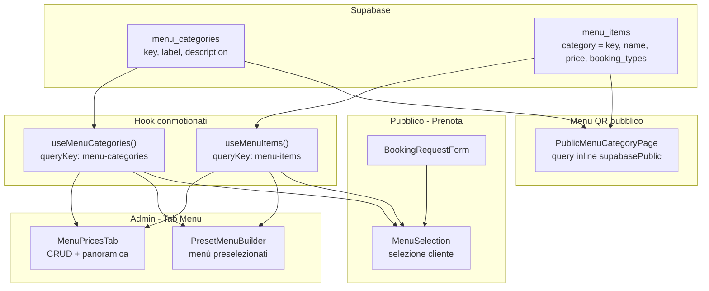

# Analisi flusso dati ingredienti menu

## Esito investigazione


Il contatore **`0/3` in pagina Prenota** significa **0 selezionati / 3 disponibili**, non «zero ingredienti». Stessa logica in [`PresetMenuBuilder.tsx`](src/features/booking/components/PresetMenuBuilder.tsx). In admin [`MenuPricesTab.tsx`](src/features/booking/components/MenuPricesTab.tsx) il formato è diverso: **`3 ingredienti`**. 
cambiamo questa logica invece che il count con n/n_max  mettiamo solamente n_max come count.

Le card usano `defaultExpanded={false}`: gli ingredienti sono **dentro la card**, visibili solo dopo un click sull’header.
 invece devono essere gia visibili.
---

## Flusso dati ingredienti menu (dove nascono e dove finiscono)



### Storage (semplice)

| Tabella | Cosa contiene | Chi la scrive |
|---------|---------------|---------------|
| `menu_categories` | Elenco categorie (`key` slug, `label` titolo visibile, `description`) | Tab Menu → Gestione categorie |
| `menu_items` | Ingredienti/piatti (`category` = `key` della categoria, prezzo, `booking_types`) | Tab Menu → Crea/Modifica prodotto |

Il collegamento categoria ↔ ingrediente è **`menu_items.category` = `menu_categories.key`**. Non esiste tabella pivot.

---

## Cosa è già centralizzato

| Pezzo | File | Ruolo |
|-------|------|-------|
| Fetch ingredienti | [`useMenuItems.ts`](src/features/booking/hooks/useMenuItems.ts) | Unica fonte TanStack Query `['menu-items', tenantId]` — usata da admin e Prenota |
| Fetch categorie | [`useMenuCategories.ts`](src/features/booking/hooks/useMenuCategories.ts) | Unica fonte `['menu-categories', tenantId]` |
| Layout conmotionato | [`menuPricesCatalogLayout.ts`](src/features/booking/components/menuPricesCatalogLayout.ts) | Classi CSS griglia card, righe ingrediente, titoli |
| Tipi + filtro tipologia | [`types/menu.ts`](src/types/menu.ts) | `MenuItem`, `normalizeMenuItemBookingTypes`, `booking_types` |
| Mutations CRUD | `useCreateMenuItem`, `useUpdateMenuItem`, `useDeleteMenuItem` | Solo admin; invalidano `menu-items` |

**Consumatori di `useMenuItems`:** `MenuPricesTab`, `MenuSelection`, `PresetMenuBuilder`, `BookingRequestForm`, `AdminBookingForm`, `BookingDetailsModal`.

---

## Cosa NON è centralizzato (debito tecnico, non bug attuale)

### 1. Logica `itemsByCategory` duplicata 3 volte

Stesso pattern copy-paste in:
- [`MenuSelection.tsx`](src/features/booking/components/MenuSelection.tsx) (linee ~177–203)
- [`PresetMenuBuilder.tsx`](src/features/booking/components/PresetMenuBuilder.tsx) (linee ~89–115)
- [`MenuPricesTab.tsx`](src/features/booking/components/MenuPricesTab.tsx) (linee ~792–798, versione semplificata)

Tutte:
1. Costruiscono `categoryEntries` da `dbCategories.map(c => [c.key, c.label])`
2. Raggruppano `menuItems` per `item.category`
3. Mostrano `itemsByCategory[categoryKey]`

**Eccezione parziale:** solo `MenuPricesTab.countItemsForCategory` (delete categoria) accetta anche `item.category === label`, ma la **visualizzazione usa solo `key`**. Oggi sul DB non ci sono mismatch; resta fragile se dati legacy o import errati.

### 2. Menu QR usa fetch separato

[`PublicMenuCategoryPage.tsx`](src/pages/PublicMenuCategoryPage.tsx) non usa `useMenuItems` — query inline con `supabasePublic` e filtro `.eq('category', categoryKey)`. Corretto per l’invariante «pagine `/menu/*` solo supabasePublic», ma duplica la logica di fetch.

### 3. Client Supabase misto su Prenota

[`useMenuItems`](src/features/booking/hooks/useMenuItems.ts) usa `supabase` (client autenticato) anche in [`BookingRequestForm`](src/features/booking/components/BookingRequestForm.tsx) / [`MenuSelection`](src/features/booking/components/MenuSelection.tsx). Funziona grazie alle policy RLS `anon` su `menu_items`, ma **non rispetta** la regola skill «form pubblici → supabasePublic». Rischio futuro se le policy authenticated/anon divergono.

### 4. Filtro `booking_types` solo in Prenota

Solo `MenuSelection` filtra ingredienti per tipologia prenotazione (`rinfresco_laurea`, `menu_prezzo_fisso`, `tavolo`). Admin e preset builder mostrano tutto. Comportamento voluto (documentato in APP_CONTEXT §4 RULE Menu Prenota).

---

## Raccomandazioni (opzionali, nessuna urgente)

### A. Nessuna modifica (stato attuale accettabile)
Se il flusso ti è chiaro e aprire le card va bene, **non serve codice**.

### B. Refactor leggero centralizzazione (consigliato se vuoi robustezza)
Creare [`src/features/booking/utils/menuCatalogGrouping.ts`](src/features/booking/utils/menuCatalogGrouping.ts):

```ts
// groupMenuItemsByCategoryKey(items, categories)
// - risolve item.category matchando key OR label → bucket per key
// - ordina per sort_order, name
// - opzionale: conta orphan items non mappati
```

Sostituire i 3 `useMemo` duplicati. Aggiungere 2–3 test Vitest sul matching key/label.

### C. Allineamento client pubblico (medio termine)
Estendere `useMenuItems` con opzione `client: 'public' | 'admin'` (o hook gemello `usePublicMenuItems`) che usa `supabasePublic` + stessa query key scoped. Migrare `MenuSelection` / `BookingRequestForm` al client pubblico.


---

## Verifica post-modifica (se si fa refactor B/C)

1. Tab Menu admin: conteggi «N ingredienti» e lista dentro card
2. Pagina Prenota: conteggi `selezionati/totali`, filtro per tipologia prenotazione
3. Menù preselezionati: selezione ingredienti nel builder
4. Menu QR categoria: piatti in [`PublicMenuCategoryPage`](src/pages/PublicMenuCategoryPage.tsx)
5. `npm run validate`

---

## Conclusione

Il sistema **è già centralizzato a livello fetch** (`useMenuItems` + `useMenuCategories`). La duplicazione è nel **raggruppamento UI** e nel **client Supabase** del form pubblico. I dati sul tenant di test sono coerenti;

**Prossimo passo suggerito:** procedere con il refactor B (utility condivisa + test) 
