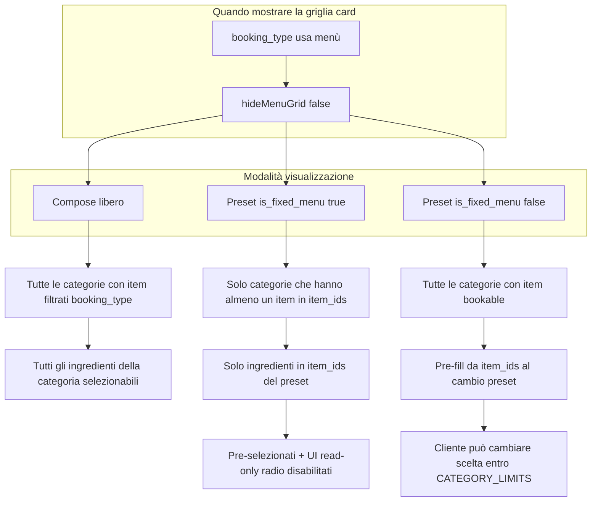

# Plan — Card categorie menù (visuale «CREA IL TUO MENU»)

**Riferimenti**
- Mockup card: `assets/.../visuale_card_menù-*.png` (5 colonne ANTIPASTO → BEVANDE)
- Mockup pagina: `docs/Sessioni di lavoro/25-05-26/Pagina Prenota v.2/Immagini pagina prenota v2/terzo screen.png`
- Stato attuale: `MenuSelection.tsx` → `CollapsibleCard` verticale, griglia admin `MENU_INGREDIENT_OVERVIEW_GRID_CLASS` (1–3 colonne)
- Ultimo commit: `8c6c1db` — sottotab orizzontali; report `docs/Sessioni di lavoro/25-05-26/Report-sottotab-orizzontali-prenota-v2.md`
- Skill: `docs/APP_CONTEXT_SKILL.md` § Pagina Prenota v2, `UI_EDIT_SKILL.md`, `UI_RESPONSIVE_SKILL.md`

**Fuori scope**
- Modifiche a RPC submit / `useCreateBookingRequest` / payload DB
- Nuove colonne su `booking_requests`
- Refactor `MenuPricesTab` admin (già gestisce `is_fixed_menu`)
- Carosello sottotab, quantità stepper +/- sul mockup (il prodotto oggi usa radio/toggle + regole `CATEGORY_LIMITS`)

---

## 1. Problema (schermata attuale)

| Dove | Cosa vede il cliente |
|------|----------------------|
| `/prenota/:slug` → `#menu-section` → `MenuSelection` | Accordion verticali «Antipasti — N ingredienti»; click espande lista; stile admin MenuPricesTab |

| Cosa vuole Matteo | Mockup allegato |
|-------------------|-----------------|
| Una **card verticale per categoria** affiancate (scroll orizzontale su mobile) | Foto categoria in alto, titolo MAIUSCOLO, testo «Scegli N opzione» / «X selezionata», lista con **radio** + nome + prezzo + descrizione |

La logica di selezione (limiti per categoria, caraffe, tiramisù kg) **esiste già** in `MenuSelection` — va **riusata**, non riscritta.

---

## 2. Dati e storage (semplice)

### Admin — menù consigliato (`MenuPricesTab` / `MenuPricesTab2`)

**Dove nell’app:** Admin → Impostazioni → tab Menù / Prezzi (sezione menù preselezionati).

**Storage:** Supabase `restaurant_settings`, chiave **`booking_custom_staff_presets`** (JSON array).

Ogni elemento (già tipizzato in `presetMenus.ts` + Zod in `restaurantSettingRegistry.ts`):

```ts
{
  id: string,              // uuid
  name: string,
  description?: string,    // card sottotab + testo sotto titolo
  item_ids: string[],      // UUID menu_items scelti dall’admin
  booking_types: ('rinfresco_laurea' | 'menu_prezzo_fisso')[],
  is_fixed_menu?: boolean, // default true = fisso
  visible_on_booking?: boolean
}
```

**Toggle admin:** «Menù fisso o personalizzabile da cliente?»
- **Attivo (fisso)** → `is_fixed_menu` omesso o `true` → cliente **non** cambia ingredienti
- **Disattivo** → salvato `is_fixed_menu: false` → cliente **può** comporre dopo aver scelto il preset

Helper già presenti: `isStaffPresetFixedMenu()`, `menuSelectionLocked` in `MenuSelection`.

### Catalogo ingredienti

| Tabella / setting | Uso nelle card |
|-------------------|----------------|
| `menu_items` | nome, prezzo, `category`, `description`, `booking_types`, `sort_order` |
| `menu_categories` | `key`, `label`, **`image_url`** (foto categoria Prenota — path `{tenantId}/booking-cat/{id}.webp`) |

Hook esistenti: `useMenuItems()`, `useMenuCategories()`, grouping `groupMenuItemsByCategory()`.

### Config pagina (sottotab)

`restaurant_settings.booking_public_form_config` → `sub_tabs[]` con `type: preset` + `preset_id` → apre la griglia menù collegata al preset staff.

---

## 3. Matrice comportamento UI (regola prodotto)



| Scenario | `booking_type` | Preset / sottotab | Ingredienti in card | Interazione |
|----------|----------------|-------------------|---------------------|-------------|
| **Componi** | `rinfresco_laurea` | Nessun preset / flusso «componi» | Tutti (filtro `booking_types`) | Radio/toggle attivi |
| **Menu speciale — fisso** | `menu_prezzo_fisso` | Sottotab `preset` + `is_fixed_menu !== false` | **Solo** `item_ids` | Solo lettura; banner «Menù fisso» (già esiste) |
| **Menu speciale — personalizzabile** | `menu_prezzo_fisso` | Sottotab `preset` + `is_fixed_menu === false` | Tutti bookable per tipo | Attivi; stato iniziale = `item_ids` |
| **Manuale** | qualsiasi | `sub_tab.type === manual` | — | `hideMenuGrid` true (invariato) |
| Built-in `menu_1`…`menu_4` | legacy | built-in | Come oggi `applyPresetTypeToBookingFormPayload` | Locked come custom fisso |

**Nota:** Per menù fisso non mostrare categorie senza ingredienti del pacchetto (evita card «0 ingredienti» come nel DOM segnalato).

---

## 4. Architettura componenti target

```
BookingRequestForm
  └── MenuSelection (orchestratore — invariato submit/emit)
        ├── [opzionale] header compose
        ├── BookingMenuComposeGrid          ← NUOVO
        │     └── BookingMenuCategoryCard[] ← NUOVO (una per categoria)
        └── [deprecare visivamente] blocco CollapsibleCard + MENU_INGREDIENT_OVERVIEW_GRID
```

### `BookingMenuCategoryCard` (nuovo, `publicBooking/`)

Struttura allineata al mockup:

1. **Header card:** `category.label` uppercase (da `menu_categories`)
2. **Immagine:** `category.image_url` con fallback placeholder warm (se assente)
3. **Stato selezione:** testo dinamico da `CATEGORY_LIMITS[categoryKey]`:
   - es. limite 1 → «Scegli 1 opzione» / «1 selezionata» o «Nessuna selezionata»
   - limite 3 → «Scegli fino a 3» / «2 selezionate»
4. **Lista ingredienti:** per ogni item visibile nella card:
   - radio (o checkbox se limite > 1 — oggi antipasti/secondi ammettono multi)
   - nome + `€ prezzo` a destra
   - descrizione sotto (se presente)
5. **Tiramisù:** se item selezionato e categoria dolci → blocco kg sotto la riga (spostare UI esistente)

Props suggerite:

```ts
type BookingMenuCategoryCardProps = {
  categoryKey: string
  categoryLabel: string
  imageUrl?: string | null
  items: NormalizedMenuItem[]
  selectedItems: SelectedMenuItem[]
  maxSelectable: number | undefined  // da CATEGORY_LIMITS
  locked: boolean                    // menuSelectionLocked
  onToggleItem: (item: NormalizedMenuItem) => void
  // tiramisù handlers se necessario
}
```

### `BookingMenuComposeGrid` (nuovo)

- Layout: `flex overflow-x-auto gap-4 snap-x` (mobile/tablet); `lg:grid lg:grid-cols-5` se ≤5 categorie visibili e spazio sufficiente (valutare in implementazione — mockup desktop = 5 colonne uguali).
- Ordine categorie: stesso `categoryEntries` di `MenuSelection` (ordine DB `menu_categories.sort_order`).
- **Filtraggio items per card:**
  - `visibleItems(categoryKey)` = funzione centralizzata:
    - base: `itemsByCategory[key]` filtrati `booking_type`
    - se `locked` + custom preset: intersect con `preset.item_ids`
    - se `locked` + built-in: intersect con items risolti da `getPresetMenu().itemNames` (match nomi esistente)
  - se `visibleItems.length === 0` → **non renderizzare** la card

### `MenuSelection.tsx` (refactor mirato)

- Sostituire il blocco righe 610–726 (`CollapsibleCard` grid) con `<BookingMenuComposeGrid ... />`.
- Mantenere: `handleItemToggle`, `emitMenuSelectionChange`, `menuSelectionLocked`, dropdown legacy preset (nascosto quando ci sono sottotab), `hideMenuGrid`, `hideSummary`.
- Attivare `variant="compose"`:
  - Titolo: **«CREA IL TUO MENU»**
  - Sottotitolo: «Seleziona una pietanza per ogni portata…» (testo mockup)
  - Mostrare quando: `booking_type === 'rinfresco_laurea'` **oppure** preset custom con `is_fixed_menu === false`
  - Per preset fisso: titolo opzionale «Il tuo menù» + nome preset (da `getPresetMenuLabel` / label sottotab)

**Selezione UI radio vs toggle multi**
- Mockup mostra radio (1 per portata). Oggi `antipasti: 3`, `secondi: 3` → usare **radio group** solo dove `CATEGORY_LIMITS === 1`; dove > 1 mantenere comportamento multi con checkbox stile radio (documentare in implementazione).

---

## 5. Flussi per schermata (acceptance)

### A — Componi il tuo menù (`terzo screen.png`)

- [ ] Griglia card orizzontale con tutte le categorie che hanno almeno 1 ingrediente `rinfresco_laurea`
- [ ] Header «CREA IL TUO MENU» + sottotitolo
- [ ] Sidebar: sezione **«IL TUO MENU»** (rinominare da «Menu selezionato») con voci per categoria se possibile
- [ ] Totale «€ X p.p.» in sidebar (già parziale)

### B — Menu speciale preset **fisso** (`secondo screen.png` + admin toggle ON)

- [ ] Dopo scelta sottotab preset: card mostrano **solo** piatti in `item_ids`
- [ ] Tutti pre-selezionati; click non modifica (`menuSelectionLocked`)
- [ ] Banner informativo menù fisso

### C — Menu speciale preset **personalizzabile** (admin toggle OFF)

- [ ] Card con **tutti** gli ingredienti bookable per `menu_prezzo_fisso`
- [ ] Alla selezione sottotab: pre-fill `menu_selection` da `item_ids` (già `handlePresetMenuChange` / `applyPresetTypeToBookingFormPayload`)
- [ ] Cliente può cambiare scelte; validazione submit invariata

### D — Sottotab manuale

- [ ] Nessuna griglia (`hideMenuGrid`) — invariato

---

## 6. Sidebar `BookingSummarySidebar`

Allineamento mockup `terzo screen.png`:

| Oggi | Target |
|------|--------|
| «Menu selezionato» + lista piatta | **«IL TUO MENU»** |
| Solo `item.name` + prezzo | Opzionale: prefisso categoria (`Antipasto:`) da `menu_categories.label` |
| Nessuna thumb | Opzionale fase 2: thumb da `menu_items.image_url` se esiste |

Implementazione minima fase 1: rename titolo + ordinare voci per `sort_order` categoria.

---

## 7. Responsive (`UI_RESPONSIVE_SKILL`)

| Breakpoint | Comportamento card |
|------------|-------------------|
| `< lg` | `overflow-x-auto`, card `min-w-[240px]` o `280px`, `snap-center`, padding container come form |
| `≥ lg` | Griglia 5 colonne se ≤5 categorie; altrimenti scroll orizzontale anche su desktop (molte categorie DB) |
| Touch | Radio/checkbox area tap ≥ 44px; non affidarsi solo al click sulla riga testo |

Non usare `CollapsibleCard` nella vista pubblica compose (solo admin).

---

## 8. File toccati (stima)

| File | Azione |
|------|--------|
| `src/features/booking/components/publicBooking/BookingMenuCategoryCard.tsx` | **Nuovo** |
| `src/features/booking/components/publicBooking/BookingMenuComposeGrid.tsx` | **Nuovo** |
| `src/features/booking/components/MenuSelection.tsx` | Refactor render griglia + helper `getVisibleItemsForCategory` |
| `src/features/booking/components/publicBooking/BookingSummarySidebar.tsx` | Titolo IL TUO MENU + ordinamento |
| `src/features/booking/utils/menuComposeVisibility.ts` | **Nuovo** (opz.) — filtri fixed/personalizzabile, testabile |
| `docs/APP_CONTEXT_SKILL.md` | RULE Pagina Prenota: UI card categorie orizzontali |
| `docs/Sessioni di lavoro/25-05-26/Report-menu-compose-cards.md` | Report post-implementazione |

**Non toccare (salvo bug):** `MenuPricesTab.tsx`, `useCreateBookingRequest`, `BookingForm.tsx` admin classica.

---

## 9. Test plan

1. **Preset fisso:** admin crea menù con 3 `item_ids`, toggle fisso ON → pagina mostra solo 3 piatti in card, non cliccabili, submit OK.
2. **Preset personalizzabile:** stessi `item_ids`, toggle OFF → tutti gli ingredienti visibili, pre-fill corretto, cambio antipasto aggiorna sidebar e totali.
3. **Componi:** card tutte le categorie, limiti antipasti/secondi/bevande/caraffe invariati.
4. **Regressione sottotab:** cambio sottotab resetta preset e griglia; manuale senza griglia.
5. `npm run validate` (137 test).

Test Vitest consigliato (nuovo): `menuComposeVisibility.test.ts` per filtro `item_ids` + categorie vuote.

---

## 10. Ordine implementazione consigliato

1. Utility filtro visibilità (`fixed` vs `compose`) + test unitario
2. `BookingMenuCategoryCard` statico con Story/mock data
3. `BookingMenuComposeGrid` + integrazione in `MenuSelection`
4. Header compose / titoli contestuali
5. Sidebar «IL TUO MENU»
6. QA responsive + aggiornamento skill/report

---

## 11. Domande aperte (conferma Matteo prima o durante impl.)

1. **Categorie senza foto:** placeholder generico per categoria o prima immagine del primo piatto della categoria?
2. **Categorie con 0 ingredienti bookable** ma con item solo in altri flussi: sempre nascoste nella griglia compose?
3. **Mockup stepper quantità** in fondo card: ignorare in v1 (solo radio + tiramisù kg) o richiesto?
4. **Built-in menu_1–4:** stessa UI card con soli item del built-in (read-only) — confermato implicito dalla matrice.

---

## 12. Deviazioni dal plan Pagina Prenota v2 originale

Il plan `pagina_prenota_v2_ui_4db75828.plan.md` diceva «prima card tipologia, poi campi» e `MenuSelection variant compose`. Questa sessione:
- ordine form già invertito (Dati e Dettagli prima);
- **compose UI** passa da griglia admin collapsible a **card orizzontali mockup**;
- logica `is_fixed_menu` già implementata in admin — va solo **riflessa nel filtro visivo** delle card (oggi mostra tutti gli ingredienti anche se locked).
