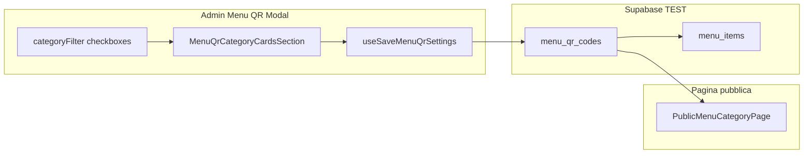

# Piano: Filtri categorie e visibilità ingredienti per Menù QR

## Contesto (lavoro già in repo)

Il flusso attuale passa da [`MenuQrModal.tsx`](src/features/booking/components/MenuQrModal.tsx) → stato `categoryFilter` → salvataggio in `menu_qr_codes.category_filter` via [`useSaveMenuQrSettings`](src/features/booking/hooks/useMenuQrCodes.ts). La sezione [`MenuQrCategoryCardsSection`](src/features/booking/components/MenuHomepageConfigPanel.tsx) oggi itera **tutte** le categorie del tenant. La pagina cliente [`PublicMenuCategoryPage.tsx`](src/pages/PublicMenuCategoryPage.tsx) carica tutti i piatti della categoria **senza** leggere regole per-QR sugli ingredienti.



---

## 1. Categorie visibili: solo con ingredienti (punto 3)

**Dove:** [`MenuQrModal.tsx`](src/features/booking/components/MenuQrModal.tsx)

- Caricare ingredienti con hook esistente [`useMenuItems`](src/features/booking/hooks/useMenuItems.ts) (query `menu-items` già usata in tab Menu).
- Derivare `categoriesWithItems`: categorie il cui `key` ha almeno un record in `menu_items.category` (riusare [`groupMenuItemsByCategory`](src/features/booking/utils/menuCatalogGrouping.ts) o un `Set` di chiavi con count > 0).
- Nella UI **«Categorie di prodotti visibili»** mappare solo `categoriesWithItems` (non tutte le righe di `menu_categories`).
- **«Attiva tutte»**: seleziona/deseleziona solo le chiavi di `categoriesWithItems`.
- Aggiornare `resolveCategoryFilterForUi` per QR legacy con `category_filter === null`: default = tutte le categorie **con ingredienti**, non tutte le categorie DB (evita checkbox vuote).

Messaggio se `categoriesWithItems.length === 0`: testo breve «Nessuna categoria con prodotti — aggiungi ingredienti nella tab Menu».

---

## 2. Titoli/foto categorie: solo categorie selezionate (punto 1)

**Dove:** [`MenuQrModal.tsx`](src/features/booking/components/MenuQrModal.tsx) + [`MenuQrCategoryCardsSection`](src/features/booking/components/MenuHomepageConfigPanel.tsx)

- Passare a `MenuQrCategoryCardsSection` una lista filtrata:
  ```ts
  selectedCategories = categoriesWithItems.filter(c => categoryFilter.includes(c.key))
  ```
- Se `categoryFilter` è vuoto: empty state nella sezione («Seleziona almeno una categoria sopra») invece di elenco lungo.
- Al **Salva**, in `buildPayload`:
  - `categoryOverrides` solo per chiavi presenti in `categoryFilter` (non tutte le categorie tenant).
  - Pulire `hidden_menu_item_ids` dagli ID appartenenti a categorie deselezionate (vedi punto 4).

---

## 3. Rimuovere tema Wine Bistrot (punto 2)

**Dove:** [`menuThemes.ts`](src/features/public-menu/menuThemes.ts), migrazione SQL, parser QR.

| Layer | Azione |
|-------|--------|
| UI admin | Rimuovere `wine_bistrot` da `MENU_THEMES` e dal tipo `MenuThemeKey` in [`MenuQrThemeSection`](src/features/booking/components/MenuHomepageConfigPanel.tsx) (legge `Object.values(MENU_THEMES)`). |
| DB TEST | Nuova migrazione `037_menu_qr_hidden_items_and_theme.sql`: `UPDATE menu_qr_codes SET theme_key = 'mediterranean_teal' WHERE theme_key = 'wine_bistrot'`; aggiornare `CHECK` su `theme_key` escludendo `wine_bistrot`. |
| Runtime | [`getMenuTheme`](src/features/public-menu/menuThemes.ts) già fa fallback su `DEFAULT_THEME_KEY` per chiavi sconosciute — sufficiente per QR vecchi fino alla migrazione. |

**Nota:** applicare migrazione solo su progetto **TEST** (`docnnernvp`) via MCP, come da [`docs/APP_CONTEXT_SKILL.md`](docs/APP_CONTEXT_SKILL.md).

---

## 4. Visibilità ingredienti per QR (punto 4) — DB + admin + pubblico

### 4.1 Storage (nuovo campo)

Aggiungere su `menu_qr_codes`:

```sql
hidden_menu_item_ids JSONB NOT NULL DEFAULT '[]'::jsonb
```

- Semantica: **lista UUID ingredienti da non mostrare** in questo Menù QR (occhio chiuso = ID presente nell’array).
- Ingredienti nuovi: non in lista → visibili di default.
- Validazione app: solo UUID stringhe; al save scartare ID di categorie non più in `categoryFilter`.

Aggiornare: [`src/types/menu.ts`](src/types/menu.ts), [`menuQrAppearance.ts`](src/features/booking/utils/menuQrAppearance.ts), [`useSaveMenuQrSettings`](src/features/booking/hooks/useMenuQrCodes.ts), rigenerare/aggiornare [`database.ts`](src/types/database.ts) se previsto dal flusso progetto.

### 4.2 UI admin — sotto la descrizione di ogni card categoria

**Dove:** [`MenuHomepageConfigPanel.tsx`](src/features/booking/components/MenuHomepageConfigPanel.tsx) (sotto l’input «Descrizione breve»).

Nuovo sotto-componente (es. `MenuQrHiddenItemsPicker`):

- Usare [`CollapsibleCard`](src/components/ui/CollapsibleCard.tsx) (**LOCK** — solo consumo, nessuna modifica al file).
  - Titolo: **«Scegli quali ingredienti non mostrare»**
  - `defaultExpanded={false}` (dropdown/casella chiusa all’apertura).
- Contenuto espanso: griglia `grid grid-cols-2 sm:grid-cols-4 gap-2` (4 colonne da `sm`, 2 su mobile stretto per leggibilità).
- Ogni cella: nome ingrediente (truncate) + pulsante icona `Eye` / `EyeOff` (lucide-react).
  - **Eye** = visibile nel menu QR (ID **non** in `hiddenItemIds`).
  - **EyeOff** = nascosto (ID **in** `hiddenItemIds`).
  - `aria-label` espliciti per accessibilità.

Props da `MenuQrModal`:

```ts
hiddenItemIds: string[]
onHiddenItemIdsChange: (ids: string[]) => void
itemsByCategory: Record<string, MenuItem[]>  // solo categorie selezionate
```

Stato `hiddenItemIds` in [`MenuQrModal.tsx`](src/features/booking/components/MenuQrModal.tsx): init da `editing.hidden_menu_item_ids` all’apertura modale; incluso in `MenuQrSettingsSavePayload.input`.

### 4.3 Pagina pubblica — applicare il filtro

**Dove:** [`PublicMenuCategoryPage.tsx`](src/pages/PublicMenuCategoryPage.tsx)

- Risolvere il QR con `usePublicMenuQr` (stesso pattern `tenantReady` già usato in [`PublicMenuPage.tsx`](src/pages/PublicMenuPage.tsx) se necessario estrarre hook condiviso leggero).
- Dopo fetch `menu_items`, filtrare: `items.filter(i => !hiddenSet.has(i.id))`.
- Se tutti nascosti: messaggio «Nessun piatto visibile in questa categoria» (coerente con lista vuota attuale).

Opzionale stesso filtro in eventuali altre liste piatti per-QR (verificare [`PublicMenuPresetPage`](src/pages/PublicMenuPresetPage.tsx) — fuori scope se i preset usano `item_ids` fissi; documentare nel report se non si tocca).

---

## 5. File principali toccati

| File | Modifica |
|------|----------|
| `supabase/migrations/037_...sql` | `hidden_menu_item_ids` + tema wine |
| `src/types/menu.ts` | tipi + payload |
| `src/features/booking/utils/menuQrAppearance.ts` | parse array UUID |
| `src/features/booking/hooks/useMenuQrCodes.ts` | save/read campo |
| `src/features/booking/components/MenuQrModal.tsx` | filtri categorie, stato hidden, wire props |
| `src/features/booking/components/MenuHomepageConfigPanel.tsx` | picker collassabile + filtro categorie passate |
| `src/features/public-menu/menuThemes.ts` | rimuove wine_bistrot |
| `src/pages/PublicMenuCategoryPage.tsx` | filtra per hidden IDs |
| `docs/per-ui-design-skill/PUBLIC_MENU_SKILL.md` | regole nuove (post-implementazione) |

---

## 6. Validazione

- `npm run validate` (lint + typecheck + 137 test).
- Test manuale su TEST con 2 QR diversi:
  1. Checkbox: compaiono solo categorie con ≥1 ingrediente; «Attiva tutte» coerente.
  2. Deselezionare una categoria → scompare dalla sezione titoli/foto.
  3. Wine Bistrot non compare nel tema; QR che lo usava mostra Mediterranean Teal dopo migrazione.
  4. Nascondere 1–2 ingredienti → Salva → scan QR → pagina categoria senza quei piatti.
  5. Riaprire modale: occhi coerenti con salvataggio.

---

## 7. Rischi / decisioni già fissate

- **Nessuna nuova tabella**: un JSONB su `menu_qr_codes` è sufficiente e allineato al modello per-QR (036).
- **CollapsibleCard**: non modificare (LOCK); solo import e props standard.
- **Categorie senza ingredienti**: mai in checkbox né in «Attiva tutte»; non bloccano la creazione QR se il ristoratore ha categorie vuote nel catalogo.
