# Plan A — Pagina Prenota v2 (UI pubblica)

## Contesto e obiettivo

Trasformare [`BookingRequestPage.tsx`](src/pages/BookingRequestPage.tsx) + [`BookingRequestForm.tsx`](src/features/booking/components/BookingRequestForm.tsx) dal layout attuale (colonna unica, select tipologia, riepilogo menù inline in [`MenuSelection.tsx`](src/features/booking/components/MenuSelection.tsx)) al mockup in [`docs/Sessioni di lavoro/25-05-26/Pagina Prenota v.2/Immagini pagina prenota v2/`](docs/Sessioni%20di%20lavoro/25-05-26/Pagina%20Prenota%20v.2/Immagini%20pagina%20prenota%20v2/).

**Non è una nuova logica prodotto**: stesso payload `BookingRequestInput`, stessi `booking_type` DB, stesso `supabasePublic`, stessi preset (`booking_custom_staff_presets`) e catalogo menù (`useMenuItems` / `useMenuCategories`).

**Fuori scope in questa sessione**: carosello sottotab (sessione admin successiva), sezione admin «Personalizza Form» ([Plan B separato](#plan-b-collegato)).

---

## Architettura UI target

```mermaid
flowchart TB
  subgraph page [BookingRequestPage]
    brand[Brand + titolo + descrizione]
    grid[Grid 2 colonne md+]
  end
  subgraph left [Colonna sinistra]
    cards[3 card Come vuoi prenotare]
    subTabs[Sottotab orizzontali se attive]
    menuUI[Menu speciale OR Componi UI]
    fields[Data Ora Ospiti Nome Intolleranze Note Occasione]
    privacy[Privacy + CTA]
  end
  subgraph right [Colonna destra]
    summary[BookingSummarySidebar dinamico]
    phone[Telefono da contact_phone]
  end
  brand --> grid
  grid --> left
  grid --> right
  cards --> subTabs
  subTabs --> menuUI
  cards --> fields
  fields --> summary
  menuUI --> summary
```



### Mapping aree mockup → dati (invariato lato DB)

| Card UI (default) | `booking_type` default | Flusso sotto-card |
|-------------------|------------------------|-------------------|
| Prenota alla carta | `tavolo` | Nessuna sottotab menù |
| Menu speciale | `menu_prezzo_fisso` | Sottotab = preset staff visibili (`booking_custom_staff_presets`) |
| Componi il tuo menù | `rinfresco_laurea` | Griglia categorie/ingredienti (logica attuale `MenuSelection`) |

In futuro ogni card potrà puntare a un `booking_type` diverso via config admin ([Plan B](#plan-b-collegato)).

---

## Config: `booking_public_form_config`

Nuova chiave in [`restaurantSettingRegistry.ts`](src/features/booking/lib/restaurantSettingRegistry.ts): `booking_public_form_config` (JSON).

**Default embedded in codice** (usato se setting assente), allineato a v2:

```ts
// Esempio struttura (da tipizzare in constants/bookingPublicFormConfig.ts)
{
  page_title: 'Prenota il tuo tavolo',
  page_description: 'Compila il modulo per riservare la tua esperienza al {restaurantName}.',
  booking_modes: [
    {
      id: 'tavolo',
      booking_type: 'tavolo',
      enabled: true,
      label: 'Prenota alla carta',
      description: 'Scegli dal menu al ristorante',
      icon: 'utensils', // lucide key
      sub_tabs_enabled: false,
      sub_tabs_display: 'horizontal', // carousel in sessione futura
      sub_tabs: []
    },
    {
      id: 'menu_speciale',
      booking_type: 'menu_prezzo_fisso',
      enabled: true,
      label: 'Menu speciale',
      description: 'Per occasioni speciali',
      icon: 'cloche',
      sub_tabs_enabled: true,
      sub_tabs_display: 'horizontal',
      sub_tabs: [] // vuoto = deriva da staff presets runtime
    },
    {
      id: 'componi',
      booking_type: 'rinfresco_laurea',
      enabled: true,
      label: 'Componi il tuo menù',
      description: 'Crea il tuo percorso',
      icon: 'chef-hat',
      sub_tabs_enabled: true,
      sub_tabs_display: 'horizontal',
      sub_tabs: []
    }
  ]
}
```

**Regola runtime sottotab Menu speciale**: se `sub_tabs` vuoto → costruire card da `customStaffPresets` filtrati con `isStaffPresetSelectableForBookingType(p, booking_type)`; label = `preset.name`; prezzo da `computeMenuTotalsFromItems` dopo selezione.

**Carosello**: ignorare `sub_tabs_display: 'carousel'` in v1 → fallback a `horizontal` (decisione utente: carousel in sessione admin).

---

## Componenti da creare / modificare

### Pagina contenitore — [`BookingRequestPage.tsx`](src/pages/BookingRequestPage.tsx)

- Layout `max-w-7xl` (o simile mockup), griglia `lg:grid-cols-[1fr_min(360px,32%)]`.
- Spostare header (brand, `page_title`, `page_description`) fuori dal form; leggere copy da config + `useRestaurantName()`.
- Mantenere sfondo tema esistente (`public_booking_page_background`) e overlay.
- **Footer orari/contatti**: mantenere sotto il grid a due colonne (scelta utente implicita: non rimuovere).
- Passare `formConfig` e dati contatto al form/sidebar.

### Nuovi componenti (cartella suggerita `src/features/booking/components/publicBooking/`)

| Componente | Ruolo |
|------------|--------|
| `BookingModeCards.tsx` | 3 card selezionabili; stato `activeModeId`; onChange aggiorna `booking_type` + reset menù come oggi |
| `BookingSubTabStrip.tsx` | Scroll orizzontale se `items.length > 3`; card stile v2 (bordo attivo, checkmark opzionale) |
| `BookingPresetPicker.tsx` | Wrapper sottotab per Menu speciale → chiama `handlePresetMenuChange` esistente |
| `BookingSummarySidebar.tsx` | Riepilogo destro: data, ora, ospiti, label modalità, preset nome + €/persona, righe menu composto, totale; **telefono** da `contact_phone` |
| `BookingFormFields.tsx` | Griglia campi mockup: data, ora, ospiti, nome; intolleranze + note; occasione opzionale |

### Form principale — [`BookingRequestForm.tsx`](src/features/booking/components/BookingRequestForm.tsx)

- Ridurre a orchestratore: state `formData`, validazione, submit, `useCreateBookingRequest` invariati.
- Ordine campi come mockup: **prima** card tipologia (+ sottotab/menù), **poi** data/ora/ospiti/nome, **poi** intolleranze/note.
- **Email + Telefono**: restano obbligatori/validati come oggi; posizione compatibile mockup (es. riga sotto nome o sezione collassabile «Contatti»).
- **Intolleranze**: per flussi menù mantenere payload `dietary_restrictions[]` via [`DietaryRestrictionsSection`](src/features/booking/components/DietaryRestrictionsSection.tsx) con UI più compatta; per `tavolo` campo testo che popola `special_requests` o prima riga semplificata (da allineare in implementazione senza rompere admin).
- **Occasione**: fuori scope dati nuovi in v1 — opzionale placeholder UI disabilitato o mappato su `special_requests` prefisso; documentare in commento.
- Rimuovere `max-w-[55vw]` dal form; larghezza gestita dal page grid.
- Sidebar: riceve props derivate da `formData` + label modalità da config.

### Menù — [`MenuSelection.tsx`](src/features/booking/components/MenuSelection.tsx)

- **Non riscrivere logica prezzi/limiti categorie**.
- Estrarre varianti presentazionali:
  - `variant="compose"` → layout colonne v2 (titolo sezione «CREA IL TUO MENU») per `rinfresco_laurea`.
  - `variant="legacy"` o nascondere dropdown preset quando si usa `BookingPresetPicker` esterno.
- Nascondere blocco «Riepilogo Scelte» interno quando sidebar attiva (evitare duplicato area blu attuale).

### Stili

- Leggere [`docs/per-ui-design-skill/UI_EDIT_SKILL.md`](docs/per-ui-design-skill/UI_EDIT_SKILL.md) + [`UI_RESPONSIVE_SKILL.md`](docs/per-ui-design-skill/UI_RESPONSIVE_SKILL.md).
- Responsive: sotto `lg`, sidebar **dopo** il form (`order-2`), sticky opzionale solo desktop.
- Palette: riusare token warm/terracotta esistenti; non introdurre tema nuovo.

---

## Flussi per screenshot v2

### 1. Pagina base — `primo screen.png`

- Card «Prenota alla carta» selezionata.
- Nessuna sezione menù.
- Sidebar: data, ora, ospiti, label modalità.

### 2. Menu speciale — `secondo screen.png`

- Card «Menu speciale» + titolo sezione «Scegli il tuo menu speciale».
- `BookingSubTabStrip` con preset staff (scroll se > 3).
- Selezione preset → popola `preset_menu` + `menu_selection` (come oggi).
- Sidebar: riga «Menu speciale: {nome}» + prezzo a persona.

### 3. Componi — `terzo screen.png`

- Card «Componi il tuo menù» + titolo «CREA IL TUO MENU».
- Colonne per categoria DB (stessa logica filtri `booking_types` su items).
- Sidebar: elenco «IL TUO MENU» con voci + totale (da `menu_total_per_person` / items).

---

## Vincoli tecnici (checklist agente esecutore)

- [ ] Caricare [`docs/APP_CONTEXT_SKILL.md`](docs/APP_CONTEXT_SKILL.md) + UI skills prima di modificare.
- [ ] **Non** toccare `useBookingMutations` admin / admin classica se non necessario.
- [ ] **Non** cambiare RPC insert prenotazione pubblica.
- [ ] `bookingTypeUsesMenuSelections` resta fonte verità per mostrare sezioni menù/intolleranze strutturate.
- [ ] Promo banner [`MenuPromoBannerCards`](src/features/booking/components/MenuPromoBannerCards.tsx): spostare sotto card tipologia o nascondere se ridondante — non eliminare logica promo.
- [ ] E2E [`e2e/public-booking.spec.ts`](e2e/public-booking.spec.ts): aggiornare selettori (card invece di `#booking_type` select).

---

## File previsti (elenco)

| Azione | File |
|--------|------|
| Modifica | `src/pages/BookingRequestPage.tsx` |
| Modifica | `src/features/booking/components/BookingRequestForm.tsx` |
| Modifica | `src/features/booking/components/MenuSelection.tsx` |
| Nuovo | `src/features/booking/constants/bookingPublicFormConfig.ts` |
| Nuovo | `src/features/booking/components/publicBooking/*.tsx` (4–5 file) |
| Modifica | `src/features/booking/lib/restaurantSettingRegistry.ts` (tipo + default setting) |
| Modifica | `e2e/public-booking.spec.ts` (selettori) |
| Opzionale | estrarre `MenuCarousel` da `PublicMenuPage.tsx` → **solo** quando si implementa carosello (Plan B fase 2) |

---

## Test e verifica

- `npm run lint` + `npm run build` (o `tsc -b`).
- Test manuale su tenant staging: 3 card, preset, composizione, submit tavolo + menù.
- Playwright public-booking se env configurato.
- Confermare in report: payload submit identico (campi `booking_type`, `preset_menu`, `menu_selection`, `dietary_restrictions`).

---

## Plan B collegato

Configurazione admin tab «Personalizza Form Prenotazioni» → plan file separato `personalizza-form-prenotazioni-admin` (creato subito dopo questo).
