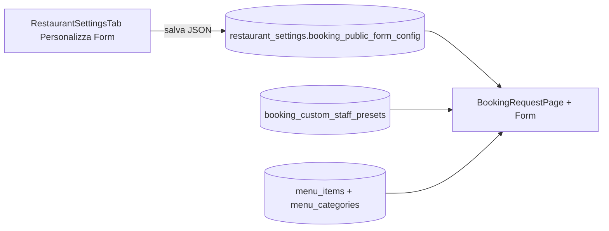

# Plan B — Admin «Personalizza Form Prenotazioni»

## Relazione con Plan A (pagina pubblica)

Il Plan A introduce lettura di `booking_public_form_config` con **default hardcoded** identici ai mockup v2. Questo Plan B descrive come il ristoratore configurerà quella stessa struttura da **Impostazioni Locale**, senza duplicare logiche menù/preset (che restano in Menu → prezzi/preset e `booking_custom_staff_presets`).

---

## Dove vive nell’app admin

- **Schermata**: Admin → tab **Impostazioni** (già monta [`RestaurantSettingsTab.tsx`](src/features/booking/components/RestaurantSettingsTab.tsx) dentro [`AdminDashboard`](src/pages/AdminDashboard.tsx)).
- **DOM attuale**: un unico `<main>` con sezioni impilate (Anagrafica, Orari, Tema app, …).
- **Cambio strutturale**: header a **2 tab/button** in cima al contenuto Impostazioni:
  1. **Anagrafica Azienda** — sezioni esistenti: nome, email, telefono, indirizzo, orari, tema app, sfondo pagina prenota, slot servizio (se Pro), ecc.
  2. **Personalizza Form Prenotazioni** — nuovo pannello dedicato (questo plan).

Pattern UI: stesso stile tab/header già usato altrove in admin (pill/button group, `admin-warm-surface`), non routing URL separato.

---

## Schema config (specchio Plan A)

File tipi condiviso: [`bookingPublicFormConfig.ts`](src/features/booking/constants/bookingPublicFormConfig.ts) (creato in Plan A).

### Campi configurabili dal ristoratore

| Sezione admin | Campo config | Effetto pagina pubblica |
|---------------|--------------|-------------------------|
| Intestazione pagina | `page_title`, `page_description` | Titolo + sottotitolo sopra il form |
| Modalità 1..3 | `booking_modes[].enabled` | Mostra/nasconde card |
| | `label`, `description`, `icon` | Testi e icona card |
| | `booking_type` | Valore inviato in submit (`tavolo` / `rinfresco_laurea` / `menu_prezzo_fisso`) |
| Sottotab | `sub_tabs_enabled` | Se false: nessuna fascia sotto la card (es. solo griglia Componi integrata) |
| | `sub_tabs_display` | `horizontal` \| `carousel` (carousel **fase 2**) |
| | `sub_tabs[]` | Override espliciti slide/tab (label, image_url, `preset_id` o `category_key`) |

**Default** (se admin non ha mai salvato): i 3 label utente — *Prenota alla carta*, *Menu speciale*, *Componi il tuo menù* — con mapping `booking_type` come Plan A.

**Deriva automatica** (non duplicare dati):

- **Menu speciale** con `sub_tabs` vuoto → anteprima live = preset da `booking_custom_staff_presets` (link «Gestisci menù consigliati» → MenuPricesTab sezione preset).
- **Componi** → categorie da `menu_categories` + items filtrati per `booking_type` della card.

---

## Struttura UI del pannello «Personalizza Form»

Nuovo componente: `BookingFormConfigPanel.tsx` (sotto `src/features/booking/components/settings/`).

### Blocco 1 — Anteprima + intestazione pagina

- Input: titolo pagina, descrizione (placeholder `{restaurantName}`).
- Anteprima ridotta (iframe o mock static) opzionale fase 2.

### Blocco 2 — Le 3 modalità di prenotazione

Per ogni `booking_mode` (accordion o 3 card admin):

1. Toggle **Attiva modalità**
2. **Label**, **Descrizione**, **Icona** (picker Lucide limitato, stesso set card pubbliche)
3. **Tipologia prenotazione collegata** (select `booking_type` — con warning se combinazione insolita)
4. Toggle **Abilita sottotab**
5. **Stile sottotab**: radio `Card orizzontali` | `Carosello` (carosello disabilitato fino a fase 2 con nota)

### Blocco 3 — Configurazione sottotab (per modalità con sottotab ON)

#### Menu speciale

- Lista sottotab = preset staff **oppure** slide custom:
  - **Fase 1 (allineata Plan A)**: solo messaggio «Le card sono i Menù consigliati visibili in Prenota» + link a gestione preset esistente; opzionale riordino `sort_order` in JSON.
  - **Fase 2 carosello**: editor slide come [`MenuHomepageConfigPanel`](src/features/booking/components/MenuHomepageConfigPanel.tsx) / [`MenuQrModal`](src/features/booking/components/MenuQrModal.tsx):
    - upload immagine (`menu-photos` path dedicato es. `{tenantId}/booking-form/carousel/{uuid}.webp`)
    - `title`, `description`, `eyebrow`, collegamento `preset_id`
    - riuso `CarouselItem` da [`types/menu.ts`](src/types/menu.ts)
    - estrarre `MenuCarousel` da [`PublicMenuPage.tsx`](src/pages/PublicMenuPage.tsx) in componente condiviso

#### Componi il tuo menù

- Toggle categorie visibili (checkbox su `menu_categories` keys)
- Ordine categorie (drag o numeri sort)
- **Fase 1**: layout colonne fisso come mockup v2 (nessun carosello categorie obbligatorio)
- **Fase 2**: opzione carosello categorie in testa sezione (stesso componente carosello)

### Blocco 4 — Campi form (fase 2+)

- Toggle visibilità: email, telefono, occasione, note — per quando si vuole allineare al mockup al 100%.
- Plan A mantiene email/telefono sempre presenti ma in layout secondario.

### Footer pannello

- Pulsante **Salva** → `useUpsertRestaurantSetting` con chiave `booking_public_form_config`.
- Invalidare query setting + eventuale cache tenant.

---

## Modifiche file admin (elenco)

| Azione | File |
|--------|------|
| Modifica | `RestaurantSettingsTab.tsx` — tab header Anagrafica \| Personalizza Form |
| Nuovo | `BookingFormConfigPanel.tsx` |
| Nuovo | `bookingPublicFormConfig.ts` (condiviso con Plan A) |
| Modifica | `restaurantSettingRegistry.ts` |
| Fase 2 | estrarre `MenuCarousel.tsx` + path storage booking-form |
| Opzionale | validazione Zod/schema per JSON config |

**Non spostare** in questa sessione: logica preset in `MenuPricesTab` (resta fonte dati menù); solo link e anteprima.

---

## Ordine di implementazione consigliato

1. **Dopo Plan A merged**: tipi + registry + default JSON già letti dal pubblico.
2. **Sessione admin v1**: tab split + `BookingFormConfigPanel` con intestazione + 3 modalità (label/descrizione/icona/enabled/booking_type/sub_tabs_enabled).
3. **Sessione admin v2**: editor carosello sottotab + `preset_id` / upload immagini.
4. **Sessione admin v3**: toggle campi form, anteprima live pagina prenota.

---

## Vincoli e rischi

- **Coerenza `booking_type`**: se admin mappa «Menu speciale» a `rinfresco_laurea`, i preset devono avere quel tipo in `booking_types` — mostrare warning in admin.
- **Preset senza immagine**: carosello mostra placeholder colore tema (come QR vuoto).
- **Classic vs Pro**: nessun feature flag nuovo; stesso tab per tutte le edition con impostazioni.
- **LOCK**: verificare se `RestaurantSettingsTab` è in LOCK file prima di edit; chiedere conferma se sì.

---

## Test admin

- Salvataggio JSON su Supabase **test** (`docnnernvp`).
- Ricaricare `/prenota/:slug` e verificare label card + titolo pagina.
- Disabilitare una modalità → card assente; fallback non selezionare tipo disabilitato.

---

## Output atteso per agente revisore

- Diagramma relazione config ↔ UI pubblica (questo documento).
- Checklist fasi 1/2/3 per non implementare carosello prima dello strip orizzontale funzionante.
- Elenco file e dipendenze da Plan A.
