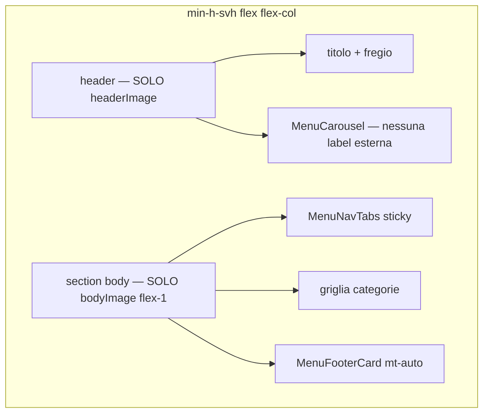

# Piano: Iterazione layout sfondi — Home menu QR

> **Stato:** la v1 del redesign è già in codice ([`PublicMenuPage.tsx`](src/pages/PublicMenuPage.tsx), [`menuThemes.ts`](src/features/public-menu/menuThemes.ts)). Questo piano copre solo i **3 aggiustamenti layout** richiesti dopo test visivo.

**Skill da caricare prima di modificare:** [`docs/APP_CONTEXT_SKILL.md`](docs/APP_CONTEXT_SKILL.md) §0 → [`PUBLIC_MENU_SKILL.md`](docs/per-ui-design-skill/PUBLIC_MENU_SKILL.md) + [`PUBLIC_MENU_LAYOUT_CONTEXT.md`](docs/per-ui-design-skill/PUBLIC_MENU_LAYOUT_CONTEXT.md).

---

## Problema attuale (codice)

`MenuContent` usa **tre blocchi con sfondi separati**:

| Blocco | Sfondo oggi | Contenuto |
|--------|-------------|-----------|
| `<header>` | `theme.headerImage` | Solo titolo + fregio |
| `<section px-4 pt-5 pb-4>` | `theme.bodyImage` | Carosello (+ label duplicata fuori slide) |
| `<main px-4 pb-6 pt-4>` | `theme.bodyImage` | Griglia categorie |

Il `<main>` non è un contenitore a **tutta altezza**: quando il contenuto è corto, il body PNG si interrompe e sotto resta `bg-stone-50` del wrapper esterno. Il footer non è ancorato al fondo viewport.

---

## Obiettivo layout (dopo modifica)



### 1. Hero unificato (header + carousel)

**Un solo `<header>`** con:

- `background-image: theme.headerImage` (o `headerFallbackBg`)
- `background-size: cover; background-position: center top`
- Padding: titolo in alto (`pt-8`), poi **solo** `<MenuCarousel />` (senza `<section>` intermedia)
- **Niente** `bodyImage` in questa zona

**Rimuovere** il `<section className="px-4 pt-5 pb-4">` che oggi avvolge il carosello.

### 2. Label «SPECIALITÀ DELLA CASA» duplicata

In `MenuCarousel` ([`PublicMenuPage.tsx`](src/pages/PublicMenuPage.tsx) ~righe 167–170) eliminare:

```tsx
<p className="mb-2 text-xs font-bold uppercase ...">Specialità della casa</p>
```

La badge resta **solo** dentro ogni slide (`absolute` sx, già presente).

### 3. Body a tutta pagina + footer in fondo

**Un wrapper** sotto l’header (es. `<div className="flex flex-1 flex-col min-h-0">` o `<section>`):

- Sfondo: **solo** `theme.bodyImage` / `bodyFallbackBg`
- `background-size: cover`
- `background-position: center top` (coerente con asset body attuali)
- `flex-1` + `min-h-[calc(100svh-<header-height>)]` oppure pagina intera `min-h-svh flex flex-col` con header `shrink-0` e body `flex-1`

**Contenuto sopra lo sfondo** (senza background proprio su `<main>`):

1. `MenuNavTabs` (sticky invariato)
2. Griglia categorie (`px-4 pt-4`, senza `background-image` inline)
3. `MenuFooterCard` con `mt-auto` — unica card bianca in basso

**Wrapper pagina** ([`PublicMenuPage`](src/pages/PublicMenuPage.tsx) ~598): sostituire `min-h-svh bg-stone-50` sul root di `MenuContent` con `min-h-svh flex flex-col` e `backgroundColor: theme.bodyFallbackBg` come fallback sotto l’immagine.

---

## Implementazione CSS (priorità)

| Approccio | Quando usarlo |
|-----------|----------------|
| **A — Flex column** (`flex-1` body + `mt-auto` footer) | Default: riempie viewport; su scroll lungo lo sfondo si estende con l’altezza del contenuto |
| **B — `background-attachment: fixed`** sul wrapper body | Opzionale se restano bande vuote; testare iOS Safari |
| **C — Asset body più alti** | Solo se A+B non bastano visivamente |

**Non servono subito 4 nuove PNG** — provare prima A. Se compaiono banding/stretch su menu molto lunghi, generare body ~**2× altezza viewport** (es. 1600–2400px) per tema, stesso stile di [`public/menu-themes/*-body.png`](public/menu-themes/).

---

## File da modificare

| File | Modifica |
|------|----------|
| [`src/pages/PublicMenuPage.tsx`](src/pages/PublicMenuPage.tsx) | Ristrutturare `MenuContent` return: header unificato, body wrapper, rimuovere label carousel, togliere `style` bg da `<main>` |
| [`docs/per-ui-design-skill/PUBLIC_MENU_LAYOUT_CONTEXT.md`](docs/per-ui-design-skill/PUBLIC_MENU_LAYOUT_CONTEXT.md) | Aggiornare diagramma §1 e tabella componenti |

**Non toccare:** `menuThemes.ts` (path header/body restano validi), admin, DB.

---

## Verifica manuale

1. Dark Gold (o altro tema): **una** fascia header PNG da top fino a sotto i pallini carousel — nessun taglio a metà con secondo sfondo body.
2. Nessuna riga «SPECIALITÀ DELLA CASA» sopra le card carousel.
3. Sotto le tab: sfondo body visibile **dietro** tutta la griglia fino in fondo pagina (anche con poche categorie).
4. Footer data/ora **incollato in basso** viewport se contenuto corto; dopo scroll lungo resta sotto l’ultima card.
5. Mobile `100svh` + tab sticky ancora funzionante.

---

## Decisioni utente (riferimento, già in v1)

- Nome da `restaurant_name` / `organizationName`; carousel da `menu_homepage_config`; tab → navigazione preset/categorie; griglia 1/2 col; footer data/ora; tema default Mediterranean Teal.
- Admin: aspetto homepage nel modal QR (fuori scope di questa iterazione).
