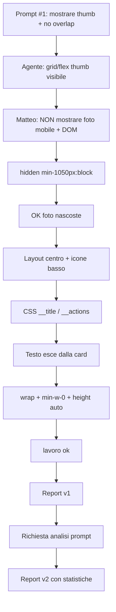

# Report — Card categorie ingredienti (overlay Menu admin) mobile + layout

- **Cosa è cambiato:** nell’overlay **Categorie Menu** (tab Menu → gestione categorie), su telefono le card elenco **non mostrano la foto** Prenota; titolo **centrato** al centro della card, **a capo** se lungo; icone Modifica/Elimina **in basso e centrate**. La card **cresce in altezza** con il testo. Da **1050px** la thumbnail `menu_categories.image_url` torna visibile a sinistra.
- **Cosa resta:** QA visivo Matteo su 375 / 834 / 1280 (solo overlay categorie); commit su «fai report finale».
- **Serve una tua azione:** no per il codice — accettazione «lavoro ok»; eventuale commit quando vuoi chiudere il capitolo.

---

## Contesto sessione

- **Profilo:** Esecuzione · **Modalità:** standard (CSS mirato + `index.css`, nessun LOCK).
- **Turni Matteo:** 5 (prompt iniziale · correzione requisito foto · conferma OK foto nascosta · allineamento centrale · wrap testo · «lavoro ok»).
- **Sub-agent:** nessuno.

## Cosa è stato fatto

1. **`AdminMenuCategoryLabelCard`** (`MenuPricesTab.tsx`): abbandonato flex orizzontale `justify-between` (overlap titolo/azioni su ~375px). Layout a colonne:
   - `.menu-prices-category-label-card__title` — zona centrale flex, titolo centrato;
   - `.menu-prices-category-label-card__actions` — azioni in basso (`margin-top: auto`), centrate.
2. **Foto Prenota:** thumb con `hidden min-[1050px]:block` (non confondere con foto QR in `category_images`).
3. **Testo responsive:** `min-w-0`, `max-width: 100%`, `overflow-wrap: anywhere`, `break-words`; card `height: auto` su mobile (override `menu-card-mobile` solo min-height).
4. **Overlay:** contenitore titolo `pr-4 sm:pr-10` (più spazio card su mobile stretto).
5. **Token:** `MENU_CATEGORY_LABEL_CARD_SHELL_CLASS` in `menuPricesCatalogLayout.ts`; regole BEM in `index.css`.
6. **Doc:** `MENU_ADMIN_CONTEXT.md` §2 allineato al comportamento reale.
7. **`npm run validate`:** **241/241 verde** (ultima esecuzione a fine sessione).

## File toccati (questo task)

| File | Perché |
|------|--------|
| `src/features/booking/components/MenuPricesTab.tsx` | `AdminMenuCategoryLabelCard` + `pr-4 sm:pr-10` overlay |
| `src/features/booking/components/menuPricesCatalogLayout.ts` | `MENU_CATEGORY_LABEL_CARD_SHELL_CLASS` |
| `src/index.css` | `.menu-prices-category-label-card*` + mobile `height: auto` |
| `docs/per-ui-design-skill/MENU_ADMIN_CONTEXT.md` | §2 card categoria admin |
| `docs/SESSION_LOG.md` | riga indice sessione |

**Fuori scope rispettato:** upload/storage `menu_categories.image_url`, card QR (`MenuQrCategoryCardsSection`), `PublicMenuPage`, panoramica ingredienti `CollapsibleCard`, default icone QR.

**Nota workspace:** in working tree compaiono anche diff non di questa sessione (`categoryIcons.ts`, `APP_CONTEXT_SKILL.md`) — **non inclusi** in questo report.

## Effetto per il ristoratore (dove nell’app)

- **Dove:** Admin → tab **Menu** → overlay **Categorie Menu** (pannello con titolo «Categorie Menu», lista card sotto «Nuova categoria ingredienti»).
- **Mobile:** vede solo **nome categoria** (anche su più righe) e pulsanti sotto; **nessuna miniatura** della foto Prenota nella lista (la foto si carica ancora dal form «Foto categoria» in modifica).
- **Desktop largo (≥1050px):** come prima concettualmente: thumb a sinistra se presente + titolo/azioni nel corpo card.
- **Storage:** invariato — `menu_categories.image_url` (path Storage `{tenantId}/booking-cat/{categoryId}.webp`); separato da `menu_homepage_config.category_images` (QR).

## Test automatici

| Comando | Esito |
|---------|--------|
| `npm run validate` | ✅ 31 file, 241 test |

## QA manuale (Matteo)

| Viewport | Cosa controllare | Esito |
|----------|------------------|--------|
| ~375px | No foto in lista; titolo centrato e a capo; icone in basso centrate; no overflow | ✅ OK (feedback sessione) |
| ~834px / ~1280px | Thumb visibile ≥1050px; layout desktop | ⬜ |
| Titolo lungo | Card più alta, testo dentro bordo | ✅ OK (feedback sessione) |

## File di skill aggiornati

| File | Modifica |
|------|----------|
| `docs/per-ui-design-skill/MENU_ADMIN_CONTEXT.md` | §2 layout card + soglia 1050px |

## Dati comunicazione

### Statistiche sessione (sintesi)

| Metrica | Valore |
|---------|--------|
| Messaggi utente totali | **7** (prompt esecuzione · correzione foto · OK foto · layout centro/basso · wrap testo · lavoro ok · richiesta analisi prompt) |
| Messaggi utente “sostanziali” | **5** (esclusi OK brevi e «lavoro ok») |
| Turni agente con modifica codice | **~5** (1° implementazione errata su foto + 4 refinement) |
| Domande agente → Matteo | **0** |
| Correzioni Matteo sul **codice/requisito** | **1** (foto: da «mostrare» a «NON mostrare» su mobile) |
| Correzioni Matteo su **layout/UX** | **2** (allineamento centro/basso; testo che esce) |
| Correzioni Matteo su **report** | **1** (manca analisi flusso prompt — questo aggiornamento) |
| `npm run validate` | **≥4×** OK (241 test) — una per giro significativo |
| Retry validate falliti | **0** |
| Sub-agent / Task tool | **0** |
| File codice toccati (task) | **4** (+ doc SESSION_LOG / MENU_ADMIN) |
| Righe diff stimate (solo task) | **~+130 / −55** (`index.css` + card TSX) |
| Skill caricate (come da prompt #1) | `MENU_ADMIN_CONTEXT` §2, `UI_RESPONSIVE`, `UI_EDIT` |
| QA viewport confermato in chat | **375px** (foto nascosta, wrap OK) — 834/1280 ⬜ |
| Commit | **no** («lavoro ok») |

### Cronologia / prompt di Matteo (annotati)

| # | Verbatim / sintesi | Intento | Esito agente |
|---|-------------------|---------|--------------|
| 1 | Profilo **Esecuzione**, skill UI/menu §2, obiettivo card `AdminMenuCategoryLabelCard` su ~375px: (1) **mostrare** thumb se `image_url`; (2) no overlap titolo/azioni; contesto file/CSS; criterio validate | Fix mobile card overlay categorie | Implementazione grid/flex orientata a **mostrare** foto + separare azioni — **non allineata al bisogno reale** |
| 2 | «non hai capito. la foto **NON** deve essere visualizzata in mobile» + DOM path overlay/card | **Correzione requisito** (nascondere thumb mobile) | `hidden min-[1050px]:block` + doc §2 |
| 3 | «ok ora non le vedo. ottimo.» | Conferma foto | — |
| 4 | Allinea pulsanti e testo al centro; testo in div centrale, icone in div bassa | Layout verticale card | CSS BEM `__title` / `__actions` |
| 5 | Testo non responsive, esce dalle card; deve andare a capo | Wrap + altezza card | `min-w-0`, `overflow-wrap: anywhere`, `height: auto` |
| 6 | «ottimo. lavoro ok» | Report, no commit | Report v1 (senza analisi flusso completa) |
| 7 | «ricorda… analisi flusso prompt… efficienza e statistiche… skill system» | Arricchire report per Meta/revisore | Questa sezione |

### Frasi / termini (conteggio)

| Frase / termine | × |
|-----------------|---|
| «lavoro ok» | 1 |
| «fai report finale» | 0 |
| «non hai capito» / correzione esplicita | 1 |
| DOM path Cursor (`data-cursor-element-id`) | 1 |
| Richiesta analisi prompt / skill system | 1 |
| «ottimo» (conferma parziale) | 2 |

### Voci Liv.2 applicate

Nessuna voce Liv.2 ambigua attivata in questa chat.

### Cosa non è successo in chat

| Assenza | Nota per revisore |
|---------|-------------------|
| Domande di chiarimento agente | Avrebbe potuto chiedere «mostrare o nascondere foto?» prima del diff — **non fatto** |
| «prepara prompt» a monte | Prompt esecuzione diretto in chat |
| Smoke 834/1280 confermato | Solo 375 implicito nei feedback |
| Aggiornamento `VOCABOLARIO.md` | Nessuno |

---

## Analisi flusso prompt, efficienza e statistiche (skill system)

> Sezione per revisore Meta e calibrazione PREPARA_PROMPT / report «lavoro ok». **Non è voto sintetico** — solo dati e lettura agente.

### 1. Flusso di lavoro (diagramma logico)

**Tipo ciclo:** singolo agente · **standard** (CSS + `index.css` mirato, no LOCK/DB).

**Classificazione del primo scarto:** il prompt #1 chiedeva esplicitamente di **mostrare** la thumbnail su mobile; il requisito corretto («**non** mostrare») è arrivato al messaggio #2. Quindi: **~40% del lavoro del primo giro** (layout thumb + grid) è stato **scartato/risritto** — costo principalmente da **cambio requisito in sessione**, non da skill mancante sola.

### 2. Anatomia del prompt #1 (qualità strutturale)

| Blocco presente | Presente | Effetto osservato |
|-----------------|----------|-------------------|
| Profilo + modalità | ✅ | Skill UI caricate, no APP_CONTEXT intero |
| Skill da leggere / esclusioni | ✅ | Scope contenuto su overlay categorie |
| Obiettivo numerato (thumb + overlap) | ✅ | Agente ha eseguito letteralmente punto (1) «mostrare» |
| File / componenti (`AdminMenuCategoryLabelCard`) | ✅ | File giusto |
| Cosa NON fare (storage QR, PublicMenuPage) | ✅ | Nessuna deriva |
| Viewport 375 / 1050 | ✅ | Breakpoint 1050 poi riusato per show/hide thumb |
| Criterio validate | ✅ | 241 test sempre verdi |

**Indice completezza prompt (checklist 10 voci):** **9/10** — manca allineamento prodotto su **visibilità foto mobile** (punto 1 del prompt era in conflitto con il bisogno finale).

**Lacuna critica:** il criterio «mostrare thumbnail su 375px» nel prompt iniziale **contraddice** il comportamento desiderato emerso dopo. Per sessioni future: formulare «**nascondere** foto in lista su &lt;1050px; resta in form modifica» oppure checkbox «mostra anteprima in lista (solo desktop)».

### 3. Efficienza esecuzione

| KPI | Valore | Lettura |
|-----|--------|---------|
| Turni codice fino a «lavoro ok» | **5** | Alto vs feature solo-CSS (benchmark ideale: 1–2) |
| Turni “sprecati” su requisito foto | **~1–1,5** | Primo diff thumb-visible poi invertito |
| Turni refinement UX post-requisito | **2** | Necessari (centro/basso, wrap) |
| Domande / turno | **0** | Bene per velocità; male per rischio malinteso |
| Validate falliti | **0** | Ottimo |
| File fuori scope | **0** | Ottimo |
| Rework report post «lavoro ok» | **1** | Gap processo: analisi prompt non in v1 |

**Rapporto segnale/rumore (messaggi utente):** medio — 5 messaggi sostanziali per ~4 file; **alto** se si conta solo codice finale utile (ultimi 3 messaggi molto densi).

**Costo conversazione (stima):** prompt #1 lungo (~600–900 token) + 4 messaggi correttivi brevi-medio + 5 risposte agente con tool. **Efficienza globale sessione:** **media-bassa** per rework foto; **alta** sui messaggi 4–5 (fix mirati, zero domande).

### 4. Cosa ha sbloccato / ridotto ambiguità (da replicare)

1. **«NON deve»** in maiuscolo + negazione esplicita — dopo il primo malinteso.
2. **DOM path** Cursor su overlay e sulla card — ancora su quale superficie intervenire.
3. **Conferma «ok ora non le vedo»** — gate prima di proseguire su layout.
4. **Messaggi UX atomici** (solo centro/basso; solo wrap) — un problema per turno → patch piccole.
5. **Soglia `min-[1050px]`** — allineata alla griglia già documentata in `MENU_ADMIN_CONTEXT`.

### 5. Cosa ha aumentato ambiguità / costo (da evitare)

1. Prompt #1 che chiede **mostrare** ciò che in produzione si voleva **nascosto**.
2. Agente **non ha chiesto** conferma su visibilità foto nonostante contesto storico («fix testo precedente» nel prompt originale suggeriva già iterazioni).
3. `MENU_ADMIN_CONTEXT` §2 (pre-sessione) descriveva griglia titolo/azioni ma **non** la regola «no thumb mobile in lista».
4. Report «lavoro ok» v1 **senza** questa sezione — rework report (messaggio #7).

### 6. Cosa migliorare (skill system / comunicazione)

| Priorità | Proposta | Destinazione |
|----------|----------|--------------|
| **Alta** | In `MENU_ADMIN_CONTEXT` §2: bullet esplicito **«Lista overlay categorie: su viewport &lt;1050px non mostrare `image_url`; thumb solo desktop»** | `docs/per-ui-design-skill/MENU_ADMIN_CONTEXT.md` |
| **Alta** | Checklist PREPARA_PROMPT / report: se il task tocca foto admin, chiedere **«lista vs form»** e **«mobile sì/no»** | `PREPARA_PROMPT_SKILL.md` |
| **Alta** | Obbligo report: sottosezione **«Analisi flusso prompt…»** su ogni «lavoro ok» standard/deep | `COMUNICAZIONE_UTENTE_SKILL.md` |
| **Media** | Agente: se prompt dice «mostrare X» ma il problema utente era «non si vede», **fermarsi e chiedere** prima del diff | Rule/hook «ambiguità requisito invertito» |
| **Media** | Template messaggio correzione: «NON [verbo] su [viewport] in [schermata]» + DOM (già efficace qui) | `VOCABOLARIO.md` esempio |
| **Bassa** | Unit test visuale non applicabile; checklist QA 375 obbligatoria in report | `TESTING_SKILL.md` §7 |

### 7. Automatizzabile vs manuale

| Attività | Automatizzabile | Motivo |
|----------|-----------------|--------|
| `hidden min-[1050px]:block` su thumb | ✅ grep pattern nel repo | Pattern Tailwind statico |
| Wrap testo flex (`min-w-0`) | ⚠️ semi | Lint/style non copre overflow card |
| Allineamento centro/basso | ❌ manuale | Giudizio UX; DevTools |
| Verifica «no foto» su 375 | ❌ manuale | QA visivo |
| Analisi prompt in report | ⚠️ semi | Agente compila tabelle; revisore usa dati |

### 8. Confronto con sessione “modello” (Menu QR ordine categorie 01-06-26)

| Metrica | Ordine categorie QR | Card categorie mobile (questa) |
|---------|---------------------|--------------------------------|
| Turni codice | 1 | 5 |
| Correzioni requisito | 0 | 1 |
| Domande agente | 0 | 0 |
| Completezza prompt vs esito | 10/10 | 9/10 (punto foto) |
| Validate | 241 OK | 241 OK |

**Lezione:** prompt strutturato **non basta** se un bullet obiettivo è sbagliato; la correzione DOM + «NON» è stata più efficace del prompt iniziale.

### 9. Token / verbosità

- **Prompt #1:** investimento alto ma con **bullet errato** su foto → costo doppio.
- **Messaggi 2–5:** bassi, altissimo ROI — andrebbero nel prompt preparato la prossima volta.
- **Report:** v2 più lungo ma utile per Meta; evitare che Matteo chieda a posteriori.

---

## Lettura qualità (sintesi per revisore)

| Aspetto | Dato |
|---------|------|
| Skill area | Caricate correttamente; **doc §2 aggiornata a posteriori** con regola thumb |
| Efficienza codice | Scope stretto; 5 turni per colpa requisito + 2 UX |
| Comunicazione Matteo | Correzioni chiare e incrementali dopo il flip foto |
| Processo report | v1 incompleto su analisi prompt — **gap noto**, colmato in v2 |

## Chiusura

- **Commit:** nessuno (regola «lavoro ok»).
- **Push:** nessuno.
- **Prossimo passo opzionale:** «fai report finale» → verifica diff + commit solo file di questo report (escludere `categoryIcons` se altro filone).
