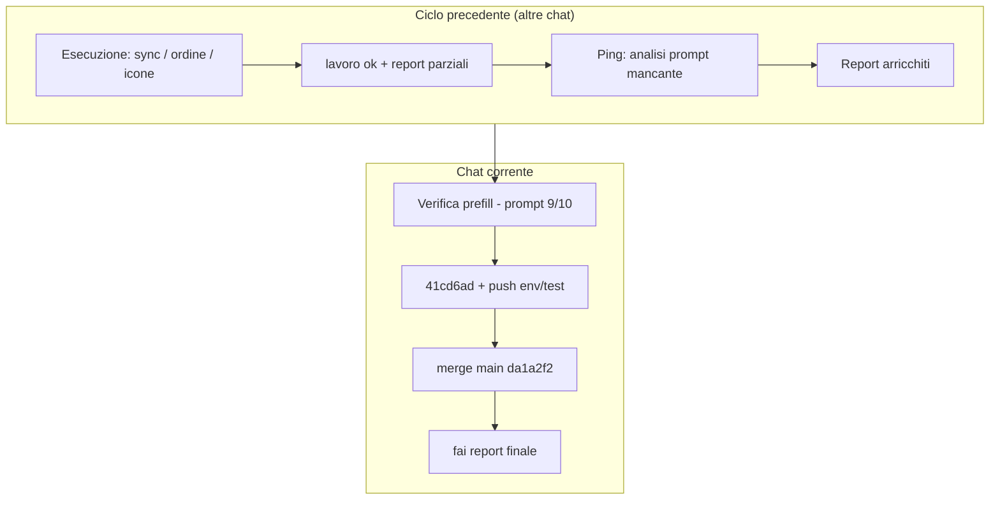

# Report finale — Ciclo Menù QR (01-06-26)

**Data chiusura:** 01-06-26  
**Profilo:** Verifica + chiusura git (questa chat)  
**Stato:** **chiuso** — merge `env/test` → `main` **`da1a2f2`** · push `origin/main` · PROD DB già allineata (migrazione `042`)

- **Cosa vede il ristoratore (riepilogo):** in Admin → Menu: card categorie più leggibili su telefono; rinominare o eliminare una categoria aggiorna anche i QR e la Pagina Prenota (con modale di conferma al rename); nel modale QR puoi ordinare le categorie con frecce e l’ordine si riflette sul menù cliente; le anteprime foto catalogo non restano «sbagliate» se riselezioni la categoria; icona predefinita Insalata; meno icone inutili nel picker.
- **Cosa resta:** QA visivo opzionale prefill stale (non bloccante); deploy frontend da confermare su hosting se non automatico.
- **Serve una tua azione:** no — ciclo codice + git chiuso.

---

## Chiusura git e production

| Step | Esito |
|------|--------|
| Commit prefill stale | `41cd6ad` (+ `f35b924` SESSION_LOG) su `env/test` |
| `npm run validate` post-merge | **263** test OK su `main` |
| Merge `--no-ff` `env/test` → `main` | `da1a2f2` |
| Push `origin/main` | OK |
| Supabase PROD (`rwuxgvld`) | Ultima migrazione `menu_qrcode_categories_icon` (= repo `042`) — **nessuna migrazione nuova** in questo ciclo |
| Deploy app | Dipende da CI su `main` — verificare dashboard hosting |

**Range merge:** `461a364`…`da1a2f2` — **35 file**, ~+2015 / −139 righe (stima da diff).

---

## Commits inclusi nel merge (ordine cronologico inverso)

| Commit | Contenuto |
|--------|-----------|
| `da1a2f2` | merge(env/test): Menù QR sync categorie, ordine, prefill stale, icone |
| `f35b924` | docs SESSION_LOG hash prefill |
| `41cd6ad` | fix prefill anteprima stale `booking-cat` |
| `037decf` | docs SESSION_LOG sync |
| `16b8bbe` | feat sync rename/delete QR + form, card admin mobile, `lucide_salad` |
| `e511ded` | ordine categorie frecce modale + pubblico |
| `576e2dc` | rimozione Lucide Zuppa/Uova |
| + doc/report intermedi | ordine categorie, Lucide, comunicazione |

---

## Funzionalità per schermata (doppio livello)

| Dove nell’app | Effetto ristoratore | Dati principali |
|---------------|---------------------|-----------------|
| Admin → Menu → overlay **Categorie** | Card più compatte su mobile; thumb opzionale solo da schermo largo | UI + `menu_categories` |
| Stesso overlay → **Rinomina** categoria | Modale avviso prima del salva; poi QR e form allineati alla nuova chiave | `menu_qr_codes.category_filter` / `category_images`, `menu_qrcode_categories`, storage `qr/…/cat/` |
| Stesso overlay → **Elimina** categoria | Modale avviso; QR e Personalizza form puliti subito | come sopra + `hidden_category_keys` in config prenota |
| Admin → Menu → **QR** → modale | Frecce ordine card; prefill foto catalogo corretto; icona default Insalata; picker icone senza Zuppa/Uova | `category_filter` (ordine array), `category_images`, `theme_key`, override card |
| Cliente → `/menu/…/qr/…` | Tab e griglia categorie nell’ordine del QR; icone coerenti | lettura `menu_qr_codes` via `supabasePublic` |

---

## File codice toccati nel ciclo (sintesi)

| Area | File chiave |
|------|-------------|
| Sync rename/delete | `syncMenuCategoryKeyRename.ts`, `syncMenuCategoryKeyDelete.ts`, `menuQrCategoryKeySync.ts`, `bookingFormCategoryKeySync.ts`, `MenuPricesTab.tsx`, `useMenuCategories.ts` |
| Ordine QR | `MenuQrModal.tsx`, `MenuHomepageConfigPanel.tsx`, `PublicMenuPage.tsx`, `menuQrAppearance.ts` |
| Prefill foto | `menuQrStorage.ts`, `MenuQrModal.tsx` |
| Icone | `categoryIcons.ts`, picker in `MenuHomepageConfigPanel.tsx` |
| Layout admin | `MenuPricesTab.tsx`, `index.css`, `menuPricesCatalogLayout.ts` |
| Test | +`menuQrCategoryKeySync`, `bookingFormCategoryKeySync`, `menuQrCategoryOrder`, `menuQrStorage`, `useMenuCategories`, `categoryIcons` |

**Non toccato nel ciclo prefill/sync:** `importCatalogCategoryImagesToQrStorage` al Salva (solo esteso helper anteprima).

---

## QA nel ciclo (stato aggregato)

| Feature | Automatico | Manuale Matteo |
|---------|------------|----------------|
| Sync rename/delete | validate + unit | **OK** (SESSION_LOG) |
| Card admin mobile | validate | **OK** 375px |
| Ordine categorie QR | validate + unit | **OK** «test fatti tutto ok» |
| Prefill stale | validate + unit | **⬜** non in browser |
| Icone / rimozione Lucide | validate | ⬜ / parziale |
| Merge main | validate post-merge | deploy ⬜ |

---

## File di skill / doc aggiornati nel ciclo

| File | Perché |
|------|--------|
| `PUBLIC_MENU_DATA_FLOW_CONTEXT.md` | rename/delete, prefill, ordine |
| `PUBLIC_MENU_SKILL.md`, `MENU_ADMIN_CONTEXT.md` | allineamento modale QR |
| `BOOKING_DATA_FLOW_SKILL.md` | sync form prenota |
| `COMUNICAZIONE_UTENTE_SKILL.md` | § analisi prompt obbligatoria |
| `SESSION_LOG.md` | indice sessioni |
| Report in `docs/Sessioni di lavoro/01-06-26/` | ordine, Lucide, prefill, **questo finale** |

---

## Dati comunicazione — chat di chiusura (questa conversazione)

### Statistiche sessione (chat corrente)

| Metrica | Valore |
|---------|--------|
| Messaggi utente totali | **3** |
| Messaggi utente sostanziali | **3** (Verifica prefill · merge main · fai report finale) |
| Turni agente (risposte complete) | **3** |
| Domande agente → Matteo | **0** |
| Correzioni Matteo sul codice | **0** |
| Correzioni su report/comunicazione | **0** (richiesta analisi inclusa nel 3º messaggio, non correzione) |
| `npm run validate` | **2×** OK (pre-merge su `env/test`, post-merge su `main`) — 263 test |
| Commit eseguiti dall’agente | `41cd6ad`, `f35b924` (prefill); merge `da1a2f2` su `main` |
| Sub-agent / Task tool | **0** |
| Browser QA manuale | **0** (Verifica si è fermata a Vitest + review) |

### Cronologia / prompt di Matteo (annotati)

| # | Verbatim / sintesi | Intento | Esito agente |
|---|-------------------|---------|--------------|
| 1 | **Profilo Verifica**, skill TESTING §7 + PUBLIC_MENU §2, contesto commit 16b8bbe/037decf, obiettivo prefill stale, **6 criteri**, file elenco, tabella QA, edge tenantId, commit+push se OK escl. immagini prova | Revisione implementazione working tree | OK: review + validate + commit `41cd6ad` + push `env/test`; QA UI ⬜ dichiarato |
| 2 | **«fai merge con main e allinea production se serve»** | Pubblicare ciclo + DB prod | OK: merge `--no-ff` `da1a2f2`, validate, push `main`; PROD già a `042` — nessun apply |
| 3 | **«fai report finale»** + analisi flusso prompt, efficienza, statistiche, osservazioni chat | Chiusura capitolo + dati revisore | Questo report + OSSERVAZIONI + commit doc |

### Cosa non è successo in chat (questa conversazione)

| Assenza | Nota |
|---------|------|
| «lavoro ok» intermedio | Chiusura diretta con Verifica → merge → report finale |
| «prepara prompt» | Prompt Verifica nativo in chat |
| QA manuale browser §7.2 | Solo tabella compilata con ⬜ / Vitest |
| Correzione codice post-review | Nessuna |
| Migrazione PROD | Non necessaria |
| Liv.2 ambigui | Nessuno |

### Frasi / termini (conteggio — chat corrente)

| Frase | × |
|-------|---|
| Profilo **Verifica** esplicito | 1 |
| «fai merge con main» | 1 |
| «fai report finale» | 1 |
| Richiesta **analisi flusso prompt** / skill system | 1 |
| «test fatti tutto ok» | 0 (in questa chat) |

### Voci Liv.2 applicate

Nessuna voce Liv.2 ambigua in questa chat.

---

## Analisi flusso prompt, efficienza e statistiche (skill system)

> Dati per revisore Meta — **non voto sintetico**. Include ciclo 01-06-26 Menù QR e focus su **questa chat**.

### 1. Flusso di lavoro (diagramma)

**Tipo ciclo aggregato:** multi-sessione · profili **Esecuzione** (maggior parte) + **Verifica** (prefill) + **chiusura git** (merge/report).

### 2. Anatomia prompt Verifica prefill (#1 chat corrente)

| Blocco | ✓ | Effetto |
|--------|---|--------|
| Profilo + modalità | ✅ | TESTING §7 caricato — QA tabella richiesta |
| Skill puntuali / no APP_CONTEXT intero | ✅ | Contesto snello |
| Contesto commit precedenti | ✅ | Evita confusione con 16b8bbe |
| Criteri accettazione numerati | ✅ | Checklist verificabile in 5 min |
| File espliciti | ✅ | Zero file errati |
| Edge case (`tenantId` null) | ✅ | Documentato in report |
| Istruzioni commit (messaggio, esclusioni) | ✅ | Eseguito fedelmente |
| Tabella QA manuale | ✅ | Struttura ok; esecuzione browser assente |

**Indice completezza:** **9/10** — modello per task **Verifica** su diff già pronto.

### 3. KPI efficienza (ciclo + chat)

| KPI | Chat corrente | Ciclo 01-06-26 Menu QR (stima) |
|-----|---------------|-------------------------------|
| Turni codice per feature | 1 (solo review) | 1–2 per feature (sync rename+delete in 1 commit) |
| Domande / feature | 0 | Basso; eccezione toast→modale rename (sync) |
| Validate falliti prima verde | 0 | 0 noti |
| Rework report post-OK | 0 | **2–3** sessioni con ping «analisi prompt» |
| Rework codice post-OK | 0 | 0 su prefill |
| Ping-pong utente | Basso | Prompt lunghi → poche correzioni |

**Rapporto segnale/rumore:** **alto** su Verifica e su Esecuzione con prompt checklist (ordine categorie, insalata). **Costo ricorrente:** 1 messaggio extra di Matteo per § analisi prompt quando «lavoro ok» non l’ha inclusa.

### 4. Cosa replicare (comunicazione + PREPARA_PROMPT)

1. **Verifica:** profilo + file + criteri N + «se OK commit con messaggio X» + esclusioni git.
2. **Esecuzione:** anti-scope esplicito (checkbox, Prenota, migrazioni) per Menu QR.
3. **Un campo DB = una behavior** (`category_filter` ordine, `category_images` URL).
4. **Pattern UI nel codebase** («come carosello QR») invece di ridisegnare.
5. **Chiusura:** merge main + check PROD migrations in un solo messaggio funziona bene.

### 5. Cosa migliorare (proposte → revisore)

| Priorità | Proposta | Destinazione |
|----------|----------|--------------|
| Alta | Hook/checklist: su «lavoro ok»/«fai report finale» **verificare presenza** sottosezione «Analisi flusso prompt…» prima di inviare | `COMUNICAZIONE` / hook `stop` |
| Alta | Su **Verifica** §7.2: dichiarare in prompt se Vitest basta o serve browser MCP | TESTING_SKILL §7 + template Verifica |
| Media | Template «report finale ciclo» quando merge multi-commit (questo file) | APP_CONTEXT §7.1 |
| Media | Allineare SESSION_LOG ↔ file report **prima** del commit (prefill link esisteva senza file fino a ora) | Procedura agente |
| Bassa | Dopo merge main, riga SESSION_LOG unica «ciclo chiuso» con hash merge | SESSION_LOG |

### 6. Automatizzabile vs manuale

| Azione | Auto? | Motivo |
|--------|-------|--------|
| `npm run validate` pre-commit | Sì | Già standard |
| Check migrazioni PROD vs repo | Semi | MCP `list_migrations` — fatto in merge |
| QA viewport modale QR | No | Serve occhio umano o Playwright dedicato |
| § Analisi prompt nel report | Semi | Regola esiste; agenti dimenticano → nudge |
| Merge env/test→main | No | Matteo decide timing |

### 7. Lettura qualità agente (osservazioni su questa chat)

**Punti di forza**

- Prompt Verifica rispettato al 100%: nessuna modifica fuori scope, commit message come suggerito, immagini prova escluse.
- Merge e production check **proattivi** (conferma PROD = 042, nessun apply inutile).
- Onestà su QA manuale ⬜ invece di segnare OK fittizio.

**Punti deboli / rischi**

- **QA §7.2 non eseguito** nonostante tabella nel prompt Verifica — coerente con «Vitest sufficiente» ma va esplicitato nel prompt o accettato come policy.
- Report prefill referenziato in SESSION_LOG **senza file** fino a questo report finale — rischio navigazione revisore.
- Terzo messaggio chiede di nuovo analisi prompt: **pattern ricorrente** del ciclo (non colpa solo di questa chat).

**Contraddizione utile per revisore:** sessioni precedenti chiedevano «non gonfiare report dopo test ok»; qui Matteo chiede **più** materiale (analisi prompt). Distinzione: **dati processo sì**, **riscrittura tecnica post-OK no**.

**Efficienza complessiva ciclo:** alta sul codice; **costo comunicazione** ~1 ping/report per feature su analisi prompt — target del motore Liv.2/nudge.

---

## Derivazione errori

Nessun errore funzionale emerso in questa chat. Unico gap processuale: file report prefill mancante fino alla chiusura.

---

## Riferimenti report parziali

| Sessione | Report |
|----------|--------|
| Ordine categorie | `Report-menu-qr-ordine-categorie-01-06-26.md` |
| Lucide / follow-up | `Report-menu-qr-lucide-icone-01-06-26.md`, `Report-follow-up-rimozione-lucide-soup-uova-01-06-26.md` |
| Prefill stale | `Report-menu-qr-prefill-stale-booking-cat-01-06-26.md` |
| Sync rename (se presente in cartella) | report sync dedicato |

---

*Chiusura «fai report finale» — 01-06-26. Merge `da1a2f2` su `origin/main`.*
