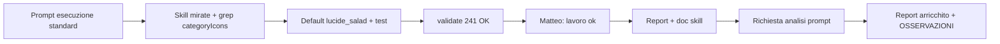

# Report — Menù QR: default icona categoria Insalata (01-06-26)

- **Area:** Menu QR pubblico + modale admin (`PUBLIC_MENU_SKILL`, `MENU_ADMIN_CONTEXT` §8).
- **Cosa è cambiato:** fallback universale categorie **senza foto QR** e **senza icona valida** da `fork_knife` (Phosphor) a **`lucide_salad`** (Insalata — Lucide), centralizzato in `MENU_QR_DEFAULT_CATEGORY_ICON_KEY`.
- **Validate:** `npm run validate` — **241** test verdi.
- **Commit:** non eseguito (chiusura «lavoro ok»).

---

## Contesto

- **Profilo:** Esecuzione · **modalità:** standard.
- **Skill:** `PUBLIC_MENU_SKILL.md`, `MENU_ADMIN_CONTEXT.md` §8, `UI_EDIT_SKILL.md` (lettura; nessuna modifica layout).
- **Vincoli:** FU-023 (un solo default); nessuna migrazione DB; mapping `MENU_QR_CATEGORY_ICON_BY_CATEGORY_KEY` invariato; `REMOVED_LUCIDE_ICON_FALLBACK` invariato (`lucide_egg_fried` → `fork_knife`).

## Cosa è stato fatto

1. `MENU_QR_DEFAULT_CATEGORY_ICON_KEY = 'lucide_salad'` in `categoryIcons.ts`.
2. Test `categoryIcons.test.ts`: categoria sconosciuta → `lucide_salad`; assert su costante; fallback legacy `lucide_egg_fried` resta `fork_knife`.
3. Funzione deprecata `resolveMenuQrCategoryIcon`: se risoluzione Lucide, ritorna glyph Phosphor `fork_knife` (API legacy non usata altrove).
4. Admin (`MenuQrModal`, `MenuQrCategoryCardsSection`, `buildCategoryOverrideDrafts`) e pubblico (`PublicMenuPage`, `MenuQrCategoryIconGlyph`) già legati alla costante — nessun altro file codice.

## File toccati

| File | Modifica |
|------|----------|
| `src/features/public-menu/categoryIcons.ts` | Default `lucide_salad`; fix deprecata |
| `src/features/public-menu/__tests__/categoryIcons.test.ts` | Expect default Insalata |
| `docs/per-ui-design-skill/PUBLIC_MENU_SKILL.md` | § Icone + RULE §9 |
| `docs/per-ui-design-skill/MENU_ADMIN_CONTEXT.md` | §8 default + picker 20 icone |
| `docs/SESSION_LOG.md` | Riga sessione |
| `docs/Sessioni di lavoro/01-06-26/Report-menu-qr-default-icona-insalata-01-06-26.md` | Questo report |

## Effetto per il ristoratore

| Dove | Prima | Dopo |
|------|-------|------|
| **Menu → I miei QR → Crea/Modifica** — card categoria senza foto caricata | Posate (Phosphor) se categoria non mappata | **Insalata** preselezionata nel picker; stesso glyph nel placeholder «Carica» |
| **Pagina cliente** `/menu/:slug/qr/:shortCode` — tab categorie e card senza `category_images` | Posate | **Insalata** |
| Categorie con mapping (es. pizza, primi) | Invariato | Invariato |
| QR già salvati con `fork_knife` in DB | Restano posate finché non risalvi | Invariato (nessuna migrazione) |

**Storage:** `menu_qrcode_categories.icon` (testo per singolo QR, migrazione 042). Il default entra solo in **nuovi draft** e categorie senza valore icona valido al salvataggio/prefill.

## Test

`npm run validate` — lint + typecheck + **241/241** test.

**QA manuale Matteo:** ⬜ modale QR categoria sconosciuta senza foto; ⬜ stesso QR su mobile 375.

## Dati comunicazione

### Statistiche sessione (sintesi)

| Metrica | Valore |
|---------|--------|
| Messaggi utente totali | **3** (prompt esecuzione · «lavoro ok» · richiesta analisi flusso prompt) |
| Messaggi utente “sostanziali” | **1** (prompt esecuzione strutturato) |
| Turni agente (risposte complete) | **2** (esecuzione + chiusura «lavoro ok») + **1** (arricchimento report) |
| Domande agente → Matteo | **0** |
| Correzioni Matteo sul codice | **0** |
| Correzioni Matteo su report/comunicazione | **1** (mancava § Analisi flusso prompt al primo «lavoro ok») |
| `npm run validate` | **1×** OK esecuzione (**241** test); non rieseguito in chiusura |
| Retry implementazione | **0** |
| Sub-agent / Task tool | **0** |
| File codice toccati | **2** |
| Righe diff codice (stima) | ~**+8** / **−6** |
| Skill area caricate (come da prompt) | **3** indicate (`PUBLIC_MENU`, `MENU_ADMIN` §8, `UI_EDIT`) — no APP_CONTEXT intero |
| Commit | **no** |

### Cronologia / prompt di Matteo (annotati)

| # | Verbatim / sintesi | Intento | Esito agente |
|---|-------------------|---------|--------------|
| 1 | Profilo **Esecuzione** standard; skill elencate + **Non caricare** APP_CONTEXT intero; obiettivo default `lucide_salad`; **3 superfici** (admin modale, pubblico, draft); implementazione in `categoryIcons.ts` + test; vincoli FU-023, no migrazione, no `AdminMenuCategoryLabelCard`; cosa NON fare (picker, REMOVED_LUCIDE); criterio di fatto `validate`; chiusura doc a «lavoro ok» | Cambio default centralizzato admin+pubblico | Implementazione + validate **241** al primo giro |
| 2 | **«lavoro ok»** | Accettazione + report + skill doc | Report tecnico + SESSION_LOG + skill; **senza** § analisi flusso prompt |
| 3 | **«ricorda di mettere un analisi del flusso di lavoro dei prompt… efficienza e statistiche… skill system»** | Dati per revisore Meta / calibrazione comunicazione | Questa sezione + OSSERVAZIONI |

### Frasi / termini (conteggio)

| Frase / termine | × |
|-----------------|---|
| «lavoro ok» | 1 |
| «fai report finale» | 0 |
| «test fatti tutto ok» | 0 |
| «spiegamelo semplice» | 0 |
| Richiesta esplicita dati per skill system | **1** |

### Voci Liv.2 applicate

Nessuna voce Liv.2 ambigua attivata in questa chat.

---

## Analisi flusso prompt, efficienza e statistiche (skill system)

> Sezione per revisore Meta e calibrazione PREPARA_PROMPT / report §7. **Non è voto sintetico** — solo dati e lettura agente.

### 1. Flusso di lavoro (diagramma logico)

**Tipo ciclo:** singolo agente · **standard** (task piccolo, cross admin+pubblico, zero DB).

### 2. Anatomia del prompt #1 (qualità strutturale)

| Blocco presente | Presente | Effetto osservato |
|-----------------|----------|-------------------|
| Profilo + modalità | ✅ | Esecuzione; no Testing-Skill |
| Skill da leggere / **non caricare** | ✅ | APP_CONTEXT intero escluso → meno rumore |
| Obiettivo (icona + schermate) | ✅ | Insalata vs posate; admin + cliente |
| **Superfici numerate (3)** | ✅ | Verifica grep consumer senza toccare file extra |
| File + costante + helper | ✅ | Solo `categoryIcons.ts` + test |
| Vincolo FU-023 (default unico) | ✅ | Nessun `lucide_salad` sparso nel repo |
| Cosa **NON** fare (4 voci) | ✅ | Picker, REMOVED_LUCIDE, migrazione, Prenota card |
| Mapping invariato | ✅ | `pizza` → `pizza_slice` non toccato |
| Criterio di fatto (`validate`) | ✅ | Gate oggettivo |
| Chiusura doc («lavoro ok») | ✅ | Skill + SESSION_LOG eseguiti |

**Indice completezza prompt (checklist 10/10):** **10/10** — stesso profilo del report [ordine categorie](Report-menu-qr-ordine-categorie-01-06-26.md): feature Menu QR “una leva, molti consumer”.

**Lacune del prompt (non bloccanti):** nessuna. Opzionale: citare esplicitamente «includi § Analisi flusso prompt nel report» finché la regola COMUNICAZIONE non è automatica al 100%.

### 3. Efficienza esecuzione

| KPI | Valore | Benchmark interno (01-06-26 Menu QR) |
|-----|--------|--------------------------------------|
| Turni codice per task chiuso | **1** | Allineato a ordine categorie / rimozione Lucide |
| Domande / turno | **0** | Ottimo |
| Validate falliti prima del verde | **0** | Ottimo |
| File fuori scope toccati | **0** | Ottimo |
| Rework codice dopo «lavoro ok» | **0** | Ottimo |
| Rework report dopo «lavoro ok» | **1** | Gap ricorrente: § analisi prompt assente al primo report |

**Costo conversazione:** 1 prompt lungo strutturato → 1 risposta agente con tool → «lavoro ok» → ping analisi. **Rapporto segnale/rumore:** alto sul codice; **medio** sul processo report (secondo messaggio correttivo).

**ROI architetturale:** investimento precedente (consumer già su `MENU_QR_DEFAULT_CATEGORY_ICON_KEY` + `MenuQrCategoryIconGlyph`) ha reso questo task **O(1)** — solo costante + test + doc.

### 4. Cosa ha ridotto ambiguità (da replicare)

1. **Superfici esplicite** (modale, pubblico, draft) — l’agente non cerca altri entry point.
2. **Divieto hardcode** fuori `categoryIcons.ts` — grep di verifica immediata.
3. **Eccezione documentata** su `REMOVED_LUCIDE_ICON_FALLBACK` — evita “sistemare” `lucide_egg_fried` al nuovo default.
4. **Nessuna migrazione DB** — zero rischio ambiente.
5. **Criterio di fatto** con `npm run validate` — chiusura binaria.

### 5. Cosa migliorare (skill system / comunicazione)

| Priorità | Proposta | Destinazione |
|----------|----------|--------------|
| Alta | § **Analisi flusso prompt** obbligatoria già al **primo** «lavoro ok» (non solo dopo ping) | `COMUNICAZIONE_UTENTE_SKILL.md` — già segnalato 01-06 ordine categorie |
| Alta | Template report: copiare blocchi §1–§7 da sessione ordine categorie / questo file | `docs/Sessioni di lavoro/_template-report-standard.md` (se assente: creare) |
| Media | In prompt esecuzione standard: riga «Report: includi Analisi flusso prompt §» | Handoff PREPARA_PROMPT |
| Bassa | Nudge hook: report senza stringa `Analisi flusso prompt` → remind | `.cursor/hooks/` |
| Info | **Pattern prompt riusabile:** “cambia costante FU-023 + elenca consumer + cosa NON toccare” per tweak visivi Menu QR | `PUBLIC_MENU_SKILL.md` § note agente |

### 6. Automatizzabile vs manuale

| Attività | Automatizzabile | Motivo |
|----------|-----------------|--------|
| Default `resolveMenuQrCategoryIconKey` | ✅ (fatto: unit test) | Logica pura |
| Picker preselezionato Insalata | ❌ manuale | UI modale; QA 375 |
| Glyph su tab/card pubblico | ❌ manuale | QA viewport |
| Analisi prompt in report | ⚠️ semi | Tabelle da agente; revisore non deve rileggere chat |
| Allineamento skill post-task | ⚠️ semi | Checklist §7.2 area |

### 7. Token / verbosità

- **Prompt utente:** alto dettaglio upfront → **zero** domande — efficiente.
- **Risposta agente esecuzione:** proporzionata al task (piccolo diff).
- **Report primo «lavoro ok»:** tecnico ok, **mancava** blocco statistico/analisi — stesso gap della sessione ordine categorie → dato per Meta: regola esiste ma **aderenza ~50%** senza ping.
- **Questo aggiornamento:** recupera dati per revisore senza riscrivere il diff tecnico.

### 8. Confronto sessioni correlate (01-06-26)

| Sessione | Completezza prompt | Turni codice | Gap report |
|--------|-------------------|--------------|------------|
| Ordine categorie | 10/10 | 1 | Analisi prompt dopo ping |
| **Default Insalata** | **10/10** | **1** | **Analisi prompt dopo ping** |
| Rimozione soup/uova | ~8/10 (follow-up) | 1 | — |
| +10 Lucide | ~9/10 | 1+ | — |

**Segnale:** prompt Menu QR strutturati di Matteo sono **maturi**; il collo di bottiglia è **chiusura report** (sezione analisi), non esecuzione codice.

---

## Revisione report («lavoro ok»)

| Check | Esito |
|-------|--------|
| `MENU_QR_DEFAULT_CATEGORY_ICON_KEY === 'lucide_salad'` | ✅ |
| `resolveMenuQrCategoryIconKey(null, 'categoria_xyz')` → `lucide_salad` | ✅ test |
| Mapping `pizza` → `pizza_slice` invariato | ✅ test |
| `lucide_egg_fried` → `fork_knife` (rimosso picker) | ✅ test |
| Nessun `lucide_salad` hardcodato fuori `categoryIcons.ts` | ✅ grep |
| `PUBLIC_MENU_SKILL` + `MENU_ADMIN_CONTEXT` §8 | ✅ |
| `npm run validate` | ✅ 241 |

## Stato

- Codice + docs: **pronti**, non committati.
- Prossimo passo opzionale: QA visivo admin + pubblico; poi «fai report finale» se commit desiderato.
