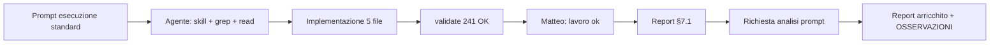

# Report — Menù QR: ordine categorie (admin + pubblico)

**Data:** 01-06-26  
**Profilo:** Esecuzione · **Modalità:** standard  
**Stato:** chiuso («fai report finale») — commit su `env/test` (vedi sotto)

- **Cosa è cambiato:** nel modale Menù QR puoi riordinare le categorie attive con frecce Su/Giù (solo card «Titoli e descrizioni categorie», non i checkbox); sul telefono del cliente tab e griglia card seguono lo stesso ordine dopo Salva.
- **Cosa resta:** niente per questo task.
- **Serve una tua azione:** no — **QA manuale Matteo OK** (01-06-26, «test fatti tutto ok»).

---

## Cosa è stato fatto (cronologico)

1. Letti skill di contesto: `APP_CONTEXT_SKILL` (§0, §1b, §7), `PUBLIC_MENU_SKILL`, `PUBLIC_MENU_LAYOUT_CONTEXT`, sezione Menu QR di `MENU_ADMIN_CONTEXT`.
2. **Admin — `MenuQrModal.tsx`**
   - `categoryFilter` trattato come lista **ordinata** (sorgente di verità per ordine card e salvataggio).
   - `selectedCategories` derivate con `categoryFilter.map(key → categoria)` invece di filtrare il catalogo per `sort_order`.
   - `moveCategoryInFilter` scambia chiavi adiacenti nell’array.
   - `serializeMenuQrDraft`: rimosso `.sort()` su `categoryFilter` così il riordino segna correttamente «modifiche non salvate».
3. **Admin — `MenuQrCategoryCardsSection`** (`MenuHomepageConfigPanel.tsx`)
   - Frecce `ChevronUp` / `ChevronDown` su ogni card (disabilitate su primo/ultimo), `aria-label` «Sposta su» / «Sposta giù» — stesso pattern carosello QR e `BookingFormCarouselEditor`.
   - Checkbox «Categorie visibili» in alto **non** toccati (solo attiva/disattiva; nuova categoria in **coda**).
4. **Pubblico — `PublicMenuPage.tsx` + `menuQrAppearance.ts`**
   - `orderMenuCategoriesByFilter`: dopo fetch, riordina per indice in `category_filter`.
   - Legacy `category_filter === null`: nessun riordino post-fetch → resta `sort_order` catalogo fino al primo salvataggio con array esplicito.
5. **Test** — `menuQrCategoryOrder.test.ts` (4 casi); `npm run validate` OK (241 test).

---

## File toccati (effetto per il ristoratore)

| File | Effetto |
|------|---------|
| `MenuQrModal.tsx` | Modale **Impostazioni → I miei QR**: l’ordine delle card «Titoli e descrizioni categorie» è quello che salvi; il confronto bozza/base non ignora più il riordino. |
| `MenuHomepageConfigPanel.tsx` | Frecce Su/Giù su ogni card categoria nel modale. |
| `menuQrAppearance.ts` | Logica condivisa ordine pubblico da `category_filter`. |
| `PublicMenuPage.tsx` | Pagina Menu QR cliente: **barra tab** e **griglia card** nello stesso ordine del QR. |
| `menuQrCategoryOrder.test.ts` | Test automatici sull’ordinamento. |

**Storage:** tabella `menu_qr_codes`, colonna `category_filter` (`text[]`) — **l’ordine degli elementi nell’array è l’ordine visualizzato**. Nessuna migrazione; `menu_categories.sort_order` invariato.

**Fuori scope (rispettato):** frecce sui checkbox categorie; drag & drop; Pagina Prenota; migrazioni DB.

---

## Domande e risposte

Nessuna domanda in chat: prompt iniziale già completo (scope, file, legacy, smoke, cosa non fare).

---

## Test eseguiti

| Comando | Esito |
|---------|--------|
| `npm run validate` (lint + typecheck + vitest) | **OK** — 31 file, **241** test (inclusi 4 nuovi `menuQrCategoryOrder`) |

**QA manuale Matteo:** ✅ «test fatti tutto ok» — smoke Menu QR (tab + griglia dopo Salva, ordine frecce).

---

## File di skill aggiornati

| file | modifica (breve) | perché |
|------|------------------|--------|
| `docs/per-ui-design-skill/PUBLIC_MENU_SKILL.md` | §3 `category_filter` + §7 modale: ordine array, frecce card | §7.2 — toccati `MenuQrModal` / pagina pubblica |
| `docs/SESSION_LOG.md` | riga indice sessione | §7.1 |
| `docs/Sessioni di lavoro/01-06-26/Report-menu-qr-ordine-categorie-01-06-26.md` | report + § Analisi flusso prompt | §7.1 standard |
| `docs/COMUNICAZIONE_UTENTE_SKILL.md` | sottosezione obbligatoria analisi prompt | richiesta Matteo + §7.2 comunicazione |
| `docs/APP_CONTEXT_SKILL.md` | puntatore in §7.1 report | allineamento chiusura report |
| `docs/Comunicazione-Skill/OSSERVAZIONI.md` | riga sessione ordine categorie | protocollo «lavoro ok» |

*Aggiornamento post «lavoro ok»: righe COMUNICAZIONE / APP_CONTEXT / OSSERVAZIONI + arricchimento report.*

---

## Dati comunicazione

### Statistiche sessione (sintesi)

| Metrica | Valore |
|---------|--------|
| Messaggi utente totali | 5 (ciclo: prepara prompt · conferma checkbox · esecutore finito · report finale · test ok + nota skill) |
| Messaggi utente “sostanziali” | 2 (prompt esecuzione + prepara) (+ chiusura/meta) |
| Turni agente (risposte complete) | 2 esecuzione + 1 aggiornamento report |
| Domande agente → Matteo | **0** |
| Correzioni Matteo sul codice | **0** |
| Correzioni Matteo su report/comunicazione | **1** (manca analisi flusso prompt — questo aggiornamento) |
| `npm run validate` | 1× OK esecuzione (241 test); 1× OK chiusura report finale |
| Retry implementazione | **0** |
| Sub-agent / Task tool | **0** |
| File codice toccati | 5 (+ 1 test nuovo) |
| Righe diff codice (stima) | ~+78 / −6 |
| Skill area caricate (come da prompt) | 4 indicate + §7 APP_CONTEXT |
| Commit (post «fai report finale») | sì — vedi § Chiusura |

### Cronologia / prompt di Matteo (annotati)

| # | Verbatim / sintesi | Intento | Esito agente |
|---|-------------------|---------|--------------|
| 1 | Profilo **Esecuzione**, modalità **standard**, skill elencate (con esclusioni), regola «solo alzare modalità», obiettivo frecce Su/Giù su card categorie QR, contesto file/DB, 4 step implementazione, fuori scope checkbox, anti-pattern (no DnD, no migrazioni, no Prenota), smoke `/menu/...`, criterio di fatto | Feature completa admin+pubblico in un turno | Implementazione + validate verde al primo giro |
| 2 | **«lavoro ok»** | Accettazione + report completo, no commit | Report §7.1 scritto; skill PUBLIC_MENU + SESSION_LOG; sezione comunicazione **senza** ancora analisi flusso dettagliata |
| 3 | **«ricorda di mettere un analisi del flusso di lavoro dei prompt… efficienza e statistiche… skill system»** | Arricchire report per revisore Meta | Sezione «Analisi flusso prompt» + OSSERVAZIONI/PROPOSTE |
| 4 | **«test fatti tutto ok»** + nota: agenti spesso aggiungono dettagli come se report fosse approssimativo | Conferma QA; regola skill system | Solo QA ✅ + annotazione processo (no riscrittura tecnica) |

### Cosa non è successo in chat

| Assenza | Nota per revisore |
|---------|-------------------|
| Domande di chiarimento | Prompt già delimitato (file, legacy, anti-scope) |
| «prepara prompt» a monte | Prompt esecuzione nativo in chat (no ciclo prepare→exec) |
| Smoke manuale confermato | ✅ Matteo «test fatti tutto ok» (01-06-26) |
| Correzione codice post-consegna | Nessuna |
| Aggiornamento VOCABOLARIO | Nessuno |
| Liv.2 espliciti nel prompt | Nessuna voce ambigua attivata |

### Frasi / termini (conteggio)

| Frase / termine | × |
|-----------------|---|
| «lavoro ok» | 1 |
| «fai report finale» | 1 |
| «test fatti tutto ok» | 1 |
| «spiegamelo semplice» | 0 |
| Richiesta esplicita dati per skill system | 1 |

### Voci Liv.2 applicate

Nessuna voce Liv.2 ambigua attivata in questa chat.

---

## Analisi flusso prompt, efficienza e statistiche (skill system)

> Sezione per revisore Meta e calibrazione PREPARA_PROMPT / report §7. **Non è voto sintetico** — solo dati e lettura agente.

### 1. Flusso di lavoro (diagramma logico)

**Tipo ciclo:** singolo agente · **standard** (non light: report dedicato; non deep: no DB/migrazioni/LOCK).

### 2. Anatomia del prompt #1 (qualità strutturale)

| Blocco presente | Presente | Effetto osservato |
|-----------------|----------|-------------------|
| Profilo + modalità | ✅ | Caricamento skill mirato, no Testing-Skill |
| Skill da leggere / non caricare | ✅ | Zero deriva su ADMIN_CLASSIC / BOOKING_DATA_FLOW |
| Obiettivo utente (schermata) | ✅ | Scope chiaro: card categorie, non checkbox |
| File / componenti nominati | ✅ | 6 riferimenti → nessun file sbagliato |
| Pattern esistente citato | ✅ | Carosello QR + `BookingFormCarouselEditor` → UI coerente |
| Persistenza dati (`category_filter`) | ✅ | Nessuna migrazione tentata |
| Comportamento legacy | ✅ | `null` vs array esplicito documentato |
| Anti-scope (5 voci) | ✅ | Checkbox, DnD, sort_order catalogo, Prenota esclusi |
| Smoke URL esplicito | ✅ | `/menu/...` non `/prenota/` |
| Criterio di fatto | ✅ | validate + report §7 |

**Indice completezza prompt (checklist 10/10):** **10/10** — modello riusabile per feature Menu QR “piccola ma cross admin+pubblico”.

**Lacune del prompt (non bloccanti):** nessuna; opzionale avrebbe potuto indicare «non aggiornare MENU_ADMIN_CONTEXT se solo PUBLIC_MENU basta» (§7.2 ha coperto PUBLIC_MENU).

### 3. Efficienza esecuzione

| KPI | Valore | Benchmark interno (sessioni 01-06-26 Menu QR) |
|-----|--------|-----------------------------------------------|
| Turni codice per feature chiusa | **1** | Allineato a «12 icone» / Lucide (1 turno) |
| Domande / turno | **0** | Ottimo |
| Validate falliti prima del verde | **0** | Ottimo |
| File fuori scope toccati | **0** | Ottimo |
| Rework codice dopo «lavoro ok» | **0** | Ottimo |
| Rework report dopo «lavoro ok» | **1** | Gap: mancava sottosezione analisi prompt (regola COMUNICAZIONE già presente ma non applicata al 100%) |

**Costo conversazione (ordine di grandezza):** 1 prompt lungo strutturato (~800–1200 token utente stimati) → 1 risposta agente con tool batch → 2 messaggi utente brevi. **Rapporto segnale/rumore:** alto (poco ping-pong).

### 4. Cosa ha ridotto ambiguità (da replicare)

1. **Riferimento pattern esistente** nel codebase (frecce + `aria-label`) invece di descrivere UI da zero.
2. **Fuori scope esplicito** sui checkbox — evita il bug classico “frecce ovunque”.
3. **Un solo campo DB** come ordine (`category_filter`) — niente migrazione.
4. **Regola dirty state** (`serializeMenuQrDraft` senza `.sort()`) — dettaglio che spesso si dimentica.
5. **Separazione admin vs pubblico** in step numerati.

### 5. Cosa migliorare (skill system / comunicazione)

| Priorità | Proposta | Destinazione suggerita |
|----------|----------|------------------------|
| Alta | Rendere **obbligatoria** nel report la sottosezione «Analisi flusso prompt…» su ogni «lavoro ok» standard/deep | `COMUNICAZIONE_UTENTE_SKILL.md` § Dati comunicazione |
| Alta | Su **«test fatti tutto ok»**: aggiornare solo QA/cappello; **vietato** gonfiare report retroattivo | `PROPOSTE.md` 01-06-26 — attesa ok Matteo |
| Media | Template **PREPARA_PROMPT** per feature Menu QR: ripetere checklist 10 voci del §2 sopra | `PREPARA_PROMPT_SKILL.md` o handoff tipo ciclo 30-05-26 |
| Bassa | Hook/nudge fine sessione: se report senza «Analisi flusso prompt» → remind | `.cursor/hooks/` (come nudge Dati comunicazione) |
| Bassa | Voce Liv.1: «ricorda analisi prompt nel report» finché non è automatico | candidata `PROPOSTE.md` — **non** promuovere finché non ripetuta ≥3 sessioni |

### 6. Automatizzabile vs manuale

| Attività | Automatizzabile | Motivo |
|----------|-----------------|--------|
| Ordine categorie da `category_filter` | ✅ (fatto: unit test) | Logica pura |
| Smoke tab/griglia stesso ordine | ❌ manuale | Layout/viewport; checklist 375/900/1256 |
| Analisi prompt in report | ⚠️ semi | Agente deve compilare tabelle; revisore non deve rileggere chat |
| Scelta pattern UI frecce | ✅ per agente | Grep `Sposta su` nel repo |

### 7. Token / verbosità

- **Prompt utente:** investimento upfront alto → **risparmio** su domande e rework (efficiente per sessione standard).
- **Report agente iniziale:** sufficiente su codice; **mancava** blocco statistico → correzione Matteo (#3) evita perdita dati per Meta.
- **Risposta chat default:** ok sintetica; dettaglio nel report (coerente con feedback 30-05-26).

### 8. Lettura qualità (agente — dati, non voto revisore)

| Dimensione | Dato |
|------------|------|
| Allineamento skill system | Prompt ha rispettato profilo Esecuzione e §7.2 PUBLIC_MENU |
| Efficienza implementativa | Massima per questa classe di task (1 turno, 0 retry) |
| Qualità prompt Matteo | Alta struttura; da usare come **esempio** in sessione Meta |
| Gap processo agente | Report «lavoro ok» incompleto su analisi prompt nonostante regola COMUNICAZIONE — **corretto in questo aggiornamento** |

---

## Derivazione errori

| Classificazione | Dettaglio |
|-----------------|-----------|
| **nessuna difficoltà** | Implementazione lineare al primo giro; validate verde senza retry. |

---

## Chiusura report finale (01-06-26)

| Controllo | Esito |
|-----------|--------|
| Diff vs report | **OK** — 6 file codice/docs come tabella sopra + test nuovo |
| `npm run validate` (ri-eseguito a chiusura) | **OK** — 241 test |
| Commit + push `env/test` | `e511ded` (feat) · `8a35733` (docs) — push `origin/env/test` |

## Cosa resta / FOLLOW_UP

Nessuno per questo task (QA chiuso).

---

## Deviazioni dal plan

Nessuna.

---

*Lettura qualità sintetica → integrata in **§ Analisi flusso prompt** (§8).*

---

## Terminale

Puoi chiudere le tab terminale lasciate dall’agente (es. vecchi `npm run validate`); tieni quella con il tuo `npm run dev` se stai ancora provando in locale.
