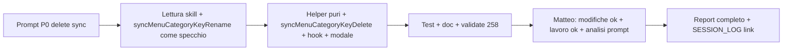

# Report — Sync delete categoria → Menù QR + Personalizza form (01-06-26)

- **Area:** Tab Menu → overlay **Categorie ingredienti** (`MenuPricesTab`) · Menù QR · Personalizza form (`booking_public_form_config`).
- **Cosa è cambiato:** alla conferma **Elimina categoria**, oltre al magazzino (`menu_items`, `menu_categories`, foto `booking-cat/`), sync immediato su tutti i `menu_qr_codes` del tenant, DELETE `menu_qrcode_categories`, rimozione `hidden_category_keys` nelle sub_tab del form pubblico; modale con avviso QR/form.
- **Validate:** `npm run validate` — **258** test verdi.
- **Commit:** non eseguito (chiusura «lavoro ok»).

---

## Contesto

- **Profilo:** Esecuzione · **modalità:** standard.
- **Skill caricate (come da prompt):** `PUBLIC_MENU_DATA_FLOW_CONTEXT.md`, `BOOKING_DATA_FLOW_SKILL.md`, `MENU_ADMIN_CONTEXT.md` — **no** `APP_CONTEXT` intero.
- **P0 già in repo (non rifatto):** `syncMenuCategoryKeyRename`, `renameCategoryKeyInQrRow`, `bookingFormCategoryKeySync` rename, hook rename + toast info.
- **Vincoli rispettati:** rename/sync rename intatti; no `buildCatalogPrefill` / prefill modale QR; no migrazione SQL one-shot.

## Cosa è stato fatto

1. **`deleteCategoryKeyFromQrRow`** (`menuQrCategoryKeySync.ts`) — puro: rimuove chiave da `category_images`; da `category_filter` solo se array (`null` legacy = tutte le categorie, invariato); flag `changed` / `shouldRemoveStoragePhoto`.
2. **`removeCategoryKeyFromBookingPublicFormConfig`** (`bookingFormCategoryKeySync.ts`) — simmetrico al rename su `sub_tabs[].hidden_category_keys`.
3. **`syncMenuCategoryKeyDelete.ts`** — select QR tenant → patch row → update se changed; DELETE `menu_qrcode_categories` per `(tenant_id, category_key)`; upsert `booking_public_form_config`; opz. `removeMenuPhotoPath` su `qr/{id}/cat/{key}.webp`.
4. **`useDeleteMenuCategory`** — dopo delete `menu_categories` OK → `await syncMenuCategoryKeyDelete`; errore → throw + toast; invalidazione query QR + form.
5. **`MenuPricesTab`** — paragrafo modale con `CATEGORY_KEY_DELETE_INFO_MESSAGE`.
6. **Test** — helper delete QR/form; hook delete mock sync (pattern rename).

## File toccati

| File | Modifica |
|------|----------|
| `src/features/booking/utils/menuQrCategoryKeySync.ts` | `deleteCategoryKeyFromQrRow` |
| `src/features/booking/utils/bookingFormCategoryKeySync.ts` | `removeCategoryKeyFromBookingPublicFormConfig` |
| `src/features/booking/services/syncMenuCategoryKeyDelete.ts` | **Nuovo** orchestrazione + messaggio modale |
| `src/features/booking/hooks/useMenuCategories.ts` | Sync delete + invalidate |
| `src/features/booking/components/MenuPricesTab.tsx` | Testo modale elimina |
| `src/features/booking/utils/__tests__/menuQrCategoryKeySync.test.ts` | Test delete |
| `src/features/booking/utils/__tests__/bookingFormCategoryKeySync.test.ts` | Test remove key |
| `src/features/booking/hooks/__tests__/useMenuCategories.test.tsx` | Test `useDeleteMenuCategory` + mock sync |
| `docs/per-ui-design-skill/PUBLIC_MENU_DATA_FLOW_CONTEXT.md` | § delete sync + hub file |
| `docs/BOOKING_DATA_FLOW_SKILL.md` | Nota delete → `hidden_category_keys` |
| `docs/per-ui-design-skill/MENU_ADMIN_CONTEXT.md` | Bullet elimina categoria |
| `docs/SESSION_LOG.md` | Riga sessione |
| `docs/Sessioni di lavoro/01-06-26/Report-sync-delete-categoria-qr-form-01-06-26.md` | Questo report |

## Effetto per il ristoratore

| Dove nell’app | Cosa succede |
|---------------|--------------|
| **Admin → Menu → Categorie ingredienti** → Elimina categoria | Modale avvisa che la categoria sparisce anche dai Menù QR e da Personalizza form. |
| **Impostazione Menù QR** (ogni QR del locale) | La chiave esce da filtri e foto card (`category_filter` / `category_images`); spariscono titoli/descrizioni override in `menu_qrcode_categories`; file thumb QR opz. rimosso da Storage. |
| **Impostazioni → Personalizza form** | La chiave esce da `hidden_category_keys` delle card/sottotab che la nascondevano (non tocca `field_overrides`). |
| **Pagina cliente** `/menu/.../qr/...` | Dopo elimina (subito, non al Salva modale QR): card/filtri non mostrano più quella categoria. |

**Storage coinvolto:**

| Path / tabella | Dati |
|----------------|------|
| `menu_categories` + `menu_items` | Categoria e ingredienti eliminati (già esistente). |
| `{tenantId}/booking-cat/{categoryId}.webp` | Foto categoria Pagina Prenota (già esistente). |
| `menu_qr_codes.category_filter` / `category_images` | JSON per QR; chiave rimossa se presente. |
| `menu_qrcode_categories` | Righe `(menu_qr_code_id, category_key)` DELETE tenant-wide per quella key. |
| `restaurant_settings.booking_public_form_config` | JSON vetrina; `hidden_category_keys` ripuliti. |
| `{tenantId}/qr/{qrId}/cat/{categoryKey}.webp` | Thumb card QR; remove best-effort se c’era in `category_images`. |

## Test

`npm run validate` — lint + typecheck + **258/258** test (+7 rispetto ciclo rename 252: nuovi test delete).

**QA manuale Matteo:** ⬜ categoria in QR con foto + override titolo → elimina → verifica filtro, immagini, assenza override, form senza chiave in hidden.

---

## Dati comunicazione

### Statistiche sessione (sintesi)

| Metrica | Valore |
|---------|--------|
| Messaggi utente totali | **2** |
| Messaggi utente “sostanziali” | **2** (prompt esecuzione P0 · «lavoro ok» + richiesta analisi prompt) |
| Turni agente (risposte complete) | **2** (implementazione · report «lavoro ok») |
| Domande agente → Matteo | **0** |
| Correzioni Matteo sul codice | **0** («modifiche ok» al primo giro) |
| Correzioni Matteo su report/comunicazione | **0** (analisi prompt richiesta **nello stesso** messaggio «lavoro ok») |
| `npm run validate` | **1×** OK (**258** test) |
| Retry implementazione | **0** |
| Sub-agent / Task tool | **0** |
| File codice + test toccati | **9** |
| File doc toccati | **4** (+ questo report) |
| Servizio nuovo | **1** (`syncMenuCategoryKeyDelete.ts`) |
| Skill area caricate | **3** (come da prompt) — APP_CONTEXT intero escluso |
| Commit | **no** |

### Cronologia / prompt di Matteo (annotati)

| # | Verbatim / sintesi | Intento | Esito agente |
|---|-------------------|---------|--------------|
| 1 | **Profilo Esecuzione** standard; skill `PUBLIC_MENU_DATA_FLOW`, `BOOKING_DATA_FLOW`, `MENU_ADMIN`; **no APP_CONTEXT**; **P0 già in repo** (rename, non rifare); obiettivo delete sync su QR + `menu_qrcode_categories` + `hidden_category_keys`; **decisioni prodotto** (testo modale + sync al click Elimina, non Salva QR); implementazione numerata 1–6; **Cosa NON fare** (rename, prefill, SQL); criterio di fatto + chiusura doc §7 | Feature delete allineata al pattern rename | Implementazione completa + validate 258 al primo giro |
| 2 | **«modifiche ok. lavoro ok»** + richiesta **analisi flusso prompt, efficienza, statistiche** per skill system | Accettazione + report con § Meta | Questo report |

### Frasi / termini (conteggio)

| Frase / termine | × |
|-----------------|---|
| «lavoro ok» | 1 |
| «modifiche ok» | 1 |
| «fai report finale» | 0 |
| Richiesta esplicita dati per skill system / analisi prompt | **1** (accorpata a «lavoro ok») |
| «Non caricare APP_CONTEXT intero» | 1 |
| «P0 già in repo — non rifare» | 1 |

### Voci Liv.2 applicate

Nessuna voce Liv.2 ambigua; profilo **Esecuzione** riconosciuto da grilletto implicito nel prompt.

---

## Analisi flusso prompt, efficienza e statistiche (skill system)

> Per revisore Meta e calibrazione `PREPARA_PROMPT` / report §7. **Non è voto sintetico** — dati e lettura agente.

### 1. Flusso di lavoro (diagramma logico)

**Tipo ciclo:** singolo agente · **standard** · task **medio** (DB multi-tabella + Storage + form JSON + UI modale), **zero** domande di chiarimento.

### 2. Anatomia del prompt #1 (qualità strutturale)

| Blocco presente | Presente | Effetto osservato |
|-----------------|----------|-------------------|
| Profilo + modalità | ✅ | Esecuzione standard |
| Skill da leggere / **non caricare** | ✅ | Contesto mirato; rename P0 citato senza re-implementare |
| Obiettivo end-to-end | ✅ | Delete → QR + override + form |
| Decisioni prodotto (Matteo) | ✅ | Testo modale + **timing** sync (Elimina, non Salva QR) — evita ambiguità INC storiche |
| Implementazione numerata 1–6 | ✅ | Ordine file naturale: pure → service → hook → test |
| **Cosa NON fare** | ✅ | Protegge rename, prefill, SQL — riduce scope creep |
| Criterio di fatto | ✅ | Verificabile (QR fields, righe override, hidden keys, modale, validate) |
| Chiusura doc esplicita | ✅ | PUBLIC_MENU + BOOKING_DATA + SESSION_LOG |
| Contesto P0 «già in repo» | ✅ | **Alta efficienza:** agente legge pattern rename invece di re-discover |

**Lunghezza prompt #1:** ~450 parole · **densità alta** · rapporto segnale/rumore **ottimo** per task simmetrico a rename già mergiato.

### 3. Efficienza esecuzione (agente)

| Indicatore | Valore | Nota |
|------------|--------|------|
| Giri implementazione | **1** | Nessun rework post-feedback |
| Tool call batching | Sì (read paralleli, validate singolo) | |
| Allineamento a pattern esistente | **Alto** | `syncMenuCategoryKeyRename` copiato come scheletro |
| Domande superflue | **0** | Prompt autosufficiente |
| Test aggiunti / regressione | +7 test (252→258) | Copertura simmetrica rename |
| Tempo validate | ~15s | Pipeline locale OK |

### 4. Confronto con prompt «rename» (stessa famiglia)

| Aspetto | Rename (sessione precedente) | Delete (questa) |
|---------|------------------------------|-----------------|
| Struttura prompt | Simile (skill + P0 + NON fare) | **Stesso template** — effetto positivo su velocità |
| Complessità Storage | copy on rename | remove on delete (più semplice) |
| `menu_qrcode_categories` | UPDATE/merge per QR | DELETE globale per key (più semplice) |
| Modale admin | Pre-save rename | Delete + paragrafo informativo |
| Feedback Matteo | — | **«modifiche ok»** senza fix |

**Ipotesi per skill system:** mantenere **coppia prompt speculare** (rename/delete) con sezione «P0 già in repo» e «Cosa NON fare» come template in `PREPARA_PROMPT` o `FOLLOW_UP` per sync categoria.

### 5. Lettura qualità (dati, non voto)

| Dimensione | Osservazione |
|------------|--------------|
| **Chiarezza prompt** | Timing sync e legacy `category_filter null` esplicitati → zero ambiguità implementativa |
| **Skill routing** | Tre file area + esclusione APP_CONTEXT = carico contesto adeguato senza overflow |
| **Comunicazione Matteo** | Conferma breve («modifiche ok») + richiesta analisi nel messaggio chiusura → **buona abitudine** per ciclo Meta |
| **Rischio residuo** | QR con `category_filter: null` dopo delete categoria ancora «mostra tutto» lato pubblico (by design legacy) — documentato in helper; QA dovrebbe includere un QR legacy se esiste in TEST |
| **Gap doc pre-prompt** | BOOKING_DATA non aveva ancora delete → aggiornato in chiusura; PUBLIC_MENU § delete aggiunto |

### 6. Suggerimenti operativi (per OSSERVAZIONI / prossimi prompt)

1. **Template handoff:** «Sync delete categoria» = stesso scheletro del rename con tabella file da toccare / non toccare (già usato con successo).
2. **QA checklist one-liner** nel prompt: «QR con filtro esplicito + QR legacy null» — opzionale, riduce rischio interpretazione legacy.
3. **Report «lavoro ok»:** includere sempre § **Analisi flusso prompt** (Matteo lo richiede esplicitamente quando serve calibrazione Meta).

---

## Chiusura

- **Stato:** accettato da Matteo («modifiche ok»).
- **Prossimo passo suggerito:** QA manuale delete su tenant TEST; poi eventuale «fai report finale» → commit.
- **Follow-up fuori scope:** `buildCatalogPrefill` / prefill modale QR dopo delete (prompt successivo indicato da Matteo).
