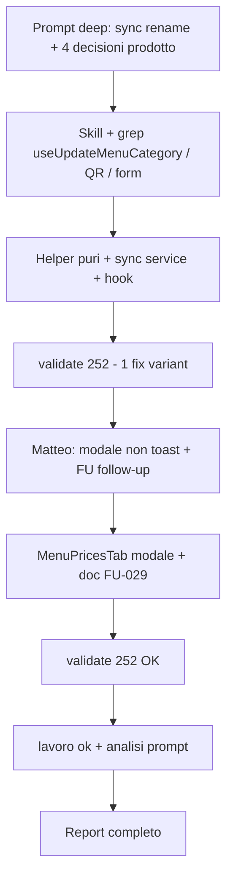

# Report — Sync rename chiave categoria → Menù QR + Personalizza form (01-06-26)

- **Area:** Tab Menu (magazzino) · overlay «Categorie ingredienti» · Menù QR · Personalizza form (`BOOKING_DATA_FLOW`, `PUBLIC_MENU_DATA_FLOW`).
- **Cosa è cambiato:** al **salvataggio** di una categoria con **slug (`key`) rinominato**, allineamento automatico di `menu_items`, tutti i `menu_qr_codes` / `menu_qrcode_categories` del tenant, e `hidden_category_keys` in `booking_public_form_config`; **modale conferma pre-salvataggio** (FU-029, richiesta Matteo post-implementazione).
- **Validate:** `npm run validate` — **252** test verdi (fine sessione).
- **Commit:** non eseguito (chiusura «lavoro ok»).

---

## Contesto

- **Profilo:** Esecuzione · **modalità:** deep.
- **Skill caricate (come da prompt):** `PUBLIC_MENU_DATA_FLOW_CONTEXT.md`, `BOOKING_DATA_FLOW_SKILL.md`, `DB_SKILL.md` (lettura contesto), `PUBLIC_MENU_SKILL.md`, `MENU_ADMIN_CONTEXT.md` — **no** `APP_CONTEXT` intero.
- **Problema:** rename categoria aggiornava solo `menu_items`; restavano chiavi orfane in `category_filter` / `category_images` QR e in Personalizza form.

## Cosa è stato fatto

### Fase 1 — Sync rename (prompt iniziale)

1. **Helper puri** `menuQrCategoryKeySync.ts`: `renameCategoryKeyInQrRow` (`category_filter`, `category_images`), rewrite URL, flag copia storage.
2. **Helper** `bookingFormCategoryKeySync.ts`: sostituzione `previousKey` → `newKey` in `sub_tabs[].hidden_category_keys` (normalizer incluso).
3. **Orchestrazione** `syncMenuCategoryKeyRename.ts`: loop QR tenant, update DB, merge override su UNIQUE `(menu_qr_code_id, category_key)`, upsert `booking_public_form_config` se dirty; copia opz. `qr/{id}/cat/{old}.webp` → `{new}.webp` via `tryCopyQrCategoryPhotoOnRename` in `menuQrStorage.ts`.
4. **Hook** `useUpdateMenuCategory`: dopo update `menu_categories` + `menu_items`, chiama sync; errore sync → `throw` + toast errore; invalidate query QR + form config.
5. **Test:** 8 + 2 unit helper; estensione hook test rename + mock sync.
6. **Doc:** § rename in `PUBLIC_MENU_DATA_FLOW`, `MENU_ADMIN`, LOCK in `BOOKING_DATA_FLOW`, `SESSION_LOG`.

### Fase 2 — UX conferma (follow-up Matteo)

7. **Rimosso** toast informativo laterale post-save (`toast.info` + `CATEGORY_KEY_RENAME` in hook).
8. **Modale** in `MenuPricesTab` (pattern modale «Elimina categoria»): titolo «Rinominare la categoria?», testo `CATEGORY_KEY_RENAME_INFO_MESSAGE`, **Annulla** / **Conferma e salva**; salvataggio solo dopo conferma se `editingCategory.key !== newKey`.
9. **FU-029** in `FOLLOW_UP.md` (richiesta Matteo annotata come follow-up post-implementazione).

## File toccati (questo task)

| File | Modifica |
|------|----------|
| `src/features/booking/utils/menuQrCategoryKeySync.ts` | **Nuovo** — logica pura rename QR row |
| `src/features/booking/utils/bookingFormCategoryKeySync.ts` | **Nuovo** — `hidden_category_keys` |
| `src/features/booking/services/syncMenuCategoryKeyRename.ts` | **Nuovo** — sync DB tenant + messaggio modale |
| `src/features/booking/utils/menuQrStorage.ts` | `tryCopyQrCategoryPhotoOnRename` |
| `src/features/booking/hooks/useMenuCategories.ts` | Integrazione sync; no toast rename |
| `src/features/booking/hooks/__tests__/useMenuCategories.test.tsx` | Test rename + mock sync |
| `src/features/booking/utils/__tests__/menuQrCategoryKeySync.test.ts` | **Nuovo** |
| `src/features/booking/utils/__tests__/bookingFormCategoryKeySync.test.ts` | **Nuovo** |
| `src/features/booking/components/MenuPricesTab.tsx` | Modale pre-save; `executeSaveCategory` |
| `docs/per-ui-design-skill/PUBLIC_MENU_DATA_FLOW_CONTEXT.md` | § rename + file hub |
| `docs/per-ui-design-skill/MENU_ADMIN_CONTEXT.md` | § rename + FU-029 |
| `docs/BOOKING_DATA_FLOW_SKILL.md` | LOCK rename |
| `docs/FOLLOW_UP.md` | FU-029 Fatto |
| `docs/SESSION_LOG.md` | Riga sessione |
| `docs/Sessioni di lavoro/01-06-26/Report-sync-rename-categoria-qr-form-01-06-26.md` | Questo report |

**Non toccato (come da prompt):** `buildCatalogPrefill`, migrazione SQL massiva, sync aprendo tab Menu/QR senza save categoria.

## Effetto per il ristoratore

| Dove | Cosa vede / cosa succede |
|------|-------------------------|
| **Tab Menu → Categorie ingredienti** | Modifica nome categoria → se cambia lo slug interno, alla pressione **Salva** compare modale che spiega impatto su Menù QR e Personalizza form → **Conferma e salva** o **Annulla** |
| **Tutti i Menù QR** del locale | Checkbox categorie, foto card QR, override titolo/icona: la **chiave** segue il nuovo slug; personalizzazioni (titoli, icone, foto già caricate) **non** vengono azzerate |
| **Personalizza form → card Prenota** | Se una card aveva categorie **nascoste** con la vecchia chiave, la lista si aggiorna al nuovo slug (solo se quel campo era salvato in vetrina) |
| **Pagina Prenota / Menu QR cliente** | Dopo conferma admin, niente categorie «fantasma» con vecchia chiave |

**Storage:** `menu_qr_codes` (JSONB `category_filter`, `category_images`), `menu_qrcode_categories`, `restaurant_settings.booking_public_form_config`, opz. bucket `menu-photos` path `…/qr/{qrId}/cat/{key}.webp`.

## Strategia conflitto UNIQUE override QR

Se per lo stesso QR esistono già righe con `previousKey` e `newKey`: merge `title` / `description` / `icon` (preferenza valori già su riga `newKey`, riempimento da riga vecchia se null), poi delete riga `previousKey`.

## Test

`npm run validate` — lint + typecheck + **252/252** test (da 241 a inizio giornata → +11 test nuovi/estesi in questa feature).

**QA manuale Matteo:** ⬜ rename categoria usata in QR + hidden in Personalizza form; ⬜ modale Annulla non persiste; ⬜ Conferma allinea pubblico.

---

## Dati comunicazione

### Statistiche sessione (sintesi)

| Metrica | Valore |
|---------|--------|
| Messaggi utente totali | **3** |
| Messaggi utente “sostanziali” | **2** (prompt esecuzione deep · follow-up UX modale) |
| Turni agente (risposte complete) | **3** (implementazione · modale FU-029 · report «lavoro ok») |
| Domande agente → Matteo | **0** |
| Correzioni Matteo sul **codice** | **0** (bug) |
| Correzioni Matteo su **prodotto/UX** | **1** (toast → modale pre-save) |
| Correzioni Matteo su **report** | **0** (questo «lavoro ok» include già richiesta § analisi prompt) |
| `npm run validate` | **2×** OK (252 test; 1× fix `Button variant` post typecheck) |
| Retry implementazione (codice) | **1** (typecheck `variant="default"` → `primary`) |
| Sub-agent / Task tool | **0** |
| File codice nuovi | **5** |
| File codice modificati (task) | **4** |
| File doc | **5** + FOLLOW_UP + SESSION_LOG |
| Skill area caricate | **5** nominate + APP_CONTEXT escluso |
| Commit / push | **no** |

### Cronologia / prompt di Matteo (annotati)

| # | Verbatim / sintesi | Intento | Esito agente |
|---|-------------------|---------|--------------|
| 1 | Profilo **Esecuzione** · **deep**; skill elencate + no APP_CONTEXT; obiettivo sync rename su save `useUpdateMenuCategory`; **4 decisioni prodotto** (solo al save, avviso utente, non cancellare personalizzazioni, UX come modali esistenti); implementazione helper + hook + test; cosa NON fare; criterio di fatto + chiusura §7 doc | Feature sync cross-store | Implementato al primo giro; toast info post-save (interpretazione «avviso») |
| 2 | **Non** toast laterale: **check prima di salvare** conferma/annulla, **uguale altri in app**; annotare richiesta come follow-up; **errori = toast** | Correzione UX | Modale `MenuPricesTab` + FU-029; rimosso `toast.info` |
| 3 | **«lavoro ok»** + **ricorda analisi flusso prompt, efficienza, statistiche** per skill system | Chiusura + dati Meta | Questo report |

### Frasi / termini (conteggio)

| Frase / termine | × |
|-----------------|---|
| «lavoro ok» | 1 |
| «Profilo: Esecuzione» / «deep» | 1 |
| «Non caricare: APP_CONTEXT» | 1 |
| Richiesta modale vs toast (follow-up) | 1 |
| Richiesta esplicita analisi prompt / skill system | 1 |
| «fai report finale» | 0 |
| «spiegamelo semplice» | 0 |

### Voci Liv.2 applicate

Nessuna voce Liv.2 ambigua attivata. Comportamento **«lavoro ok»** = report completo + analisi prompt (esplicitato al messaggio 3).

---

## Analisi flusso prompt, efficienza e statistiche (skill system)

> Per revisore Meta e calibrazione PREPARA_PROMPT / report / COMUNICAZIONE. **Non è voto sintetico.**

### 1. Flusso di lavoro (diagramma)

**Tipo ciclo:** singolo agente · **deep** (multi-store: menu + QR + restaurant_settings + storage).

### 2. Anatomia prompt #1 (qualità strutturale)

| Blocco | Presente | Effetto |
|--------|----------|---------|
| Profilo + modalità deep | ✅ | Scope ampio senza domande |
| Skill lista + **esclusione** APP_CONTEXT | ✅ | Carico mirato |
| Obiettivo + gap («solo menu_items») | ✅ | Chiaro «perché» |
| **4 decisioni prodotto obbligatorie** | ✅ | Vincoli forti (timing save, non reset override, no sync tab) |
| Implementazione nominata (file/helper) | ✅ | Struttura pronta all’uso |
| Cosa NON fare (3 voci) | ✅ | Evita scope creep |
| Criterio di fatto + chiusura doc §7 | ✅ | Gate validate + doc |
| **Forma dell’avviso utente** | ⚠️ parziale | «toast + testo form o modale leggero» → agente ha scelto **toast post-save**; Matteo ha corretto a **modale pre-save** |

**Indice completezza prompt:** **9/10** — eccellente su dati e confini; l’unica ambiguità è **quando** e **come** mostrare l’avviso (post vs pre, toast vs modale in-app).

**Pattern vincente da replicare:** decisioni prodotto numerate + helper testabile + integrazione hook esistente + esplicito «cosa NON fare» per task cross-tabella.

### 3. Anatomia prompt #2 (follow-up UX)

| Aspetto | Valore |
|---------|--------|
| Lunghezza | Breve (~4 righe) |
| Chiarezza | **Alta** — divieto toast, paragone «come altri in app», eccezione errori |
| Costo per agente | **Basso** — 1 file UI + rimozione 3 righe hook + FU-029 |
| Tipo correzione | **Prodotto/UX**, non bug logica sync |

**Segnale:** follow-up mirato senza riaprire l’intero prompt deep → **efficiente** per Matteo e agente.

### 4. Efficienza esecuzione

| KPI | Valore | Note |
|-----|--------|------|
| Turni codice per feature core | **1** | Sync completo al primo messaggio |
| Turni aggiuntivi UX | **1** | Modale (richiesta esplicita) |
| Domande / turno | **0** | Nessun blocco su schema DB |
| Validate falliti | **1** (typecheck Button) | Risolto in <1 min |
| Rework dopo «lavoro ok» codice | **0** | — |
| Allineamento UX prima richiesta vs finale | **~80%** | Logica sync OK; forma avviso da calibrare nel prompt |

**Rapporto segnale/rumore prompt #1:** **alto** su architettura e invarianti; **medio** su copy/UX timing.

**Costo conversazione totale:** 1 prompt lungo + 1 correzione corta + 1 chiusura con analisi = **3 messaggi utente** per feature multi-surface → **buon ROI**.

### 5. Cosa ha ridotto ambiguità (da replicare in PREPARA_PROMPT)

1. **«Solo al salvataggio useUpdateMenuCategory»** — evita sync fantasma su tab change.
2. **«Non cancellare personalizzazioni»** — definisce merge UNIQUE e no reset `menu_qrcode_categories`.
3. **Helper testabile separato** — test veloci senza mock Supabase pesante.
4. **Riferimento BOOKING_DATA_FLOW** per `hidden_category_keys` — un solo array da mappare (grep confermato).
5. **Criterio di fatto con validate** — chiusura oggettiva.

### 6. Cosa migliorare (skill system / comunicazione)

| Priorità | Proposta | Destinazione |
|----------|----------|--------------|
| Alta | Nei prompt rename/sync: blocco **UX obbligatorio** — «modale conferma **prima** del persist, pattern `MenuPricesTab` elimina categoria; **no** toast informativo post-success» | `MENU_ADMIN_CONTEXT` § rename · template PREPARA_PROMPT |
| Alta | In `COMUNICAZIONE_UTENTE_SKILL`: al «lavoro ok» includere **sempre** § Analisi flusso prompt (Matteo l’ha chiesto esplicitamente in 2 sessioni 01-06) | Skill comunicazione |
| Media | Esempio handoff: incollare testo modale `CATEGORY_KEY_RENAME_INFO_MESSAGE` nel prompt | Report sync / PUBLIC_MENU_DATA_FLOW |
| Media | Checklist QA rename: 3 bullet nel report (già in questo file) | Template report |
| Bassa | Test componente modale (opzionale; oggi solo unit + hook mock) | Backlog test |

### 7. Automatizzabile vs manuale

| Attività | Automatizzabile | Motivo |
|----------|-----------------|--------|
| `renameCategoryKeyInQrRow` | ✅ fatto | Puro |
| `hidden_category_keys` in form config | ✅ fatto | Puro |
| Sync Supabase multi-tabella | ⚠️ parziale | Test integrazione costosi; hook mock |
| Modale pre-save | ❌ QA manuale | Flusso overlay + stati pending |
| Copia storage `.webp` | ❌ QA / env TEST | Dipende da file esistente |
| Analisi prompt in report | ⚠️ semi | Tabelle agente; revisore legge report |

### 8. Token / verbosità

- **Prompt #1:** lungo ma **denso** — ogni paragrafo ha effetto (decisioni, file, divieti). Giustifica **zero** domande.
- **Prompt #2:** ottimo rapporto segnale/token per correzione UX.
- **Risposta agente #1:** proporzionata (multi-file); tool explore mirati.
- **Report:** questo file compensa dati per Meta senza rifare il diff tecnico.

### 9. Confronto sessioni 01-06-26 (Menu / booking)

| Sessione | Completezza prompt | Turni codice | Correzione UX post-implementazione |
|----------|-------------------|--------------|-----------------------------------|
| Ordine categorie QR | 10/10 | 1 | — |
| Default icona Insalata | 10/10 | 1 | — |
| **Sync rename QR+form** | **9/10** | **1+1** | **Modale vs toast** |
| Admin card mobile | — | — | — |

**Segnale:** task **cross-store** restano gestibili in 1 turno se il prompt elenca storage e hook; il rischio residuo è **interpretazione UX** quando il prompt offre alternative («toast o modale»).

### 10. Dati grezzi per revisore (checklist qualità prompt Matteo)

| Dimensione | Lettura agente (dato, non voto) |
|------------|----------------------------------|
| Chiarezza obiettivo | Alta |
| Confini scope | Molto chiari (cosa NON fare efficace) |
| Allineamento skill citate | Sì — doc §7 aggiornati |
| Necessità correzioni | 1 UX (prevedibile da disambiguare «avviso») |
| Efficienza tool | Alta (grep + read hook esistente) |
| Aderenza «lavoro ok» | Report richiesto con analisi — **soddisfatto** in questo messaggio |

---

## Revisione report («lavoro ok») — allineamento codice

| Check | Esito |
|-------|--------|
| Sync solo se `previousKey !== key` in `useUpdateMenuCategory` | ✅ |
| `syncMenuCategoryKeyRename` per tutti QR tenant | ✅ |
| `hidden_category_keys` in `booking_public_form_config` | ✅ helper + service |
| Modale pre-save se slug cambia (`MenuPricesTab`) | ✅ |
| Nessun `toast.info` rename post-save | ✅ |
| Errori sync → toast errore hook | ✅ |
| `npm run validate` | ✅ **252** |
| FU-029 + doc § rename | ✅ |

## Stato

- Codice + docs: **pronti**, non committati.
- Prossimo passo opzionale: QA manuale rename; poi «fai report finale» se commit desiderato.
