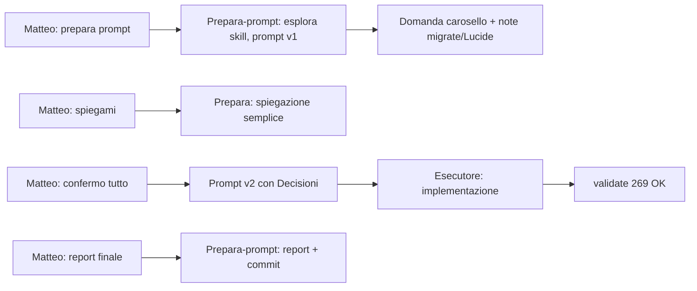

# Report — Unificazione icone Prenota = catalogo Menù QR

**Data:** 01-06-26  
**Branch:** `env/test`  
**Modalità sessione:** standard (prompt prepara-prompt → esecutore)  
**Stato:** codice + validate OK · QA visivo Lucide card scorrevoli ⬜ · commit in chiusura report

---

## 1. Obiettivo (cosa voleva Matteo)

Nel modale **Crea/Modifica Menù QR**, le card categoria senza foto hanno ~20 icone (Phosphor + Lucide).  
Stesso catalogo doveva comparire in **Personalizza form** per:

- **Tipologie di prenotazione** (card in alto in Pagina Prenota)
- **Card scorrevoli** (sotto-tab a card)
- **Slide carosello** (icona su ogni foto)

I clienti con config **vecchia** (`utensils`, `wine`, …) devono continuare a vedere l’icona giusta **senza** obbligo di risalvare subito (**migrate-on-read**).

---

## 2. Cosa è cambiato (effetto per il ristoratore)

| Dove nell’admin | Prima | Dopo |
|----------------|-------|------|
| Personalizza form → tipologia | ~10 icone proprie | Stessa griglia del modale QR (~20) |
| Personalizza form → card scorrevole | 5 icone | Stessa griglia |
| Personalizza form → carosello (per slide) | 5 icone | Stessa griglia |
| Pagina Prenota (cliente) | Icone diverse / set ridotto | Stesso aspetto del Menu QR (Phosphor + Lucide) |

**Storage (Supabase):** nessuna migrazione SQL. I valori restano in `restaurant_settings.booking_public_form_config` (JSON). Chiavi legacy restano nel file finché l’admin non salva; in app vengono interpretate al volo.

---

## 3. File toccati

| Area | File | Ruolo |
|------|------|--------|
| Catalogo | `src/features/public-menu/categoryIcons.ts` | `BOOKING_LEGACY_ICON_TO_MENU_QR_KEY`, `resolveBookingStoredIconKey` |
| Picker admin | `src/features/public-menu/MenuCategoryIconPicker.tsx` | **Nuovo** — griglia condivisa |
| Render | `src/features/public-menu/MenuQrCategoryIconGlyph.tsx` | Lucide `strokeWidth` 1.75, Phosphor `regular` |
| Config tipi | `src/features/booking/constants/bookingPublicFormConfig.ts` | `BookingModeIcon` / `SubTabIcon` = `MenuQrCategoryIconKey` |
| Parse DB | `src/features/booking/lib/restaurantSettingRegistry.ts` | Allineamento parse |
| Admin UI | `BookingFormConfigPanel.tsx`, `BookingFormCarouselEditor.tsx`, `MenuHomepageConfigPanel.tsx` | Usano `MenuCategoryIconPicker` |
| Pubblico | `BookingModeCards.tsx`, `BookingSubTabCards.tsx`, `BookingRequestForm.tsx` | `MenuQrCategoryIconGlyph` |
| Tipi | `src/types/menu.ts` | `CarouselSlideIcon` → catalogo QR |
| Test | `categoryIcons.test.ts`, `bookingPublicFormConfig.test.ts` | +3 test migrate-on-read / normalize |
| Skill | `BOOKING_FORM_CONFIG_PANEL_CURSOR_CONTEXT.md`, `BOOKING_REQUEST_PAGE_LAYOUT_CONTEXT.md` | § icone aggiornato |

**Diff netto:** ~257 inserimenti, ~416 rimozioni (rimozione duplicati `ModeIcon` / picker inline).

---

## 4. Mappa legacy (migrate-on-read)

| Chiave vecchia | Chiave nuova |
|----------------|--------------|
| `utensils` | `fork_knife` |
| `chef-hat` | `lucide_chef_hat` |
| `wine` | `martini` |
| `coffee` | `coffee` |
| `pizza` | `pizza_slice` |
| `hamburger` | `steak` |
| `bowl-steam` | `cooking_pot` |
| `cake` / `martini` / `leaf` | invariati nel nuovo namespace |
| `cloche` | `bowl_food` |
| `star` | `lucide_salad` (default catalogo) |

**Migrate-on-write:** solo quando l’admin salva Personalizza form (`normalizeBookingPublicFormConfig` riscrive chiavi nuove). Confermato da Matteo in ciclo prepara-prompt.

---

## 5. Verifica tecnica

| Controllo | Esito |
|-----------|--------|
| `npm run validate` | **OK** — 33 file test, **269** test (+3 vs baseline 266) |
| Typecheck / lint | OK |
| QA browser 375/834/1280 (Matteo) | **Non eseguito** in sessione — in particolare Lucide su card scorrevoli `h-7` / `text-warm-wood-dark` |
| Revisione accurata dedicata | Non richiesta post-report; diff allineato al prompt |

---

## 6. Dati comunicazione

### Frasi / prompt di Matteo (ciclo completo)

1. **«prepara prompt»** — stesse icone categoria ingredienti (modale QR) anche per tipologia prenotazione e card scorrevoli (testo iniziale vago).
2. **«spiegami meglio e brevemente»** — su migrate-on-read vs write e QA Lucide (correzione dopo prima risposta troppo tecnica).
3. **«confermo tutto»** — scope carosello incluso, migrate-on-read, QA Lucide da fare in implementazione.
4. **«agente ha finito lavoro. fai report finale»** — chiusura + analisi flusso prompt.

### Prompt annotati (prepara-prompt)

- **Prompt v1:** obiettivo + 3 superfici + mappa legacy + vincoli FU-023; domanda A/B carosello (default B).
- **Prompt v2 (finale):** blocco «Decisioni prodotto (Matteo 01-06-26)» con migrate-on-read e QA Lucide espliciti.

### Statistiche ciclo (per skill system / Meta)

| Metrica | Valore | Nota |
|---------|--------|------|
| Messaggi Matteo nel ciclo prepara + chiusura | **4** | prepara → chiarimento → conferma → report finale |
| Correzioni dopo 1ª risposta prepara | **1** | richiesta spiegazione semplice (migrate-on-read / Lucide) |
| Giri prepara-prompt prima prompt esecutore | **2** | v1 + v2 con decisioni bloccate |
| Domande bloccanti pre-prompt | **1** | carosello sì/no (risolta con default B + conferma «tutto») |
| Follow-up nuovi aperti | **0** | QA visivo rimandato nel report, non FU-ID dedicato |
| Modalità alzata in corso | **no** | restato `standard` |
| Efficacia prompt (lettura revisore) | **alta** | esecutore ha rispettato scope; diff coerente; test aggiunti |
| Punto debole | **QA umano** | prompt chiedeva smoke 3 viewport — non tracciato come fatto da Matteo |

### Lettura qualità comunicazione

- **Cosa ha funzionato:** ciclo «prepara → 1 domanda chiara → spiegazione semplice su richiesta → conferma tutto → prompt con blocco Decisioni» ha eliminato ambiguità su DB e carosello senza bloccare Matteo a lungo.
- **Cosa migliorare:** alla prima preparazione si poteva già assumere carosello (stesso set 5 icone legacy) e migrate-on-read come default raccomandato, riducendo il giro «spiegami».
- **Pattern da tenere:** tabella storage admin/pubblico nel prompt; mappa legacy esplicita; «Cosa NON fare» su Menu QR layout parallelo.

---

## 7. Analisi flusso di lavoro (agenti e prompt)

| Fase | Agente | Durata relativa | Output |
|------|--------|-----------------|--------|
| Preparazione | prepara-prompt | ~2 chat | Prompt auto-contenuto + decisioni prodotto |
| Esecuzione | esecutore (chat separata) | 1 sessione | 17 file, componente condiviso, test |
| Chiusura | prepara-prompt | 1 chat | Questo report, commit, push |

**Efficienza:** un solo passaggio esecutore dopo prompt v2 — nessun rework segnalato nel diff. Il costo extra è **1 chat** di chiarimento (utile: ha fissato migrate-on-read evitando migrate-on-write involontario).

---

## 8. Follow-up / debiti

| Voce | Stato | Azione |
|------|--------|--------|
| QA visivo Pagina Prenota (tipologie + card + carosello, 375/834/1280) | ⬜ | Matteo su tenant test; focus Lucide su card scorrevoli |
| Revisione accurata opzionale | ⬜ | Solo se emergono regressioni in QA |

Non aperti nuovi FU-ID: debito coperto da checklist report.

---

## 9. Allineamento skill (§7.2)

- `BOOKING_FORM_CONFIG_PANEL_CURSOR_CONTEXT.md` — § Icone aggiornato ✅  
- `BOOKING_REQUEST_PAGE_LAYOUT_CONTEXT.md` — §5 tipologie/sottotab/carosello ✅  
- `PUBLIC_MENU_SKILL.md` — invariato (catalogo già documentato in §042)

---

## 10. Chiusura commit

Vedi commit associato a questa sessione (messaggio con `Review:` verso questo file e `SESSION_LOG.md`).
