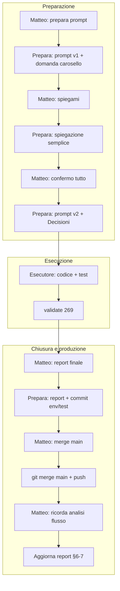

# Report — Unificazione icone Prenota = catalogo Menù QR

**Data:** 01-06-26  
**Branch:** `env/test`  
**Modalità sessione:** standard (prompt prepara-prompt → esecutore)  
**Stato:** codice + validate OK · QA visivo Lucide card scorrevoli ⬜ · commit `b1c345d` su `env/test`

---

## 1. Obiettivo (cosa voleva Matteo)

Nel modale **Crea/Modifica Menù QR**, le card categoria senza foto hanno ~20 icone (Phosphor + Lucide).  
Stesso catalogo doveva comparire in **Personalizza form** per:

- **Tipologie di prenotazione** (card in alto in Pagina Prenota)
- **Card scorrevoli** (sotto-tab a card)
- **Slide carosello** (icona su ogni foto)

I clienti con config **vecchia** (`utensils`, `wine`, …) devono continuare a vedere l’icona giusta **senza** obbligo di risalvare subito (**migrate-on-read**).

---

## 2. Cosa è cambiato (effetto per il ristoratore)

| Dove nell’admin | Prima | Dopo |
|----------------|-------|------|
| Personalizza form → tipologia | ~10 icone proprie | Stessa griglia del modale QR (~20) |
| Personalizza form → card scorrevole | 5 icone | Stessa griglia |
| Personalizza form → carosello (per slide) | 5 icone | Stessa griglia |
| Pagina Prenota (cliente) | Icone diverse / set ridotto | Stesso aspetto del Menu QR (Phosphor + Lucide) |

**Storage (Supabase):** nessuna migrazione SQL. I valori restano in `restaurant_settings.booking_public_form_config` (JSON). Chiavi legacy restano nel file finché l’admin non salva; in app vengono interpretate al volo.

---

## 3. File toccati

| Area | File | Ruolo |
|------|------|--------|
| Catalogo | `src/features/public-menu/categoryIcons.ts` | `BOOKING_LEGACY_ICON_TO_MENU_QR_KEY`, `resolveBookingStoredIconKey` |
| Picker admin | `src/features/public-menu/MenuCategoryIconPicker.tsx` | **Nuovo** — griglia condivisa |
| Render | `src/features/public-menu/MenuQrCategoryIconGlyph.tsx` | Lucide `strokeWidth` 1.75, Phosphor `regular` |
| Config tipi | `src/features/booking/constants/bookingPublicFormConfig.ts` | `BookingModeIcon` / `SubTabIcon` = `MenuQrCategoryIconKey` |
| Parse DB | `src/features/booking/lib/restaurantSettingRegistry.ts` | Allineamento parse |
| Admin UI | `BookingFormConfigPanel.tsx`, `BookingFormCarouselEditor.tsx`, `MenuHomepageConfigPanel.tsx` | Usano `MenuCategoryIconPicker` |
| Pubblico | `BookingModeCards.tsx`, `BookingSubTabCards.tsx`, `BookingRequestForm.tsx` | `MenuQrCategoryIconGlyph` |
| Tipi | `src/types/menu.ts` | `CarouselSlideIcon` → catalogo QR |
| Test | `categoryIcons.test.ts`, `bookingPublicFormConfig.test.ts` | +3 test migrate-on-read / normalize |
| Skill | `BOOKING_FORM_CONFIG_PANEL_CURSOR_CONTEXT.md`, `BOOKING_REQUEST_PAGE_LAYOUT_CONTEXT.md` | § icone aggiornato |

**Diff netto:** ~257 inserimenti, ~416 rimozioni (rimozione duplicati `ModeIcon` / picker inline).

---

## 4. Mappa legacy (migrate-on-read)

| Chiave vecchia | Chiave nuova |
|----------------|--------------|
| `utensils` | `fork_knife` |
| `chef-hat` | `lucide_chef_hat` |
| `wine` | `martini` |
| `coffee` | `coffee` |
| `pizza` | `pizza_slice` |
| `hamburger` | `steak` |
| `bowl-steam` | `cooking_pot` |
| `cake` / `martini` / `leaf` | invariati nel nuovo namespace |
| `cloche` | `bowl_food` |
| `star` | `lucide_salad` (default catalogo) |

**Migrate-on-write:** solo quando l’admin salva Personalizza form (`normalizeBookingPublicFormConfig` riscrive chiavi nuove). Confermato da Matteo in ciclo prepara-prompt.

---

## 5. Verifica tecnica

| Controllo | Esito |
|-----------|--------|
| `npm run validate` | **OK** — 33 file test, **269** test (+3 vs baseline 266) |
| Typecheck / lint | OK |
| QA browser 375/834/1280 (Matteo) | **Non eseguito** in sessione — in particolare Lucide su card scorrevoli `h-7` / `text-warm-wood-dark` |
| Revisione accurata dedicata | Non richiesta post-report; diff allineato al prompt |

---

## 6. Dati comunicazione

### Frasi / prompt di Matteo (ciclo completo)

1. **«prepara prompt»** — stesse icone categoria ingredienti (modale QR) anche per tipologia prenotazione e card scorrevoli (testo iniziale vago).
2. **«spiegami meglio e brevemente»** — su migrate-on-read vs write e QA Lucide (correzione dopo prima risposta troppo tecnica).
3. **«confermo tutto»** — scope carosello incluso, migrate-on-read, QA Lucide da fare in implementazione.
4. **«agente ha finito lavoro. fai report finale»** — chiusura + analisi flusso prompt (richiesta esplicita statistiche per skill system).
5. **«fai commit push e merge con main di tutto poi»** — deploy branch produzione (nessun codice nuovo, solo merge).
6. **«ricorda di mettere un analisi del flusso…»** — promemoria qualità report (già in §6–7; questa passata completa il ciclo deploy).

### Prompt annotati (prepara-prompt)

- **Prompt v1:** obiettivo + 3 superfici + mappa legacy + vincoli FU-023; domanda A/B carosello (default B).
- **Prompt v2 (finale):** blocco «Decisioni prodotto (Matteo 01-06-26)» con migrate-on-read e QA Lucide espliciti.

### Statistiche ciclo (per skill system / Meta)

| Metrica | Valore | Nota |
|---------|--------|------|
| Messaggi Matteo (ciclo intero prepara → produzione) | **6** | vedi elenco sopra |
| Chat/agenti distinti coinvolti | **3** | prepara-prompt · esecutore · prepara (chiusura+merge) |
| Correzioni dopo 1ª risposta prepara | **1** | «spiegami meglio» (migrate-on-read / Lucide) |
| Giri prepara-prompt prima prompt esecutore | **2** | v1 + v2 con «Decisioni prodotto» |
| Domande bloccanti pre-prompt | **1** | carosello (chiusa con default B + conferma) |
| Passate esecutore post-prompt | **1** | nessun rework segnalato |
| Commit su `env/test` (feature) | **3** | `b1c345d` feat + 2 doc hash |
| Merge `main` | **1** | fast-forward `283c36b` → `f4dc30a` |
| Test validate | **269** (+3) | lint + typecheck + vitest OK |
| Follow-up nuovi (FU-ID) | **0** | QA visivo solo in report |
| Modalità alzata | **no** | `standard` per tutto |
| Rapporto messaggi utili / correzioni | **6:1** | basso attrito dopo chiarimento |
| Tempo-agente stimato (ordine grandezza) | prepara 2× · esec 1× · chiusura 2× | merge = operazione git, no nuovo codice |

**KPI sintetici (per confronto sessioni future)**

| KPI | Questa sessione | Interpretazione |
|-----|-----------------|-----------------|
| Prompt esecutore utili prima del «fatto» | **1** (v2) | Buono: una sola incollata decisiva |
| % ciclo in chiarimenti | ~**17%** (1/6 messaggi) | Accettabile; evitabile con default nel prompt v1 |
| Rework codice post-merge | **0** | Segnale prompt + esecuzione allineati |
| Sezioni report richieste da Matteo | comunicazione + statistiche | **Obbligatorie** a chiusura — vedi §7.1 template |

### Efficacia prompt (sintesi per Meta senior)

| Aspetto | Voto operativo | Evidenza |
|---------|----------------|----------|
| Chiarezza obiettivo | Alta | Diff 20 file coerente con prompt v2 |
| Completezza vincoli | Alta | migrate-on-read, mappa legacy, 3 superfici rispettate |
| Costo ciclo | Medio-basso | 2 chat prepara + 1 esecuzione; 1 chiarimento utile |
| Tracciabilità QA | Bassa | smoke 3 viewport non confermato da Matteo |
| Chiusura operativa | Alta | commit, push, merge `main` senza conflitti |

### Lettura qualità comunicazione

- **Cosa ha funzionato:** ciclo «prepara → 1 domanda chiara → spiegazione semplice su richiesta → conferma tutto → prompt con blocco Decisioni» ha eliminato ambiguità su DB e carosello senza bloccare Matteo a lungo.
- **Cosa migliorare:** alla prima preparazione si poteva già assumere carosello (stesso set 5 icone legacy) e migrate-on-read come default raccomandato, riducendo il giro «spiegami».
- **Pattern da tenere:** tabella storage admin/pubblico nel prompt; mappa legacy esplicita; «Cosa NON fare» su Menu QR layout parallelo.

---

## 7. Analisi flusso di lavoro (agenti e prompt)

### 7.1 Template obbligatorio report (richiesta Matteo)

Ogni **«fai report finale»** su task standard/deep deve includere — oltre al diff tecnico:

1. **Elenco prompt/frasi** di Matteo in ordine cronologico.
2. **Tabella statistiche** (messaggi, correzioni, giri prepara, commit, FU, modalità alzata).
3. **Diagramma o tabella fasi** (prepara → esec → revisione → deploy).
4. **Lettura qualità** (cosa ha funzionato / cosa migliorare nel prompt).
5. **KPI confrontabili** tra sessioni (almeno: passate esecutore, % chiarimenti, rework).

Questa sessione è il riferimento per il punto 1–5.

### 7.2 Diagramma ciclo completo

| Fase | Agente | Input prompt | Output | Efficienza |
|------|--------|--------------|--------|------------|
| Preparazione | prepara-prompt | Richiesta vaga + 1 chiarimento | Prompt v2 bloccato | Media — 2 giri necessari |
| Esecuzione | esecutore | Incolla prompt v2 | 20 file, +3 test | **Alta** — 1 passata |
| Chiusura doc | prepara-prompt | «report finale» | Report + `b1c345d` | Alta |
| Deploy | prepara-prompt / shell | «merge main» | `main` @ `f4dc30a` | Alta — fast-forward |
| Arricchimento | prepara-prompt | «ricorda analisi…» | §6–7 estesi | — |

### 7.3 Raccomandazioni per skill system (dati grezzi → Meta)

| # | Raccomandazione | Priorità | Target file |
|---|-----------------|----------|-------------|
| R1 | Nel **primo** prompt prepara, includere sempre blocco «Default raccomandati» (es. migrate-on-read, scope carosello se stesso set legacy) per ridurre giro «spiegami» | Media | `PREPARA_PROMPT_SKILL.md` §1.B |
| R2 | Checklist **report finale**: § Dati comunicazione + statistiche + diagramma fasi obbligatori | Alta | `PREPARA_PROMPT_SKILL.md` §5 |
| R3 | Voce Liv.1 **«ricorda analisi flusso»** = richiesta esplicita sezione statistiche in report (non opzionale) | Bassa | `VOCABOLARIO.md` / `PROPOSTE.md` |
| R4 | Metriche sessione: aggiungere colonne **commit count** e **merge main sì/no** nel registro EVOLUZIONE | Bassa | `EVOLUZIONE_SKILLS.md` |

**Efficienza complessiva del ciclo:** **buona** — un solo passaggio codice; costo principale = 2 chat prepara + 1 chiarimento prodotto (migrate-on-read). Il merge non ha generato conflitti né commit di fix.

### 7.4 Cosa NON è stato misurato (limite dati)

- Tempo wall-clock reale (minuti) per fase — non tracciato.
- Token/contesto per chat — non disponibile in report.
- Esito QA visivo Matteo — ancora ⬜.

---

## 8. Follow-up / debiti

| Voce | Stato | Azione |
|------|--------|--------|
| QA visivo Pagina Prenota (tipologie + card + carosello, 375/834/1280) | ⬜ | Matteo su tenant test; focus Lucide su card scorrevoli |
| Revisione accurata opzionale | ⬜ | Solo se emergono regressioni in QA |

Non aperti nuovi FU-ID: debito coperto da checklist report.

---

## 9. Allineamento skill (§7.2)

- `BOOKING_FORM_CONFIG_PANEL_CURSOR_CONTEXT.md` — § Icone aggiornato ✅  
- `BOOKING_REQUEST_PAGE_LAYOUT_CONTEXT.md` — §5 tipologie/sottotab/carosello ✅  
- `PUBLIC_MENU_SKILL.md` — invariato (catalogo già documentato in §042)

---

## 10. Chiusura commit e deploy

| Branch | Commit | Nota |
|--------|--------|------|
| `env/test` | `b1c345d` (feat) · `f4dc30a` (doc) | push OK |
| `main` | `f4dc30a` | fast-forward merge da `env/test`, push OK — Vercel prod |

Asset locali **non** versionati: `immagini di prova/`, `mobile-full01-bottom.png`.
