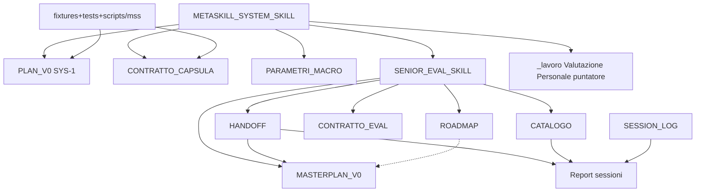

# Report A2 — Grafo link, owner, router, progressive disclosure

**Modalità:** deep · SEP-10 fase A2 · `SEP-SES-20260810-021` (segmento A2)  
**AGC:** `SEP-AGC-xai-cursor-001` · Cursor Grok 4.5 · 10-08-2026  
**Plan:** tenuto · **Zero migrazione**

---

## Cappello

- **Cosa è cambiato:** mappa owner/link tra router MSS, pack SEP e viste.
- **Cosa resta:** B1 consolida.
- **Serve una tua azione:** no.

---

## 1. Fotografia Git

`env/test` · HEAD `bec82c39…` · staging vuoto · WT concorrente non attribuito.

---

## 2. Grafo (mermaid)



Archi tratteggiati = vista che **non** deve possedere stato.

---

## 3. Tabella owner

| concetto_stato | owner_dichiarato | file_che_scrivono_o_ripetono | conflitto | certezza |
|---|---|---|---|---|
| Stato/gate SYS-1 | `PLAN_V0.md` | report H-1*, skill narrative | **sì soft**: PLAN stale vs H-1.3 FAIL nei report | alta |
| Stato/gate pack SEP | `MASTERPLAN_V0.md` | handoff attivo, report SEP | **no** se handoff resta vista; rischio F06 se handoff promuove stato | alta |
| Continuità senior | `HANDOFF_SENIOR_V0.md` | fine sessione | no (continuità ≠ stato) | alta |
| Forma eval senior | `CONTRATTO_EVAL_SENIOR_V0.md` | — | no | alta |
| Storia sedute/metodi | `CATALOGO_…` | report | no se append-only | alta |
| Schema capsula | `CONTRATTO_CAPSULA…` | scripts/mss, fixture | no | alta |
| Sequenza leggibile | `ROADMAP_V0.md` | — | no se senza stati vivi | alta |
| Indice sessioni app | `SESSION_LOG.md` | ogni chiusura | no (vista) | alta |

---

## 4. Progressive disclosure (intenti tipici)

| Intent | File minimi necessari | Aperti per inerzia (rischio) |
|---|---|---|
| Riprendere SEP | skill SEP + handoff + masterplan | tutti i report 015–020 |
| Eval/catalogo | contratto + record catalogo | PLAN_V0 intero + H-1.3 |
| Capsula/validate | contratto capsula + CLI | tutto fixtures tree |
| Fantasticazione | TIPO + prompt owner | Valutazione Personale (STOP) |
| Archiviazione SEP-10 | plan + masterplan SEP-10 | src/, DB, privata |

---

## 5. Findings A2

| ID | Sev. | Asse | Nota |
|---|---|---|---|
| A2-F01 | MEDIUM | sistema | Rotta MSS→SEP presente; pack ancora untracked → router punta a file non in git |
| A2-F02 | MEDIUM | sistema | Doppia narrazione stato: PLAN_V0 vs report H-1.3 (non sanata) |
| A2-F03 | LOW | sistema | ROADMAP non aggiornata con stati vivi (corretto); agenti possono leggerla come progresso |
| A2-F04 | MEDIUM | output | Handoff e masterplan devono restare disallineabili solo con vittoria masterplan (già scritto; E soft) |

---

## 6. Inventario subset A2

| path | categoria | owner_attuale | stato | rischio | certezza | note_1_riga |
|---|---|---|---|---|---|---|
| `METASKILL_SYSTEM_SKILL.md` | router | routing | fonte | alto | alta | hub |
| `SENIOR_EVAL_SKILL.md` | router | pack | fonte | alto | alta | hub pack |
| `PLAN_V0.md` | kernel_contratto | SYS-1 | fonte | alto | alta | stale vs H-1.3 |
| `MASTERPLAN_V0.md` | pacchetto_entry | SEP stato | fonte | alto | alta | |
| `HANDOFF_SENIOR_V0.md` | vista_indice | continuità | vista | medio | alta | |
| `ROADMAP_V0.md` | vista_indice | sequenza | vista | basso | alta | |

Colonne link_in/out: vedi grafo §2.

---

## 7. Segnali MSS

- Friction: intent «stato» apre spesso sia PLAN sia MASTERPLAN.
- Disclosure: skill dichiara progressive; pratica chat Meta carica liste lunghe (questa inclusa).
- G/O/E owner: G forte nei file; O agenti a volte duplicano stato in report; E assente.

---

## Capsula MetaSkillSystem

```jsonl
{"schema_version":"mss.session/0.1.1","system_revision":"mss-v0.1-wp0.1-freeze-2","record_type":"session_event","record_id":"mss-rec-019fec21-a201-7000-8000-000000000001","session_id":"mss-ses-019fec21-a201-7000-8000-0000000000a1","correlation_id":"mss-cor-019fec21-a201-7000-8000-0000000000c1","segment_no":1,"capture_key":"mss-ses-019fec21-a201-7000-8000-0000000000a1/1/session_event/1","created_at":"2026-08-10T15:10:00+02:00","finalization":"final","recorded_by":{"actor_id":"cursor-grok-sep10-a2","actor_type":"agente","role":"sep10_a2","agent_runtime":{"provider":"xAI/Cursor","model":"Cursor Grok 4.5","runtime":"Cursor Agent","surface":"Cursor IDE"},"tools_used":["PowerShell","Git","Read","Grep","Write","Node.js"]},"packages_loaded":[{"package_id":"metaskill-system","package_version_or_revision":"mss-v0.1-wp0.1-freeze-2","source_ref":"docs/MetaSkillSystem/METASKILL_SYSTEM_SKILL.md"},{"package_id":"mss.senior-eval-pack","package_version_or_revision":"0.1.0","source_ref":"docs/MetaSkillSystem/Senior-Eval-Pack/SENIOR_EVAL_SKILL.md"},{"package_id":"communication-closure","package_version_or_revision":"working-tree","source_ref":"docs/Comunicazione-Skill/CHIUSURA_SESSIONE.md"}],"event":{"event_id":"mss-evt-019fec21-a201-7000-8000-0000000000e1","event_kind":"session_close","occurred_at":"2026-08-10T15:10:00+02:00","continues_record_id":"nessuno","causation_record_id":"nessuno","intent_user":"Eseguire A2 grafo","session_type":"deep","capsule_status":"completa","role_key":"Meta writer","area":"MetaSkillSystem SEP-10 A2","environment":"branch env/test; HEAD bec82c39; staging vuoto; working-tree concorrente non attribuito","authorization":{"read":["docs/MetaSkillSystem/**","scripts/mss/**","plan SEP-10"],"write":["docs/Sessioni di lavoro/10-08-26/SEP-10-archiviazione/**","report ombrello","MASTERPLAN SEP-10","HANDOFF","SESSION_LOG"],"forbid":["rename/move/migrazione","SEP-11","H-1.3 fix","WP-1","Valutazione Personale contents","commit"]},"authorized_outputs":["report A2","capsula"],"route":{"chosen":"SENIOR_EVAL_SKILL + MASTERPLAN","alternatives_or_conflicts":"nessuno"},"observed_outcome":"A2 grafo link/owner","open_items":["B1","B2","SEP-11 vietato"],"controls":[{"control_id":"NO-MIGRATION","criterio":"zero rename/move","esito":"pass","numeratore":1,"denominatore":1,"esecutore":"cursor-grok-sep10-a2","evidence_refs":["owner-report"]},{"control_id":"SCHEMA-INVENTORY","criterio":"report contiene inventario/findings/segnali","esito":"pass","numeratore":1,"denominatore":1,"esecutore":"cursor-grok-sep10-a2","evidence_refs":["owner-report"]}],"subject_runtime":{"actor_id":"mss.senior-eval-pack/0.1.0","provider":"non_applicabile:oggetto documentale","model":"non_applicabile:oggetto documentale","runtime":"docs/MetaSkillSystem/Senior-Eval-Pack","surface":"markdown pack"},"privacy":{"classification":"internal","capture_basis":"user_request","allowed_content":["finding","path","git metadata","decisioni Matteo"],"prohibited_content":["dati personali Valutazione Personale","segreti"],"redactions":"nessuno","external_release":"forbidden","retention":"undecided_wp0.1","rectification_route":"amendment"},"owner_refs":[{"ref_id":"owner-report","owner_id":"SEP-10-A2","uri_or_path":"docs/Sessioni di lavoro/10-08-26/SEP-10-archiviazione/Report-A2-grafo-link-owner.md","stable_anchor_or_event_id":"SEP-SES-20260810-021","revision_or_hash":"working-tree-10-08-26","sensitivity":"internal"},{"ref_id":"owner-masterplan","owner_id":"mss.senior-eval-masterplan","uri_or_path":"docs/MetaSkillSystem/Senior-Eval-Pack/MASTERPLAN_V0.md","stable_anchor_or_event_id":"SEP-10","revision_or_hash":"working-tree-10-08-26","sensitivity":"internal"}],"source_refs":[{"ref_id":"source-user","owner_id":"conversation","uri_or_path":"conversation:this-session","stable_anchor_or_event_id":"mandate-SEP-10-A1A4","revision_or_hash":"10-08-26","sensitivity":"internal"},{"ref_id":"source-plan","owner_id":"plan","uri_or_path":".cursor/plans/sep-10_archiviazione_mss_430c9c1d.plan.md","stable_anchor_or_event_id":"A1-A4","revision_or_hash":"kept","sensitivity":"internal"}]}}
{"schema_version":"mss.session/0.1.1","system_revision":"mss-v0.1-wp0.1-freeze-2","record_type":"annotation","record_id":"mss-rec-019fec21-a201-7000-8000-000000000002","session_id":"mss-ses-019fec21-a201-7000-8000-0000000000a1","correlation_id":"mss-cor-019fec21-a201-7000-8000-0000000000c1","segment_no":1,"capture_key":"mss-ses-019fec21-a201-7000-8000-0000000000a1/1/annotation/1","created_at":"2026-08-10T15:10:01+02:00","finalization":"final","recorded_by":{"actor_id":"cursor-grok-sep10-a2","actor_type":"agente","role":"sep10_a2","agent_runtime":{"provider":"xAI/Cursor","model":"Cursor Grok 4.5","runtime":"Cursor Agent","surface":"Cursor IDE"},"tools_used":["Write"]},"packages_loaded":[{"package_id":"mss.senior-eval-pack","package_version_or_revision":"0.1.0","source_ref":"docs/MetaSkillSystem/Senior-Eval-Pack/SENIOR_EVAL_SKILL.md"}],"annotation":{"annotation_id":"mss-ann-019fec21-a201-7000-8000-0000000000a1","axis":"persona","subject_record_ids":["mss-rec-019fec21-a201-7000-8000-000000000001"],"delta":"nessuno","assertions":[{"signal":"non_osservato","actor":"matteo","assistance":"non_applicabile:analisi read-only","origin":"naturale","source_ref":"source-user","effect":"nessuna nuova decisione mid-flight","evidence_state":"observed"}],"asserted_by":{"actor_id":"cursor-grok-sep10-a2","role":"sep10_a2","basis":"direct_observation"},"verification":{"status":"unverified","verified_by":[],"verified_at":"non_applicabile:nessuna valutazione Persona","criterion_ref":"non_applicabile:gate_o_archivio","evidence_refs":["source-user"],"notes":"nessuna inferenza su competenze o profilo di Matteo"}}}
{"schema_version":"mss.session/0.1.1","system_revision":"mss-v0.1-wp0.1-freeze-2","record_type":"annotation","record_id":"mss-rec-019fec21-a201-7000-8000-000000000003","session_id":"mss-ses-019fec21-a201-7000-8000-0000000000a1","correlation_id":"mss-cor-019fec21-a201-7000-8000-0000000000c1","segment_no":1,"capture_key":"mss-ses-019fec21-a201-7000-8000-0000000000a1/1/annotation/2","created_at":"2026-08-10T15:10:02+02:00","finalization":"final","recorded_by":{"actor_id":"cursor-grok-sep10-a2","actor_type":"agente","role":"sep10_a2","agent_runtime":{"provider":"xAI/Cursor","model":"Cursor Grok 4.5","runtime":"Cursor Agent","surface":"Cursor IDE"},"tools_used":["Write","Grep"]},"packages_loaded":[{"package_id":"mss.senior-eval-pack","package_version_or_revision":"0.1.0","source_ref":"docs/MetaSkillSystem/Senior-Eval-Pack/MASTERPLAN_V0.md"}],"annotation":{"annotation_id":"mss-ann-019fec21-a201-7000-8000-0000000000a2","axis":"sistema","subject_record_ids":["mss-rec-019fec21-a201-7000-8000-000000000001"],"delta":"NON_INIZIATO -> IN_CORSO_analisi","assertions":[{"rule_id_version":"SEP-10@mss.senior-eval-pack/0.1.0","trigger_event":"ricognizione A2","decision_or_output_changed":"artefatto analisi","G":2,"O":2,"E":0}],"asserted_by":{"actor_id":"cursor-grok-sep10-a2","role":"sep10_a2","basis":"direct_observation"},"verification":{"status":"self_report","verified_by":[],"verified_at":"non_applicabile:self_report","criterion_ref":"owner-masterplan","evidence_refs":["owner-report"],"notes":"calibrazione/documentazione"}}}
{"schema_version":"mss.session/0.1.1","system_revision":"mss-v0.1-wp0.1-freeze-2","record_type":"annotation","record_id":"mss-rec-019fec21-a201-7000-8000-000000000004","session_id":"mss-ses-019fec21-a201-7000-8000-0000000000a1","correlation_id":"mss-cor-019fec21-a201-7000-8000-0000000000c1","segment_no":1,"capture_key":"mss-ses-019fec21-a201-7000-8000-0000000000a1/1/annotation/3","created_at":"2026-08-10T15:10:03+02:00","finalization":"final","recorded_by":{"actor_id":"cursor-grok-sep10-a2","actor_type":"agente","role":"sep10_a2","agent_runtime":{"provider":"xAI/Cursor","model":"Cursor Grok 4.5","runtime":"Cursor Agent","surface":"Cursor IDE"},"tools_used":["Write"]},"packages_loaded":[{"package_id":"mss.senior-eval-pack","package_version_or_revision":"0.1.0","source_ref":"docs/MetaSkillSystem/Senior-Eval-Pack/SENIOR_EVAL_SKILL.md"}],"annotation":{"annotation_id":"mss-ann-019fec21-a201-7000-8000-0000000000a3","axis":"output","subject_record_ids":["mss-rec-019fec21-a201-7000-8000-000000000001"],"delta":"creato","assertions":[{"output_id":"SEP-OUT-sep10-a2-0.1","primary_type":"registro","canonical_version":"2026-08-10-v1","recipient":"Matteo","problem_or_job":"ricognizione archiviazione read-only","intended_use":"input B1","conceived_by":"Matteo via plan","decided_by":"plan tenuto","directed_by":"prompt Fase 2","authored_by":"cursor-grok-sep10-a2","verified_by":"validate capsula","acceptance_criterion":"report in cartella SEP-10 senza migrazione","verification_or_use_evidence":"file presente","verification_status":"self_report","owner_ref":"owner-report","privacy_release":"internal","support_files":["docs/Sessioni di lavoro/10-08-26/SEP-10-archiviazione/README.md"],"relations_no_double_count":["un report per fase"],"product_candidate":{"recipient":"pass","problem_or_job":"pass","canonical_version":"pass","fixed_acceptance_criterion":"pass","verification_or_use_evidence":"fail","result":"not_eligible"}}],"asserted_by":{"actor_id":"cursor-grok-sep10-a2","role":"sep10_a2","basis":"direct_observation"},"verification":{"status":"self_report","verified_by":[],"verified_at":"non_applicabile:self_report","criterion_ref":"owner-report","evidence_refs":["owner-report"],"notes":"non eval prospettica"}}}
```
