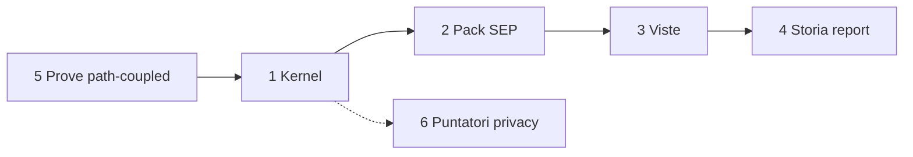

# Report B1 — Sintesi piano migrazione archiviazione MSS

**Modalità:** Meta/deep · SEP-10 Prompt-B1 · `SEP-SES-20260810-022`
**Profilo:** Meta · sintesi (zero rename/move)
**AGC:** `SEP-AGC-xai-cursor-001` · Cursor Grok 4.5
**Data:** 10-08-2026
**Plan tenuto:** `.cursor/plans/sep-10_archiviazione_mss_430c9c1d.plan.md`
**Input:** Report-A1 · A2 · A3 · A4 (tutti presenti — nessun STOP per input mancante)

---

## Cappello

- **Cosa è cambiato:** c’è un piano di archiviazione a livelli e un ordine di migrazione a fasi piccole e reversibili, pronto perché tu scelga (non perché qualcuno sposti file).
- **Cosa resta:** B2 (revisore distinto); tue max 5 decisioni; SEP-11 solo dopo tuo Sì esplicito; H-1.3 resta FAIL.
- **Serve una tua azione:** sì — leggere le 5 decisioni (§10) e dire Sì/No ad avviare B2 (non eseguito qui).

---

## Verdetto (una riga)

**PIANO PRONTO PER DECISIONE** — A1–A4 complete; sintesi 1–10 disponibile; zero migrazione eseguita; SEP-G5 non aperto (spetta a te dopo B2).

---

## 1. Fotografia Git e confini analizzati (unione A*)

| Campo | Valore (ri-fotografato in B1) |
|---|---|
| Branch | `env/test` |
| HEAD | `bec82c39f9e821ef33ac99214dc2efada27dcf1a` |
| Upstream | `origin/env/test` · ahead **2** · behind 0 |
| Staging | vuoto |
| WT concorrente | sì — hook, fixture, `scripts/mss`, pack SEP, report 09/10-08, SEP-10 cartella: **delta esterno non attribuito a B1** |
| Confini lettura | unione A1–A4: `docs/MetaSkillSystem/**`, `scripts/mss/**`, hook MSS, `SESSION_LOG`, report MSS/SEP mirati, solo **puntatori** privacy |
| Confini scrittura B1 | report B1 + viste pack (MASTERPLAN/ROADMAP) + SESSION_LOG + HANDOFF (ultimo atto) — **no** `PLAN_V0`, no move |
| H-1.3 | `FAIL` autorevole (report revisione indipendente 10-08); `PLAN_V0` ancora pre-H-1.3 → **registrato, non corretto** |
| SEP-G1 | `PASS_CON_RISERVE` Cursor-only (R1–R3) — non PASS pulito |

---

## 2. Mappa archiviazione attuale per livello

| Livello | Contenuto attuale | Pacchetto / owner | Note da A* |
|---|---|---|---|
| 1 Kernel/contratti | skill MSS, `PLAN_V0`, capsula, parametri, protocolli, tipi seduta | SYS-1 → `PLAN_V0`; schema → contratto capsula | root flat sotto `docs/MetaSkillSystem/` |
| 2 Pacchetti entry | `Senior-Eval-Pack/*` (6 file) | pack → `MASTERPLAN_V0` | ancora **untracked** (A1-F01 / A2-F01) |
| 3 Viste/indici | `ROADMAP`, `HANDOFF`, `SESSION_LOG`, `REPORT_001` | viste (non stato) | convivono con storia nella stessa tree |
| 4 Archivio storico | report in `docs/Sessioni di lavoro/**` (sottoinsieme MSS/SEP/CFG/H-1*) | storia; catalogo SEP = subset | ~21 mirati 09–10/08; monorepo ~397 report totali (fuori dominio) |
| 5 Prove tecniche | `fixtures/v0.1`, `tests/h1`, `scripts/mss`, matrix, hook | H-1 / validator | **path hard-coded** (A3 HIGH) |
| 6 Privato/sigillato | solo puntatori `_lavoro/.../Valutazione Personale/` (+ owner Matteo) | Bussola / privato | **mai aperti** in A*/B1 |



---

## 3. Findings consolidati (dedup)

| ID | Sev. | Fonti | Certezza | Asse | Effetto |
|---|---|---|---|---|---|
| B1-F01 | **HIGH** | A3-F01/F02, A1 «da non spostare» | alta | sistema | Move banale di `fixtures/v0.1`, `scripts/mss`, `COVERAGE_MATRIX_H1.json` o depth hook rompe validate/test/chiusura |
| B1-F02 | **HIGH** | A4-F04 | alta | persona | Qualunque fase che tocchi `docs/_lavoro/...` o contenuti privati è fuori mandato e pericolosa |
| B1-F03 | **HIGH** | A1-F02, A2-F02, H-1.3 | alta | sistema | Doppia narrazione stato: `PLAN_V0` stale vs H-1.3 FAIL — **non sanare in SEP-10/11** senza mandato SYS-1 |
| B1-F04 | MEDIUM | A1-F01, A2-F01 | alta | sistema | Pack + prove + molti report ancora untracked → «disco ≠ git» confonde cutover |
| B1-F05 | MEDIUM | A1-F03/F04, A4-F02/F05 | media | sistema | Storia e stato (e report non-MSS) convivono nello stesso FS senza sotto-albero archive dedicato |
| B1-F06 | MEDIUM | A2-F04, A4-F03 | alta | output | Handoff/report/SESSION_LOG narrano la stessa onda; rischio che una vista finga stato (E soft) |
| B1-F07 | MEDIUM | A4-F01 | media | output | Catalogo SEP non è indice completo dei report (by design) — orfani di catalogo ≠ orfani di log |
| B1-F08 | LOW | A2-F03, A3-F05 | alta | sistema | G forte su owner/archive; O agenti a volte aprono troppo; E path-coupled o assente |

---

## 4. Struttura futura proposta (principi, owner unici, progressive disclosure)

### Principi

1. **Un owner per stato dinamico:** SYS-1 → `PLAN_V0`; pack → `MASTERPLAN_V0`; schema capsula → contratto; continuità → handoff (vista); sequenza leggibile → roadmap (vista); indici → SESSION_LOG / catalogo (storia, non gate).
2. **Report = storia append-only**, mai stato vivo; non riscrivere provenienza.
3. **Prove tecniche restano path-coupled** finché non esiste fase dedicata di rewrite costanti + gate H-1.x separato.
4. **Privacy = solo puntatore**; nessun copy sotto pack o archive pubblico.
5. **Redirect/alias:** ogni stub dichiara durata e criterio di rimozione.
6. **Progressive disclosure:** intent tipici restano 2–4 file minimi (A2 §4); vietato «aprire tutta la tree» come default.

### Layout logico proposto (non eseguito)

```text
docs/MetaSkillSystem/
  METASKILL_SYSTEM_SKILL.md          # router L1 (resta)
  PLAN_V0.md / CONTRATTO_* / …       # kernel (resta; PLAN solo con mandato SYS-1)
  Senior-Eval-Pack/                  # pacchetto L2 (resta path)
  fixtures/v0.1/ + tests/h1/         # L5 FINCHÉ non fase path-rewrite
  archive/                           # NUOVO (vuoto prima): indici + stub redirect storia MSS
    README.md                        # policy archive + durata redirect
    indices/                         # viste derivate (opz.)
scripts/mss/                         # L5 resta (gate rewrite separato)
docs/Sessioni di lavoro/GG-MM-AA/    # L4 resta fisico di default (opzione: solo link da archive/)
docs/_lavoro/.../Valutazione…/       # L6 INTANGIBILE
```

Owner unici post-struttura (nessun doppio owner di stato):

| Stato | Owner unico |
|---|---|
| Gate/WP SYS-1 | `PLAN_V0.md` |
| Gate/WP SEP | `MASTERPLAN_V0.md` |
| Schema capsula | `CONTRATTO_CAPSULA_SESSIONE_V0.md` |
| Continuità senior | `HANDOFF_SENIOR_V0.md` (vista) |
| Storia metodi/sedute SEP | `CATALOGO_…` (append/rettifica) |
| Indice narrativo app | `SESSION_LOG.md` (vista) |

---

## 5. Matrice origine → destinazione proposta

> Tutte le azioni sono **ipotetiche** (SEP-11). Nessuna eseguita in B1.

| # | Origine | Destinazione proposta | azione_ipotetica | Motivazione | Dipendenze | Rischio | link_da_aggiornare | Rollback |
|---|---|---|---|---|---|---|---|---|
| M01 | — | `docs/MetaSkillSystem/archive/README.md` | create-only | policy livelli + redirect | decisione D1 | basso | masterplan nota | delete README |
| M02 | — | `archive/indices/MSS-REPORT-INDEX.md` | create-only | indice path report MSS senza muoverli | A4 elenco | basso | SESSION_LOG opz. | delete indice |
| M03 | `REPORT_001_…md` | `archive/osservazioni/REPORT_001_…` + stub | move+stub | storia non-stato fuori root | M01; link skill | medio | `METASKILL_SYSTEM_SKILL` | reverse move + drop stub |
| M04 | report MSS in `Sessioni…` | **restano** + riga in indice M02 | no-move / index | provenienza date-folder | M02 | basso | catalogo opz. | drop riga indice |
| M05 | `Senior-Eval-Pack/**` | stesso path | track-in-git (non move) | chiudere A1-F01 | decisione D2 | medio | nessuno path | `git rm --cached` se serve |
| M06 | `fixtures/v0.1/**` | stesso path (v0) | **freeze path** | A3 HIGH | — | alto se moved | adapter/run/hooks | N/A finché freeze |
| M07 | `scripts/mss/**` | stesso path (v0) | **freeze path** | A3 HIGH | — | alto se moved | package/hooks | N/A |
| M08 | path constants in adapter/run | constants centralizzate | rewrite-only | sblocca futuri move L5 | gate H-1.x + D4 | alto | tutti i consumatori A3 | revert commit rewrite |
| M09 | `_lavoro/Valutazione Personale/**` | — | **vietato** | A4-F04 | — | critico | — | non applicabile |
| M10 | `PLAN_V0.md` | — | **no-touch** in SEP-11 | B1-F03 | mandato SYS-1 separato | alto | — | — |
| M11 | stub redirect post-M03 | rimozione stub | delete dopo TTL | criterio rimozione | D5 | basso | skill già su nuovo path | ricrea stub |

---

## 6. Ordine migrazione in fasi atomiche

| Fase | Nome | Perimetro | Precondizioni | STOP | Rollback | Owner fase |
|---|---|---|---|---|---|---|
| **F0** | Snapshot + no-move gate | foto git; elenco path freeze L5/L6 | B2 ADEGUATO*; decisioni D1–D2 | WT sporco non classificato | N/A | Meta + Matteo |
| **F1** | Create-only archive shell | M01 (+ opz. M02) | F0; **zero** rename | touch L5/L6/PLAN | delete file creati | Meta writer |
| **F2** | Indice storia senza move | M02/M04 | F1 | riscrittura report chiusi | drop indice | Meta writer |
| **F3** | Prima prova move piccola | solo M03 (REPORT_001) + stub | F2; link-check; review breve | altri move | reverse M03 | Meta + revisore |
| **F4** | Track artefatti untracked (opz.) | M05 (+ fixture/scripts se D2) | D2=Sì; **no path change** | claim H-1.3 sanato | unstage | Meta |
| **F5+** | Path-rewrite L5 | M08 poi eventuale relocate | gate H-1.x **separato**; D4 | senza suite verde | revert rewrite | Meta H-1 · **non** default SEP-11 |

Ordine: **F1 prima prova piccola e reversibile** (solo create). Nessun cutover root. SEP-11 = autorizzazione **una fase alla volta**.

---

## 7. Gate / verifiche per fase

Per ogni fase F1–F3 (minimo):

| Check | Criterio |
|---|---|
| Snapshot | branch `env/test`; HEAD annotato; staging dichiarati; WT concorrente non mescolato |
| Link-check | `rg` su path origine/destinazione; skill/router aggiornati se move |
| Validator | `npm run validate:mss -- <report|fixture toccati>` se tocchi capsule/report |
| Hook/fixture | se perimetro ≠ L5: **non** richiedere verde H-1.3 come sanatoria; se L5: suite + matrix espliciti |
| Diff-check | `git diff --check` sul perimetro scritto |
| Rollback | procedura scritta e provata a secco (F1/F2) o dry-run reverse (F3) |
| Review | F3+ richiede revisore distinto (stile B2); F1–F2 self_report + tuo ok |
| Privacy | checklist «nessun path `_lavoro` / `.env` nel perimetro» |
| Autorità | touch H-1.x / frozen / privato / secondo router → **gate separato** (non F1–F3) |

`SEP-G5` (masterplan): analisi read-only ✓ · mappa source→target ✓ (questo B1) · owner ✓ · rollback ✓ · privacy ✓ · test per fase ✓ · **conferma esplicita Matteo sul perimetro** ancora mancante (+ B2).

---

## 8. Elementi da NON spostare (e perché)

| Elemento | Perché | Gate se mai |
|---|---|---|
| `scripts/mss/**`, `fixtures/v0.1/**`, `tests/h1/**`, `COVERAGE_MATRIX_H1.json` | path hard-coded (B1-F01) | F5+ / H-1.x |
| `.cursor/hooks/fine-sessione-*.mjs` (depth) | import relativi → scripts | con rewrite |
| `CONTRATTO_CAPSULA_SESSIONE_V0.md` | freeze schema / validator | H-1.x |
| `PLAN_V0.md` | owner SYS-1; stale ≠ licenza move/fix | mandato SYS-1 |
| `MASTERPLAN_V0.md` | owner stato pack | solo edit stato, non relocate casuale |
| `docs/_lavoro/**` (Valutazione + Owner Matteo) | privacy (B1-F02) | **mai via SEP-11** |
| Report storici già linkati (contenuto) | provenienza append-only | solo indice/stub, no rewrite body |
| Secondo router / `SENIOR_EVAL_SKILL` path | routing pack | SEP-9 + mandato |

---

## 9. Conflitti col working tree / info mancanti

| Voce | Stato |
|---|---|
| Pack SEP + scripts + fixture untracked | conflitto operativo cutover (B1-F04); non attributo a B1 |
| Hook/contratto/PROTOCOLLO modificati in WT | delta esterno; non nel perimetro scrittura B1 |
| `npm run test:mss` non rieseguito in A3/B1 come sanatoria | intenzionale — H-1.3 FAIL resta; suite non è prova di archive |
| Catalogo incompleto vs SESSION_LOG | noto (B1-F07); non bloccante per piano |
| Conteggio esatto «tutti i report MSS storici» pre-09-08 | incompleto in A4 (scelta mirata); F2 può estendere indice |
| Indipendenza B2 | **mancante** — proposta sotto; non eseguita |
| Budget modelli non-Cursor | fuori (SEP-G1 R1) |

Nessuna di queste rende il piano **BLOCCATO**: sono vincoli di fase / decisioni, non assenza di A*.

---

## 10. Massimo 5 decisioni strutturali per Matteo

### D1 — Prima fase SEP-11 autorizzabile
- **Opzioni:** (a) solo F1 create-only archive shell · (b) F1+F2 indice senza move · (c) rimandare SEP-11 finché non c’è commit degli untracked.
- **Effetto:** (a) rischio minimo; (b) utile subito agli agenti; (c) riduce confusione disco≠git ma allunga.
- **Raccomandazione:** **(b)** dopo B2 ADEGUATO*.

### D2 — Artefatti untracked MSS (pack/prove/report)
- **Opzioni:** (a) commit/track **prima** di qualsiasi move · (b) lasciare untracked e migrare solo create-only · (c) slice: track pack docs, lasciare fixture a parte.
- **Effetto:** (a) base git chiara; (b) veloce ma fragile; (c) bilanciato.
- **Raccomandazione:** **(c)** — pack+report analisi in git; L5 track solo con consapevolezza H-1.3 FAIL.

### D3 — Dove vive l’«archive» fisico della storia MSS
- **Opzioni:** (a) nuovo `docs/MetaSkillSystem/archive/` + report restano in `Sessioni…` · (b) spostare anche report MSS sotto archive/ per data · (c) nessun sotto-albero; solo policy/documentazione.
- **Effetto:** (a) disclosure senza riscrivere provenienza date; (b) path break su link storici; (c) minimo sforzo, poca enforcement.
- **Raccomandazione:** **(a)**.

### D4 — Touch prove L5 / path rewrite
- **Opzioni:** (a) freeze L5 fuori SEP-11 · (b) aprire WP path-rewrite con gate H-1.x separato · (c) move fixture «sperando» di aggiornare stringhe in un colpo.
- **Effetto:** (a) sicuro; (b) corretto ma costoso; (c) alto rischio regressione.
- **Raccomandazione:** **(a)** ora; **(b)** solo con mandato esplicito post-H-1.3.

### D5 — Policy redirect/stub
- **Opzioni:** (a) TTL 30 giorni + rimozione quando `rg` zero hit sul vecchio path · (b) stub permanenti · (c) niente stub (solo changelog).
- **Effetto:** (a) igiene; (b) rumore eterno; (c) link morti.
- **Raccomandazione:** **(a)**.

---

## Telemetria ricognizione (calibrazione `non_comparabile`)

> Usabile dal Senior Eval Pack come **calibrazione di metodo di ricognizione**, non come eval né ranking.

### Segnali Persona / Sistema / Output

| Asse | Segnale consolidato | Evidenza A* | Uso |
|---|---|---|---|
| Persona | Nessuna nuova decisione mid-flight in A1–A4; decisioni strutturali rinviate a post-B1 | A* annotazioni persona `non_osservato` | non inferire profilo |
| Sistema | Owner G forti; O agenti aprono troppo; E soft o path-coupled | A2 G/O/E; A3 E path | calibrazione enforcement archive |
| Sistema | Friction routing: intent «stato» apre PLAN+MASTERPLAN | A2 | disclosure |
| Output | Inventari A* usabili per decisione (completezza matrice B1) | questo report | readiness SEP-G5 input |
| Output | Catalogo ≠ indice completo report | A4-F01 | non promuovere lacuna a fail eval |

### G / O / E (regole archive — vince il più debole)

| Regola | G | O | E | Più debole |
|---|---|---|---|---|
| Report = vista/storia, non stato | 2 (dichiarato skill/contratto) | 1–2 (a volte usati come stato) | 0 (no lint anti-overwrite) | **E=0** |
| Un owner per stato dinamico | 2 | 2 (se handoff resta vista) | 0–1 soft | **E soft** |
| Prove versionate / path stabili | 2 | 2 su path corrente | 2 path-coupled (rompe se move) | path-coupled ≠ policy archive |
| Privacy boundary `_lavoro` | 2 | 2 in A* (non aperti) | 0 automatico in SEP-11 | serve checklist umana |
| Progressive disclosure | 2 in skill | 1 (liste lunghe in chat Meta) | 0 | **O/E deboli** |

### Confondenti da non promuovere a esito eval

- Working tree sporco / untracked pack.
- HEAD fisso vs tree diverso.
- H-1.3 FAIL vs `PLAN_V0` stale.
- Suite verde ≠ sanatoria H-1.3; suite non eseguita ≠ piano bloccato.

---

## Cosa è stato fatto (questa chat B1)

1. Verificati presenti A1–A4 (nessun STOP input).
2. Ri-fotografato Git.
3. Sintetizzati livelli, findings, struttura futura, matrice, fasi, gate, no-move, decisioni.
4. Allineate viste MASTERPLAN (`SEP-10` → `CHIUSO_NEL_DISEGNO`) e ROADMAP; SESSION_LOG; HANDOFF ultimo.
5. Zero rename/move/copy/delete archivi; `PLAN_V0` non riscritto; H-1.3 non sanato; WP-1 non aperto; B2 non eseguito.

---

## File toccati e perché

| File | Perché |
|---|---|
| `…/SEP-10-archiviazione/Report-B1-sintesi-piano-migrazione.md` | output B1 |
| `…/SEP-10-archiviazione/README.md` | stato fase B1 |
| `docs/MetaSkillSystem/Senior-Eval-Pack/MASTERPLAN_V0.md` | owner stato SEP-10 |
| `docs/MetaSkillSystem/Senior-Eval-Pack/ROADMAP_V0.md` | vista sequenza |
| `docs/SESSION_LOG.md` | riga narrativa |
| `docs/MetaSkillSystem/Senior-Eval-Pack/HANDOFF_SENIOR_V0.md` | ultimo atto continuità |

---

## Test eseguiti e risultato

- `npm run validate:mss -- --mode file --file …/Report-B1-… --kind report --require-capsule` → **OK** (dopo fix `causation_record_id=nessuno`).
- `git diff --check` sul perimetro scritto (B1, README SEP-10, MASTERPLAN, ROADMAP, SESSION_LOG) → **verde**.
- `npm run test:mss`: **non** eseguito come sanatoria H-1.3 (fuori mandato).

---

## File di skill aggiornati

| file | modifica | perché |
|---|---|---|
| `MASTERPLAN_V0.md` | SEP-10 → `CHIUSO_NEL_DISEGNO` + registro + prossimo passo B2 | owner stato pack |
| `ROADMAP_V0.md` | nota vista su SEP-10 chiuso nel disegno | allineamento vista |
| `HANDOFF_SENIOR_V0.md` | handoff attivo → B1 done / prossimo B2 | continuità |
| nessuno skill area app | — | task Meta archive, non Prenota/QR |

---

## Dati comunicazione

- Frasi ricorrenti: «plan da TENERE», «zero migrazione», «A1–A4 obbligatori», «max 5 decisioni», «proponi B2 ma non eseguire».
- Formato che funziona: prompt autocontenuto con STOP espliciti + ordine output 1–10.
- Automatizzabile: checklist presenza A* prima di B1; non automatizzare decisioni D1–D5.

---

## Capsula MetaSkillSystem

```jsonl
{"schema_version":"mss.session/0.1.1","system_revision":"mss-v0.1-wp0.1-freeze-2","record_type":"session_event","record_id":"mss-rec-019fec30-b101-7000-8000-000000000001","session_id":"mss-ses-019fec30-b101-7000-8000-0000000000b1","correlation_id":"mss-cor-019fec21-0211-7000-8000-0000000000c1","segment_no":1,"capture_key":"mss-ses-019fec30-b101-7000-8000-0000000000b1/1/session_event/1","created_at":"2026-08-10T15:45:00+02:00","finalization":"final","recorded_by":{"actor_id":"cursor-grok-sep10-b1","actor_type":"agente","role":"sep10_b1","agent_runtime":{"provider":"xAI/Cursor","model":"Cursor Grok 4.5","runtime":"Cursor Agent","surface":"Cursor IDE"},"tools_used":["PowerShell","Git","Read","Grep","Write","Node.js"]},"packages_loaded":[{"package_id":"metaskill-system","package_version_or_revision":"mss-v0.1-wp0.1-freeze-2","source_ref":"docs/MetaSkillSystem/METASKILL_SYSTEM_SKILL.md"},{"package_id":"mss.senior-eval-pack","package_version_or_revision":"0.1.0","source_ref":"docs/MetaSkillSystem/Senior-Eval-Pack/SENIOR_EVAL_SKILL.md"},{"package_id":"communication-closure","package_version_or_revision":"working-tree","source_ref":"docs/Comunicazione-Skill/CHIUSURA_SESSIONE.md"}],"event":{"event_id":"mss-evt-019fec30-b101-7000-8000-0000000000e1","event_kind":"session_close","occurred_at":"2026-08-10T15:45:00+02:00","continues_record_id":"nessuno","causation_record_id":"nessuno","intent_user":"Eseguire Prompt-B1 sintesi piano migrazione da A1-A4 senza migrazione reale","session_type":"deep","capsule_status":"completa","role_key":"Meta writer","area":"MetaSkillSystem SEP-10 B1","environment":"branch env/test; HEAD bec82c39; ahead 2; staging vuoto; working-tree concorrente non attribuito","authorization":{"read":["docs/MetaSkillSystem/**","Report-A1..A4","plan SEP-10","PLAN_V0 read-only","H-1.3 report"],"write":["docs/Sessioni di lavoro/10-08-26/SEP-10-archiviazione/Report-B1-sintesi-piano-migrazione.md","MASTERPLAN_V0 SEP-10","ROADMAP vista","SESSION_LOG","HANDOFF ultimo","README SEP-10"],"forbid":["rename/move/migrazione","SEP-11 esecuzione","Prompt-B2 senza Si/No","H-1.3 fix","WP-1","PLAN_V0 rewrite","Valutazione Personale contents","commit"]},"authorized_outputs":["report B1 punti 1-10","telemetria ricognizione","capsula","vista SEP-10 CHIUSO_NEL_DISEGNO"],"route":{"chosen":"SENIOR_EVAL_SKILL + MASTERPLAN + plan Prompt-B1","alternatives_or_conflicts":"nessuno"},"observed_outcome":"PIANO PRONTO PER DECISIONE; SEP-10 chiuso nel disegno; zero migrazione","open_items":["B2 revisore distinto","decisioni D1-D5 Matteo","SEP-11 vietato finche non autorizzato","H-1.3 FAIL conservato"],"controls":[{"control_id":"NO-MIGRATION","criterio":"zero rename/move/copy/delete archivi","esito":"pass","numeratore":1,"denominatore":1,"esecutore":"cursor-grok-sep10-b1","evidence_refs":["owner-report"]},{"control_id":"INPUT-A-STAR","criterio":"A1 A2 A3 A4 presenti","esito":"pass","numeratore":4,"denominatore":4,"esecutore":"cursor-grok-sep10-b1","evidence_refs":["source-a1","source-a2","source-a3","source-a4"]},{"control_id":"NO-PLAN-V0-REWRITE","criterio":"PLAN_V0 non modificato","esito":"pass","numeratore":1,"denominatore":1,"esecutore":"cursor-grok-sep10-b1","evidence_refs":["owner-report"]}],"subject_runtime":{"actor_id":"mss.senior-eval-pack/0.1.0","provider":"non_applicabile:oggetto documentale","model":"non_applicabile:oggetto documentale","runtime":"docs/MetaSkillSystem/Senior-Eval-Pack","surface":"markdown pack"},"privacy":{"classification":"internal","capture_basis":"user_request","allowed_content":["finding","path","git metadata","decisioni proposte Matteo"],"prohibited_content":["dati personali Valutazione Personale","segreti"],"redactions":"nessuno","external_release":"forbidden","retention":"undecided_wp0.1","rectification_route":"amendment"},"owner_refs":[{"ref_id":"owner-report","owner_id":"SEP-10-B1","uri_or_path":"docs/Sessioni di lavoro/10-08-26/SEP-10-archiviazione/Report-B1-sintesi-piano-migrazione.md","stable_anchor_or_event_id":"SEP-SES-20260810-022","revision_or_hash":"working-tree-10-08-26","sensitivity":"internal"},{"ref_id":"owner-masterplan","owner_id":"mss.senior-eval-masterplan","uri_or_path":"docs/MetaSkillSystem/Senior-Eval-Pack/MASTERPLAN_V0.md","stable_anchor_or_event_id":"SEP-10","revision_or_hash":"working-tree-10-08-26","sensitivity":"internal"}],"source_refs":[{"ref_id":"source-user","owner_id":"conversation","uri_or_path":"conversation:this-session","stable_anchor_or_event_id":"mandate-SEP-10-B1","revision_or_hash":"10-08-26","sensitivity":"internal"},{"ref_id":"source-plan","owner_id":"plan","uri_or_path":".cursor/plans/sep-10_archiviazione_mss_430c9c1d.plan.md","stable_anchor_or_event_id":"Prompt-B1","revision_or_hash":"kept","sensitivity":"internal"},{"ref_id":"source-a1","owner_id":"SEP-10-A1","uri_or_path":"docs/Sessioni di lavoro/10-08-26/SEP-10-archiviazione/Report-A1-inventario-filesystem.md","stable_anchor_or_event_id":"SEP-SES-20260810-021","revision_or_hash":"working-tree","sensitivity":"internal"},{"ref_id":"source-a2","owner_id":"SEP-10-A2","uri_or_path":"docs/Sessioni di lavoro/10-08-26/SEP-10-archiviazione/Report-A2-grafo-link-owner.md","stable_anchor_or_event_id":"SEP-SES-20260810-021","revision_or_hash":"working-tree","sensitivity":"internal"},{"ref_id":"source-a3","owner_id":"SEP-10-A3","uri_or_path":"docs/Sessioni di lavoro/10-08-26/SEP-10-archiviazione/Report-A3-prove-tecniche-path.md","stable_anchor_or_event_id":"SEP-SES-20260810-021","revision_or_hash":"working-tree","sensitivity":"internal"},{"ref_id":"source-a4","owner_id":"SEP-10-A4","uri_or_path":"docs/Sessioni di lavoro/10-08-26/SEP-10-archiviazione/Report-A4-archivi-report-privacy.md","stable_anchor_or_event_id":"SEP-SES-20260810-021","revision_or_hash":"working-tree","sensitivity":"internal"}]}}
{"schema_version":"mss.session/0.1.1","system_revision":"mss-v0.1-wp0.1-freeze-2","record_type":"annotation","record_id":"mss-rec-019fec30-b101-7000-8000-000000000002","session_id":"mss-ses-019fec30-b101-7000-8000-0000000000b1","correlation_id":"mss-cor-019fec21-0211-7000-8000-0000000000c1","segment_no":1,"capture_key":"mss-ses-019fec30-b101-7000-8000-0000000000b1/1/annotation/1","created_at":"2026-08-10T15:45:01+02:00","finalization":"final","recorded_by":{"actor_id":"cursor-grok-sep10-b1","actor_type":"agente","role":"sep10_b1","agent_runtime":{"provider":"xAI/Cursor","model":"Cursor Grok 4.5","runtime":"Cursor Agent","surface":"Cursor IDE"},"tools_used":["Write"]},"packages_loaded":[{"package_id":"mss.senior-eval-pack","package_version_or_revision":"0.1.0","source_ref":"docs/MetaSkillSystem/Senior-Eval-Pack/SENIOR_EVAL_SKILL.md"}],"annotation":{"annotation_id":"mss-ann-019fec30-b101-7000-8000-0000000000a1","axis":"persona","subject_record_ids":["mss-rec-019fec30-b101-7000-8000-000000000001"],"delta":"nessuno","assertions":[{"signal":"non_osservato","actor":"matteo","assistance":"non_applicabile:sintesi senza nuova decisione mid-flight","origin":"naturale","source_ref":"source-user","effect":"decisioni D1-D5 proposte non scelte; B2 proposto non eseguito","evidence_state":"observed"}],"asserted_by":{"actor_id":"cursor-grok-sep10-b1","role":"sep10_b1","basis":"direct_observation"},"verification":{"status":"unverified","verified_by":[],"verified_at":"non_applicabile:nessuna valutazione Persona","criterion_ref":"non_applicabile:gate_o_archivio","evidence_refs":["source-user"],"notes":"nessuna inferenza su competenze o profilo di Matteo"}}}
{"schema_version":"mss.session/0.1.1","system_revision":"mss-v0.1-wp0.1-freeze-2","record_type":"annotation","record_id":"mss-rec-019fec30-b101-7000-8000-000000000003","session_id":"mss-ses-019fec30-b101-7000-8000-0000000000b1","correlation_id":"mss-cor-019fec21-0211-7000-8000-0000000000c1","segment_no":1,"capture_key":"mss-ses-019fec30-b101-7000-8000-0000000000b1/1/annotation/2","created_at":"2026-08-10T15:45:02+02:00","finalization":"final","recorded_by":{"actor_id":"cursor-grok-sep10-b1","actor_type":"agente","role":"sep10_b1","agent_runtime":{"provider":"xAI/Cursor","model":"Cursor Grok 4.5","runtime":"Cursor Agent","surface":"Cursor IDE"},"tools_used":["Write"]},"packages_loaded":[{"package_id":"mss.senior-eval-pack","package_version_or_revision":"0.1.0","source_ref":"docs/MetaSkillSystem/Senior-Eval-Pack/MASTERPLAN_V0.md"}],"annotation":{"annotation_id":"mss-ann-019fec30-b101-7000-8000-0000000000a2","axis":"sistema","subject_record_ids":["mss-rec-019fec30-b101-7000-8000-000000000001"],"delta":"SEP-10 IN_CORSO -> CHIUSO_NEL_DISEGNO","assertions":[{"rule_id_version":"SEP-10@mss.senior-eval-pack/0.1.0","trigger_event":"sintesi B1","decision_or_output_changed":"piano migrazione documentale","G":2,"O":2,"E":0},{"rule_id_version":"archive-owner-unico@mss.senior-eval-pack/0.1.0","trigger_event":"proposta struttura","decision_or_output_changed":"owner map","G":2,"O":1,"E":0}],"asserted_by":{"actor_id":"cursor-grok-sep10-b1","role":"sep10_b1","basis":"direct_observation"},"verification":{"status":"self_report","verified_by":[],"verified_at":"non_applicabile:self_report","criterion_ref":"owner-masterplan","evidence_refs":["owner-report"],"notes":"calibrazione non_comparabile; SEP-G5 non dichiarato"}}}
{"schema_version":"mss.session/0.1.1","system_revision":"mss-v0.1-wp0.1-freeze-2","record_type":"annotation","record_id":"mss-rec-019fec30-b101-7000-8000-000000000004","session_id":"mss-ses-019fec30-b101-7000-8000-0000000000b1","correlation_id":"mss-cor-019fec21-0211-7000-8000-0000000000c1","segment_no":1,"capture_key":"mss-ses-019fec30-b101-7000-8000-0000000000b1/1/annotation/3","created_at":"2026-08-10T15:45:03+02:00","finalization":"final","recorded_by":{"actor_id":"cursor-grok-sep10-b1","actor_type":"agente","role":"sep10_b1","agent_runtime":{"provider":"xAI/Cursor","model":"Cursor Grok 4.5","runtime":"Cursor Agent","surface":"Cursor IDE"},"tools_used":["Write"]},"packages_loaded":[{"package_id":"mss.senior-eval-pack","package_version_or_revision":"0.1.0","source_ref":"docs/MetaSkillSystem/Senior-Eval-Pack/SENIOR_EVAL_SKILL.md"}],"annotation":{"annotation_id":"mss-ann-019fec30-b101-7000-8000-0000000000a3","axis":"output","subject_record_ids":["mss-rec-019fec30-b101-7000-8000-000000000001"],"delta":"creato","assertions":[{"output_id":"SEP-OUT-sep10-b1-0.1","primary_type":"registro","canonical_version":"2026-08-10-v1","recipient":"Matteo","problem_or_job":"piano archiviazione verificabile per decisione","intended_use":"input B2 e decisioni D1-D5; non esecuzione SEP-11","conceived_by":"Matteo via plan Prompt-B1","decided_by":"plan tenuto","directed_by":"prompt B1","authored_by":"cursor-grok-sep10-b1","verified_by":"validate capsula + diff-check","acceptance_criterion":"punti 1-10 + verdetto una riga + zero migrazione","verification_or_use_evidence":"file Report-B1 presente; no move in git status perimetro","verification_status":"self_report","owner_ref":"owner-report","privacy_release":"internal","support_files":["docs/Sessioni di lavoro/10-08-26/SEP-10-archiviazione/Report-A1-inventario-filesystem.md","docs/Sessioni di lavoro/10-08-26/SEP-10-archiviazione/Report-A2-grafo-link-owner.md","docs/Sessioni di lavoro/10-08-26/SEP-10-archiviazione/Report-A3-prove-tecniche-path.md","docs/Sessioni di lavoro/10-08-26/SEP-10-archiviazione/Report-A4-archivi-report-privacy.md"],"relations_no_double_count":["un report B1"],"product_candidate":{"recipient":"pass","problem_or_job":"pass","canonical_version":"pass","fixed_acceptance_criterion":"pass","verification_or_use_evidence":"fail","result":"not_eligible"}}],"asserted_by":{"actor_id":"cursor-grok-sep10-b1","role":"sep10_b1","basis":"direct_observation"},"verification":{"status":"self_report","verified_by":[],"verified_at":"non_applicabile:self_report","criterion_ref":"owner-report","evidence_refs":["owner-report"],"notes":"non eval prospettica; B2 ancora da fare"}}}
```

---

## Analisi flusso prompt, efficienza e statistiche

- Prompt sostanziali Matteo: 1 (mandato B1 completo).
- Correzioni dopo 1ª risposta: 0 (questa è la consegna).
- Modalità alzata: no (già deep).
- Anatomia: vincoli STOP + input obbligatori A* + ordine 1–10 riducono ambiguità; rischio residuo = sovrapporre B2/SEP-G5 (evitato esplicitamente).

---

## La TUA lettura della sessione

- **Impressioni:** A1–A4 erano abbastanza omogenei da fondere senza contraddizioni hard; il vincolo path-coupled L5 è il vero muro del piano.
- **Difficoltà:** tenere `CHIUSO_NEL_DISEGNO` per SEP-10 senza dichiarare SEP-G5 o PASS H-1.3 — risolto separando «analisi chiusa» da «migrazione autorizzata».
- **Migliorie (dato, non modifica):** un checklist automatico «A* complete?» nel plan; TTL redirect come template stub.

---

## Derivazione errori

- nessuna difficoltà bloccante in questa chat.
- Vincolo strutturale ereditato: H-1.3 FAIL + PLAN_V0 stale (registrato, non corretto) — causa esterna al B1.

---

## Cosa resta per la prossima sessione

1. **B2** revisore distinto (Prompt-B2 del plan) — solo dopo tuo Sì.
2. Tue scelte **D1–D5**.
3. Eventuale **una** fase F1/F2 di SEP-11 — solo dopo B2 + tuo mandato nuovo.
4. Fuori scope: H-1.3 remediation, WP-1, SEP-5.

---

## Handoff al prossimo agente

**Cosa è vero adesso:** SEP-10 analisi A1–A4 + sintesi B1 = `CHIUSO_NEL_DISEGNO`; verdetto piano = PRONTO PER DECISIONE; zero file spostati; SEP-G1 resta PASS_CON_RISERVE; H-1.3 FAIL; SEP-11 BLOCCATO_DA_GATE.

**Prossimo task atomico:** Prompt-B2 (revisore ≠ writer B1) → `Report-B2-review-piano-migrazione.md`. Gate chiusura B2: verdetto ADEGUATO* | NON_ADEGUATO.

**Non riaprire:** sanatoria H-1.3; WP-1; PASS pulito G1; esecuzione move.

**Owner:** stato pack = MASTERPLAN; piano proposto = questo report; SYS-1 = PLAN_V0 (non toccare).

---

## Domande di chiusura

❓ Q1 — Prompt ricevuti: riporta VERBATIM i prompt sostanziali che Matteo ti ha dato in questa chat.
✅ R1: Mandato Meta SEP-10 Prompt-B1 deep: skill list obbligatoria; plan tenuto; input A1–A4 obbligatori (STOP se manca); contesto G1 PASS_CON_RISERVE e SEP-10 IN_CORSO; obiettivo sintesi mappa/struttura/matrice/fasi/max 5 decisioni; output Report-B1 punti 1–10 + telemetria + SESSION_LOG + capsula + MASTERPLAN SEP-10→CHIUSO_NEL_DISEGNO se non bloccato + ROADMAP vista + HANDOFF ultimo; NESSUNA migrazione; non B2 senza Sì/No; non H-1.3/WP-1/SEP-11.

❓ Q2 — Dati = diff reale? I numeri/valori/file citati nel report corrispondono al diff vero? Elenca cosa hai ri-verificato aprendo i file.
✅ R2: Ri-aperti A1–A4 (presenti); MASTERPLAN riga SEP-10 era IN_CORSO; git HEAD `bec82c39…`, ahead 2, staging vuoto; PLAN_V0 non modificato da questa chat; nessun rename/move nel perimetro B1 oltre scrittura report/viste dichiarate.

❓ Q3 — File correlati allineati? Quali file erano collegati alla modifica (skill area, context, test, tipi) e hai verificato che siano aggiornati? Elencali (o «nessuno + perché»).
✅ R3: Allineati MASTERPLAN (owner), ROADMAP (vista), HANDOFF (ultimo), README SEP-10, SESSION_LOG. Non toccati: PLAN_V0, validator, fixture, skill Prenota/QR, CATALOGO (non in output obbligatori — append catalogo rinviato a Sì/No se serve record B1).

❓ Q4 — Cosa NON hai fatto? Cosa volevi/dovevi fare e hai lasciato a metà o saltato? (vietato «tutto ok» a vuoto: se davvero nulla, scrivilo e di' perché ne sei certo.)
✅ R4: Non eseguito B2; non SEP-11; non commit/push; non test:mss sanatoria; non aggiornato CATALOGO; non create cartella archive/ reale (solo proposta). Certo perché fuori mandato esplicito o «niente extra senza Sì/No».

❓ Q5 — Attrito + miglioria: che difficoltà hai avuto nel workflow con lo skill system, e come lo miglioreresti? (critica + proposta nella stessa riga; se non hai avuto attriti, scrivi «nessuna osservazione» e cosa hai verificato.)
✅ R5: Attrito lieve: confusione possibile tra chiusura SEP-10 (disegno) e apertura SEP-G5 (migrazione) — mitigato con verdetto esplicito e fasi F0–F5; miglioria: nel plan, una riga «SEP-10 CHIUSO ≠ SEP-G5 PASS».

❓ Q6 — Contesto & hook: il contesto caricato dallo skill system era troppo / giusto / troppo poco? E gli hook che hai ricevuto ti sono stati utili o rumore?
✅ R6: Contesto giusto (skill MSS + SEP + A* + chiusura); lista lunga ma necessaria per owner/G-O-E. Hook fine-sessione utili come vincolo Q/R; nessun rumore operativo in questa sintesi.

---

## Self-review del report

1. Dati = A* + git ri-fotografati — ok.
2. Viste owner allineate; PLAN non toccato — ok.
3. Q1–Q6 compilate — ok.
4. Chiusura Matteo in 5 punti sotto — ok.
5. Handoff ricostruibile (prossimo = B2) — ok.

---

## Chiusura verso Matteo (max 5 + decisioni)

1. Il piano di archiviazione c’è: livelli chiari, prove tecniche **non** si spostano per prime.
2. Prima mossa sicura proposta: creare solo una cartella «archivio» + indice — **senza** muovere i report.
3. Privato e piano globale SYS-1 restano fuori da questa migrazione.
4. H-1.3 resta FAIL; non è «risolto» da questo piano.
5. Prossimo passo naturale: **B2** (un revisore diverso che attacca il piano) — **non** l’ho avviato.

**Decisioni da scegliere (non eseguite):** D1 prima fase · D2 untracked · D3 dove vive archive · D4 freeze prove · D5 TTL redirect.

**Sì/No:** avvio Prompt-B2 (revisore distinto) nella prossima chat?
