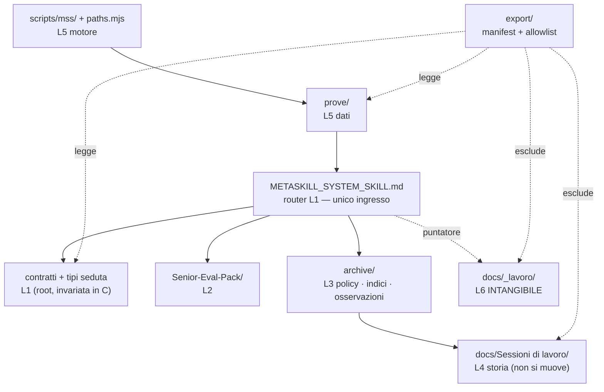

# Report — Plan directory / export / sandbox MetaSkillSystem (zero move)

**Modalità:** deep · SEP-11 plan directory · `SEP-SES-20260821-038`
**Profilo:** Meta · pianificazione (zero move, zero F5 exec)
**AGC:** `SEP-AGC-anthropic-claudecode-001` · Claude Opus 5 · **prima configurazione non-Cursor / non-Codex del pacchetto**
**Data:** 21-08-2026
**Mandato:** `docs/Sessioni di lavoro/10-08-26/Prompt-plan-directory-export-sandbox-mss-10-08-26.md`
**Owner toccati:** nessuno (allineo narrativo rinviato a dopo le decisioni di Matteo)

---

## Cappello

- **Cosa è cambiato:** esiste un progetto della «casa» MSS — albero, export e banco di prova — con tre livelli di ambizione confrontati e cinque decisioni pronte per te.
- **Cosa resta:** le tue cinque scelte, poi la review indipendente, poi una fase esecutiva alla volta.
- **Serve una tua azione:** sì — rispondere a D6–D10 in fondo. Fino ad allora non parte nessuna fase.

---

## Verdetto (una riga)

**PIANO PRONTO PER REVIEW E DECISIONE** — l'albero, l'export e la sandbox sono progettati e ordinati in fasi provabili; **zero move eseguiti**; `SEP-G5` **non** PASS; `WP-1` **NO-GO**; H-1.3 resta `PASS_CON_RISERVE`.

---

## 1. F0 — Foto Git e conferma baseline

| Campo | Valore verificato in questa seduta |
|---|---|
| Branch | `env/test` |
| HEAD | `ee0ab393816f3380a3f7a7253e492575ec534866` |
| `origin/env/test` | `ee0ab393816f3380a3f7a7253e492575ec534866` — **identico** (ahead 0 · behind 0) |
| Baseline tecnica H-1.3 | `ee0ab39` — **confermata** |
| L5 tracked in git | **sì**: `git ls-files scripts/mss` = 9 · `git ls-files docs/MetaSkillSystem` = 63 · zero untracked nel dominio |
| Staging | vuoto |
| Working tree | **sporco su 6 path**: `FOLLOW_UP.md`, `MASTERPLAN_V0.md`, `ROADMAP_V0.md`, `HANDOFF_SENIOR_V0.md`, `MSS-REPORT-INDEX.md`, `SESSION_LOG.md` + 2 untracked (`Prompt-…-036`, `Report-…-037`) |
| `npm run test:mss` | **verde ri-eseguito oggi** — 41 fixture + 32 gruppi contratto/integrazione |
| Worktree esistenti | 1 solo (il principale) |
| Tag `mss*` / `*baseline*` | **nessuno** |
| `stash@{0}` | intatto (`wip: L5+rumore pre reasoning/plan H13`) — non toccato |

### Correzione a un'assunzione del prompt `036`

Il prompt diceva: «HEAD può includere una successiva chiusura solo documentale `037`».
**Fatto osservato:** HEAD **non** la include. La chiusura `037` — report, allineo masterplan/roadmap/handoff/follow-up/indice/session-log e la modifica al prompt stesso — è **ancora tutta nel working tree, non committata**.

Conseguenza operativa: la prima fase esecutiva, qualunque essa sia, parte da un albero di lavoro che contiene già un perimetro non pubblicato di un'**altra** sessione. Vedi finding `PLAN-F02` e decisione **D10**.

### Zero-move gate di questa seduta

| Controllo | Esito |
|---|---|
| `mkdir` / `mv` / `git mv` / `cp -r` di albero target | **nessuno eseguito** |
| Modifiche a `docs/MetaSkillSystem/**` | **nessuna** |
| Modifiche a `scripts/mss/**` | **nessuna** |
| Contenuti `docs/_lavoro/**` letti | **nessuno** (solo puntatori nei file MSS) |
| `src/`, DB, migrazioni | **non aperti** |
| File creati | 2, entrambi sotto `docs/Sessioni di lavoro/21-08-26/` (questo report + prompt di review) |

---

## 2. Quadro «vero adesso» L1–L6

| Liv. | Cosa esiste davvero (verificato) | Cosa manca | Salute |
|---|---|---|---|
| **L1** Kernel | 8 file *flat* nella root `docs/MetaSkillSystem/`: router, `PLAN_V0`, contratto capsula, parametri macro, protocollo pilota, 2 tipi-seduta, + `COVERAGE_MATRIX_H1.json` + stub `REPORT_001` | nessuna separazione fra **contratti** e **tipi di seduta**: ogni nuovo tipo allunga la root | ⚠️ cresce male |
| **L2** Pacchetti | `Senior-Eval-Pack/` (6 file), **tracked** | nessun contenitore `packages/`: un secondo pacchetto nascerebbe di nuovo in root | ⚠️ non scalabile |
| **L3** Viste/indici | `archive/README.md` (policy) · `archive/indices/MSS-REPORT-INDEX.md` · `archive/osservazioni/REPORT_001` · fuori: `ROADMAP`, `HANDOFF`, `SESSION_LOG`, `FOLLOW_UP` | indice L4 **manuale** e dichiaratamente incompleto; nome `archive/` fuorviante (contiene policy viva) | ⚠️ E=0 |
| **L4** Storia report | `docs/Sessioni di lavoro/GG-MM-AA/` — **57 cartelle data · 633 `.md` totali misurati a F0**, di cui ~45 dominio MSS. *(Dopo i 2 file prodotti da questa seduta il conteggio è 635: chi ri-fotografa troverà quel numero.)* | condiviso con la storia dell'app; nessun filtro automatico | ✅ per D3 (restano lì) |
| **L5** Prove | `fixtures/v0.1/` (35) + `tests/h1/` (3) + `COVERAGE_MATRIX_H1.json` **sotto docs/** · `scripts/mss/` (9) **sotto scripts/** · 2 hook `.cursor/hooks/` · `.husky/pre-commit` | il livello è **spezzato in 3 posti**; nessun punto unico di freeze/export; path e **profondità** hard-coded | 🔴 path-coupled |
| **L6** Privato | `docs/_lavoro/` — **gitignored** (riga 42 `.gitignore`) | — | ✅ intangibile |

**Fatto nuovo rispetto a B1:** `B1-F04` («pack + prove + report untracked → disco ≠ git») è **chiuso**. Tutto il dominio MSS è ora in git a `ee0ab39`. Il piano B1 era scritto quando questo era il rischio principale: non lo è più.

**Fatto nuovo rispetto a B1 (in negativo):** le fixture contengono **zero** occorrenze della stringa `matteo` — sono sintetiche pulite. Questo *semplifica* l'export (vedi §5) e va registrato perché B1 non l'aveva verificato.

---

## 3. Requisiti del design

| # | Requisito | Come lo soddisfa il piano | Prova |
|---|---|---|---|
| R1 | **Owner unici** — nessun doppio stato | le cartelle non diventano owner: `PLAN_V0` (SYS-1) e `MASTERPLAN_V0` (pack) restano soli proprietari; ogni nuova cartella ha un README che dichiara «non sono owner» | grep «owner unico» nei README creati |
| R2 | **Progressive disclosure** — ingresso 2–4 file | il router `METASKILL_SYSTEM_SKILL.md` resta l'unico punto d'ingresso e **non si sposta mai**; le sottocartelle sono raggiunte dal router, mai enumerate | il router già oggi smista in 9 righe |
| R3 | **L1–L6 coerenti** con `archive/README.md` | i livelli restano quelli; cambia solo **dove stanno fisicamente**, e solo dove c'è una prova | tabella §7 propone l'aggiornamento del README come *proposta*, non edit live |
| R4 | **Export** — includibili/esclusi espliciti | allowlist positiva + denylist + 3 prove di sanità automatiche (§5) | `npm run export:mss` fallisce se una prova non passa |
| R5 | **Ripristino** — tornare a `ee0ab39` | tag annotato `mss/baseline-h13` + procedura scritta in 2 comandi (§6) | il tag oggi **non esiste**: è la fase F5b |
| R6 | **Sandbox** — testare senza contaminare il live | git worktree su branch dedicato; `docs/_lavoro/` è gitignored quindi **non entra** nella copia | prova di isolamento §6 |
| R7 | **L5 path-coupled** — relocate ⇒ rewrite + suite verde | nessun move L5 prima di `paths.mjs`; e `paths.mjs` da solo **non basta** (vedi `PLAN-F01`) | `test:mss` verde prima e dopo, nel worktree prima che sul live |
| R8 | **Tracce errori** — provenienza non si cancella | i report FAIL storici restano dove sono; nessuna fase li tocca; gli stub dichiarano TTL | policy D5 già attiva |

---

## 4. Findings di questa pianificazione

| ID | Sev. | Asse | Prova riproducibile | Effetto |
|---|---|---|---|---|
| **PLAN-F01** | **HIGH** | sistema | `docs/MetaSkillSystem/tests/h1/run.mjs:42` calcola `repoRoot = resolve(here, '../../../..')` — cioè **dalla profondità della propria cartella**. `.cursor/hooks/*.mjs:13-17` importano `'../../scripts/mss/*.mjs'` — idem. `docs/MetaSkillSystem/tests/h1/run.mjs:30` importa `'../../../../scripts/mss/rules.mjs'`. | L'accoppiamento **non è solo la stringa di path**: è la **profondità di directory**. Centralizzare le costanti in un `paths.mjs` risolve le ~25 stringhe ma **non** risolve `repoRoot`. Spostare `tests/h1` di un solo livello rompe la suite anche con le costanti centralizzate. B1/A3 avevano classificato il rischio come «path hard-coded»: è **sottodimensionato**. |
| **PLAN-F02** | MEDIUM | sistema | HEAD `ee0ab39` == `origin/env/test`; `git status` mostra 6 modificati + 2 untracked appartenenti alla chiusura `037`. Il prompt `036` afferma che HEAD *può* includerla. | Non la include. Chi esegue la prima fase erediterà nello stage un perimetro di un'altra sessione. Rischio di commit misto e di attribuzione sbagliata nel registro append-only. |
| **PLAN-F03** | MEDIUM | sistema | L5 vive in 3 radici: `docs/MetaSkillSystem/{fixtures,tests}`, `docs/MetaSkillSystem/COVERAGE_MATRIX_H1.json` (in root L1), `scripts/mss/`. | Non esiste un singolo path da congelare, esportare o escludere. Ogni policy L5 va scritta 3 volte e può divergere. |
| **PLAN-F04** | MEDIUM | output | `archive/indices/MSS-REPORT-INDEX.md` è compilato a mano, dichiara di essere incompleto e cresce di riga a ogni sessione. Universo: 57 cartelle data / 633 report. | La vista L4 ha `E=0` e degraderà con certezza. È l'unico artefatto del sistema che *deve* essere generato, non scritto. |
| **PLAN-F05** | LOW | sistema | `archive/` contiene policy viva (`README.md`), viste (`indices/`) e storia (`osservazioni/`). | Il nome suggerisce «materiale morto» e può indurre un agente a non leggerlo o a considerarlo non autorevole. |
| **PLAN-F06** | LOW | output | 7 file MSS citano `docs/_lavoro/…` come **puntatore**. Le fixture ne citano 0. | Un export del kernel conterrebbe puntatori a un albero che il destinatario non ha: link morti *by design*. Va deciso (D7), non subito. |

---

## 5. Proposta albero target

### 5.1 Il principio che regge il disegno

> **Sposta per primo solo ciò di cui hai una prova automatica che dimostri che non si è rotto.**

Oggi esiste **una sola** prova di questo tipo: `npm run test:mss` (41 fixture + 32 gruppi). Copre L5.
Per L1/L2/L3 la prova disponibile è solo `rg` sui link: verifica che i riferimenti *scritti* siano vivi, non che il sistema *funzioni*. È una prova debole.

Da qui l'ordine: **indirezione → prova → move su L5 → (solo dopo) move su L1/L2**.

### 5.2 Tre livelli di ambizione

| | **A — Conservativa** | **B — Albero pulito** | **C — Ibrida** ⭐ |
|---|---|---|---|
| L5 (`fixtures`,`tests`,matrix) | resta | → `prove/` | → `prove/` |
| L1 kernel (contratti, tipi seduta) | resta | → `kernel/`, `tipi-seduta/` | resta (rivalutare a 2° pacchetto) |
| L2 pacchetti | resta | → `packages/senior-eval-pack/` | resta |
| `archive/` | resta | → `viste/` | resta (solo README chiarito) |
| Nuovi documenti futuri | nascono già nella cartella giusta | — | nascono già nella cartella giusta |
| Move totali | 0 | ~25 file + ~40 link | ~39 file, **1 solo albero**, coperti da suite |
| Stub TTL da gestire | 0 | ~8 | 0 (path L5 non sono citati da documenti, solo da codice) |
| Fasi esecutive | 3 | 7 | 5 |
| Rischio residuo | albero misto per mesi | alto su L1: nessun test lo copre | contenuto |
| Chiude `PLAN-F03` | no | sì | **sì** |
| Chiude `PLAN-F01` | parziale | sì | **sì** |

**Raccomandazione: C.** L'albero resta imperfetto in superficie (L1 flat) ma il problema *reale* — un livello di prove spezzato in tre posti e legato alla profondità di directory — viene chiuso con una prova a 73 casi che dice sì o no. Il riordino di L1/L2 diventa banale **dopo**, perché a quel punto la macchina di move è già stata esercitata e c'è un banco di prova dove sbagliare gratis.

### 5.3 Albero target della variante C (non creato su disco)

```text
docs/MetaSkillSystem/
  METASKILL_SYSTEM_SKILL.md          # L1 router — path storico, MAI muovere (R2)
  PLAN_V0.md                         # L1 owner SYS-1 — path storico (M10 no-touch)
  CONTRATTO_CAPSULA_SESSIONE_V0.md   # L1 contratti — restano in C
  PARAMETRI_MACRO_V0.md
  PROTOCOLLO_PRIMO_PILOTA_V0_1.md
  TIPO_SEDUTA_FANTASTICAZIONE_V0.md  # L1b tipi seduta — restano in C
  STUDIO_RISPOSTE_FANTASTICAZIONE_V0.md
  REPORT_001_…md                     # stub D5 (TTL scaduto ~09-09-26 → vedi §8)

  Senior-Eval-Pack/                  # L2 — resta in C

  archive/                           # L3 — resta; README chiarisce «policy viva, non deposito»
    README.md · indices/ · osservazioni/

  prove/                             # L5 dati — NUOVO (fase F8)
    README.md                        # freeze + «questa cartella è provata da npm run test:mss»
    fixtures/v0.1/
    tests/h1/
    COVERAGE_MATRIX_H1.json

  export/                            # NUOVO (fase F6) — manifest, non contenuti
    EXPORT_MANIFEST_V0.md
    allowlist.json

scripts/mss/                         # L5 motore — RESTA in scripts/ (è codice, non documentazione)
  paths.mjs                          # NUOVO (fase F5a) — unico owner dei path + repoRoot robusto
  adapter.mjs · core.mjs · cli.mjs · git-adapter.mjs · parse.mjs · refs.mjs · rules.mjs · …

docs/Sessioni di lavoro/GG-MM-AA/    # L4 — restano (decisione D3, invariata)
docs/_lavoro/…                       # L6 — INTANGIBILE, gitignored
```

**Perché `scripts/mss` non si sposta sotto `docs/`:** è codice eseguibile referenziato da `package.json`, da `.husky/pre-commit` e dai due hook Cursor. Spostarlo aggiunge rischio senza aggiungere coerenza: la coerenza di L5 si ottiene dal **manifest** (`export/allowlist.json` elenca entrambe le radici) e da `paths.mjs`, non dalla vicinanza fisica.



---

## 6. Piano export

### 6.1 Che cosa è il pacchetto esportabile

Il **kernel portabile**: quello che permetterebbe a un'altra persona di far girare il MetaSkillSystem, senza contenere nulla su Matteo.
Vincolo già scritto e non negoziabile — `PLAN_V0.md` §13: «kernel privo di dati o esempi personali su Matteo».

### 6.2 Allowlist / denylist

| | Path | Perché |
|---|---|---|
| ✅ **IN** | `docs/MetaSkillSystem/METASKILL_SYSTEM_SKILL.md` | router, nessun dato personale |
| ✅ IN | `CONTRATTO_CAPSULA_SESSIONE_V0.md` · `PARAMETRI_MACRO_V0.md` · `PROTOCOLLO_PRIMO_PILOTA_V0_1.md` | contratti e schema: il cuore riusabile |
| ✅ IN | `TIPO_SEDUTA_FANTASTICAZIONE_V0.md` · `STUDIO_RISPOSTE_FANTASTICAZIONE_V0.md` | metodi, non dati |
| ✅ IN | `archive/README.md` | policy di archiviazione |
| ✅ IN | `fixtures/v0.1/**` + `tests/h1/**` + `COVERAGE_MATRIX_H1.json` | **le prove sono il valore riproducibile**; verificato: 0 occorrenze `matteo` |
| ✅ IN | `scripts/mss/**` | il validator; nessun dato personale nei messaggi (`rules.mjs:1` lo dichiara) |
| ✅ IN | `.husky/pre-commit` + i 2 hook MSS, **senza** `.fine-sessione-commit-state.json` | enforcement; lo state json è locale |
| ❌ **OUT** | `docs/_lavoro/**` | L6 — mai, in nessuna forma |
| ❌ OUT | `docs/Sessioni di lavoro/**` | L4 — contengono `intent_user`, citazioni verbatim, «Regia di Matteo», dati comunicazione |
| ❌ OUT | `PLAN_V0.md` · `Senior-Eval-Pack/**` · `ROADMAP` · `HANDOFF` · `CATALOGO` · `SESSION_LOG` · `FOLLOW_UP` | **stato del progetto di Matteo**, non del kernel |
| ❌ OUT | `archive/indices/**` · `archive/osservazioni/**` | indice e osservazioni della sua storia |
| ❌ OUT | `.cursor/hooks/.fine-sessione-commit-state.json` · `.env*` · `.cursor/plans/**` | stato locale e segreti |

### 6.3 Formato

- **Cartella**, non archivio: `dist/mss-kernel-<versione>/` (aggiungere `dist/` a `.gitignore` se non c'è).
- Un `MANIFEST.json` generato con: versione, commit sorgente, elenco path, sha256 per file.
- Un `README.md` di destinazione che dichiara: cosa è incluso, cosa è stato tolto e perché, e che `npm run test:mss` deve tornare verde nella destinazione.
- Owner della lista: `docs/MetaSkillSystem/export/EXPORT_MANIFEST_V0.md` (documentale) + `allowlist.json` (macchina).

### 6.4 Le tre prove di sanità (l'export fallisce se una non passa)

| # | Prova | Criterio |
|---|---|---|
| E1 | **nessun path L6** | zero file esportati con prefisso `docs/_lavoro/`; zero `.env*` |
| E2 | **nessun contenuto personale** | grep case-insensitive su `Matteo`, `0cavuz0`, `@gmail`, `rwuxgvld`, `docnnernvp` nei file esportati → **0 hit** (i 7 puntatori `_lavoro` di `PLAN-F06` sono in file già OUT, quindi la prova è superabile) |
| E3 | **il kernel gira davvero** | dalla cartella esportata, `node tests/h1/run.mjs` (o equivalente via `paths.mjs`) torna verde |

E3 è il punto interessante: **oggi fallirebbe**, perché `run.mjs` risolve `repoRoot` risalendo 4 livelli e cerca `docs/MetaSkillSystem/fixtures/v0.1` (`PLAN-F01`). Cioè: *l'export non è possibile finché F5a non è fatta*. Questo lega export e path-rewrite in un ordine obbligato, che B1 non aveva visto.

---

## 7. Piano ripristino + sandbox

### 7.1 Punto di ripristino (necessario, indipendente dalla sandbox)

Oggi il punto di ripristino è **uno SHA a memoria**. Proposta: un tag annotato.

```bash
git tag -a mss/baseline-h13 ee0ab39 -m "H-1.3 PASS_CON_RISERVE; L5+hooks tracked; test:mss verde"
git push origin mss/baseline-h13          # solo con Sì esplicito
```

Ripristino, due forme:

```bash
# A) ripristinare solo il dominio MSS senza toccare il resto del branch
git restore --source=mss/baseline-h13 -- docs/MetaSkillSystem scripts/mss

# B) ripartire da zero su un branch nuovo
git switch -c mss/restore-<data> mss/baseline-h13
```

Costo: zero file, zero rischio. **Va fatto prima di qualunque fase.**

### 7.2 Sandbox — confronto opzioni

| | **(A) git worktree** su `mss/sandbox-<data>` | **(B) mirror gitignored** `_sandbox/` | **(C) solo tag + restore** |
|---|---|---|---|
| **Beneficio** | copia reale e isolata; `test:mss` gira nativo; il diff è vero diff git; accettare = merge, scartare = `worktree remove` | zero interazione con git; semplice da spiegare | costo zero; ripristino chiaro |
| **Costo** | ~1× dimensione repo su disco; l'agente deve dichiarare la CWD a ogni comando | copia manuale da tenere sincronizzata a mano | non esiste posto dove sperimentare |
| **Rischio privacy** | **basso**: `docs/_lavoro/` è gitignored ⇒ **non entra** nel worktree. Verificabile. | **alto**: una copia ricorsiva dentro il repo può trascinare dentro materiale che il gitignore proteggeva solo al path originale | nullo |
| **Difetto fatale** | — | **`test:mss` non funziona lì**: `repoRoot` risale 4 livelli dalla posizione del file e cerca `docs/MetaSkillSystem/fixtures/v0.1` (`PLAN-F01`). La sandbox non può provare la cosa che serve provare. | non è una sandbox |
| **STOP** | mai `worktree add` su `env/test` o su un branch già in uso; mai lasciare worktree orfani | non usare | — |
| **Prova di chiusura** | `git worktree list` torna a 1 riga · `git branch -D mss/sandbox-<data>` · `git status` del principale invariato | `rg` che `_sandbox` non è in git · rimozione cartella | `git tag -l` |

**Raccomandazione: C + A.** Il tag è il punto di ripristino ed è permanente. Il worktree è il banco di prova ed è temporaneo, creato per una fase e rimosso alla fine. **B è da scartare** e il motivo è tecnico, non estetico: è l'unica opzione che rende impossibile la verifica.

### 7.3 Prova di isolamento richiesta alla sandbox (da eseguire in F7)

1. `git worktree add ../mss-sandbox -b mss/sandbox-<data>` → il worktree nasce da HEAD.
2. `ls ../mss-sandbox/docs/_lavoro` → **deve dare «non esiste»**. È la prova che L6 non è stata replicata.
3. `cd ../mss-sandbox && npm run test:mss` → deve essere verde *prima* di qualunque esperimento (baseline della sandbox).
4. Rompere qualcosa apposta, verificare che il repo principale sia intatto (`git status` invariato).
5. `git worktree remove ../mss-sandbox --force` + `git branch -D mss/sandbox-<data>` → `git worktree list` torna a 1.

---

## 8. Gap vs B1 / F5 — cosa resta, cosa cambia

### 8.1 Di B1 resta valido

- I sei livelli L1–L6 e la mappa owner (§4 di B1).
- `M06`/`M07` freeze L5 finché non c'è la fase di rewrite — **confermato e rafforzato** da `PLAN-F01`.
- `M09` `_lavoro` vietato · `M10` `PLAN_V0` no-touch senza mandato SYS-1.
- `M04` i report L4 restano nelle cartelle data (decisione D3).
- `D5` stub con TTL + criterio `rg` a zero.
- Una fase alla volta, con autorizzazione esplicita; review distinta da F3 in su.

### 8.2 Cosa cambia dopo H-1.3 `PASS_CON_RISERVE`

| Elemento B1 | Stato allora | Stato ora |
|---|---|---|
| `B1-F04` untracked | MEDIUM aperto | **chiuso** — 72 file del dominio tracked a `ee0ab39` |
| `M05` track pack | proposto | **fatto** (`033` + `035`) |
| H-1.3 | `FAIL` | `PASS_CON_RISERVE` (riserva `H13-POST-L01`); suite verde ri-provata oggi |
| `M08` path constants | «sblocca futuri move» — opzionale, F5+ | **prerequisito obbligato**: senza, non c'è export (E3) né sandbox utile |
| `B2-F02` autocertificazione G5 | MEDIUM | ancora valido come monito: **questo report non spunta nessuna casella di `SEP-G5`** |
| `B2-F05` indipendenza soft | MEDIUM | **superabile per la prima volta**: questa seduta è scritta da un AGC Anthropic, diverso da `SEP-AGC-xai-cursor-001` e da Codex. Vedi §10. |

### 8.3 Righe di matrice nuove (estensione di M01–M11)

| # | Origine | Destinazione | azione_ipotetica | Dipendenze | Rischio | Rollback |
|---|---|---|---|---|---|---|
| **M12** | costanti sparse in `adapter/core/git-adapter/run/build-fixtures/factory` | `scripts/mss/paths.mjs` + `repoRoot` robusto (risalita fino a `package.json`) | rewrite-only, **path invariati** | nessuna | medio | `git revert` del commit |
| **M13** | — | tag `mss/baseline-h13` su `ee0ab39` | create-only (zero file) | nessuna | nullo | `git tag -d` |
| **M14** | — | `docs/MetaSkillSystem/export/{EXPORT_MANIFEST_V0.md,allowlist.json}` + `npm run export:mss` | create-only | M12 (per E3) | basso | delete file + script |
| **M15** | — | worktree `mss/sandbox-<data>` | create-only fuori repo | M12 | basso | `worktree remove` + `branch -D` |
| **M16** | `fixtures/v0.1`,`tests/h1`,`COVERAGE_MATRIX_H1.json` | `docs/MetaSkillSystem/prove/**` | move | M12 + M15 + suite verde in sandbox | **alto** | reverse `git mv` + revert |
| **M17** | stub `REPORT_001` root | rimozione | delete dopo TTL | TTL scaduto **09-09-2026** + `rg` a zero | basso | ricrea stub |

> `M17` è una scadenza già maturata secondo la policy D5 scritta in `archive/README.md`. Non la eseguo qui: la registro perché non vada persa.

### 8.4 Ordine delle fasi atomiche proposte

| Fase | Nome | Perimetro | Precondizione | Prova di uscita | Rollback | Move? |
|---|---|---|---|---|---|---|
| **F5a** | Centralizzare i path L5 | `scripts/mss/paths.mjs` + rewrite consumatori (M12) | decisioni D6–D10 + review | `test:mss` verde · `validate:mss` OK · `git diff --check` · **zero rename** | revert commit | **no** |
| **F5b** | Punto di ripristino | tag `mss/baseline-h13` (M13) | nessuna — eseguibile subito | `git tag -l` mostra il tag | `git tag -d` | **no** |
| **F6** | Export pack | `export/` + `npm run export:mss` + prove E1–E3 (M14) | F5a | E1·E2·E3 verdi; `dist/` gitignored | delete | **no** |
| **F7** | Sandbox | worktree + 5 prove di isolamento §7.3 (M15) | F5b | `worktree list` torna a 1 riga | `worktree remove` | **no** |
| **F8** | Move L5 sotto `prove/` | M16 | F5a+F6+F7 **e** suite verde nel worktree **prima** che sul live | `test:mss` verde post-move + `validate:mss` + review indipendente | reverse `git mv` | **sì** |
| **F9** | Riordino L1/L2 (variante B) | `kernel/`,`tipi-seduta/`,`packages/` + stub TTL | F8 chiusa e osservata + **nuova** decisione di Matteo | `rg` link vivi + router aggiornato + review | reverse move + drop stub | **sì** |
| **F10** | Igiene stub | rimozione stub `REPORT_001` (M17) | TTL scaduto + `rg` zero | `rg` a zero hit | ricrea stub | no |

**Le prime quattro fasi (F5a → F7) non spostano un solo file.** Il primo move è F8, e arriva quando esistono già: costanti centralizzate, un export che prova che il kernel gira, un tag per tornare indietro e un banco di prova dove sbagliare gratis.

---

## 9. Cosa questo piano **non** dichiara

- `SEP-G5` **non** è PASS. Questo report non spunta nessuna casella del gate (lezione `B2-F02`).
- H-1.3 **non** è PASS pulito: resta `PASS_CON_RISERVE` con `H13-POST-L01`.
- `WP-1` resta **NO-GO** e non viene aperto implicitamente.
- `SEP-5` resta bloccato dalle decisioni di freeze, che sono un'altra corsia.
- Nessun contenuto `docs/_lavoro/` è stato letto o citato.
- I bypass dichiarati (E2, `--no-verify`, assenza di CI) restano tali: questo piano non li tocca.

---

## 10. Nota sull'indipendenza — occasione da non sprecare

`SEP-G1` è passato **con riserva R1** e `B2-F05` è aperto per lo stesso motivo: tutte le review finora sono state fatte dallo stesso AGC (`SEP-AGC-xai-cursor-001`, famiglia Cursor/Grok) o da Codex. Il masterplan §9 registra: «eventuale riapertura indipendenza forte se diventa disponibile un AGC/modello distinto».

Questa seduta è scritta da un AGC Anthropic. Se la review di questo piano viene affidata a **un modello di famiglia ancora diversa**, si ottiene per la prima volta una coppia writer/revisore **realmente distinta**. Non chiude `R1` retroattivamente sul contratto — quella review resta Cursor-only — ma stabilisce il precedente e permette di dichiarare `PLAN-REVIEW` come **`independently_verified`** anziché `self_report`.

Il prompt di review è pronto:
`docs/Sessioni di lavoro/21-08-26/Prompt-review-indipendente-plan-directory-mss-21-08-26.md`.

---

## 11. Decisioni per Matteo — D6–D10 (STOP finché non rispondi)

### D6 — Quanto ambizioso deve essere l'albero?

| | Opzione | Effetto |
|---|---|---|
| (a) | **Conservativa** — nessun move; solo `paths.mjs`, export, sandbox, tag | rischio quasi nullo; l'albero resta com'è; `PLAN-F03` non si chiude |
| (b) ⭐ | **Ibrida** — come (a), poi il solo L5 sotto `prove/` (F8) | chiude `PLAN-F01` e `PLAN-F03`; ogni passo è verificato da 73 casi di test; L1 si riordina dopo, con calma |
| (c) | **Completa** — anche `kernel/`, `tipi-seduta/`, `packages/`, `viste/` (F9) subito | albero definitivo subito; ma L1 non ha alcun test che ne provi la correttezza: la prova sarebbe solo `rg` |

**Raccomandazione: (b).**

### D7 — Cosa entra nel pacchetto esportabile?

| | Opzione | Effetto |
|---|---|---|
| (a) ⭐ | **Kernel + prove + policy** (§6.2) | il destinatario può far girare `test:mss`: l'export è verificabile |
| (b) | Solo kernel documentale, **senza** `fixtures/tests/scripts` | pacchetto piccolo ma non provabile: E3 non esiste |
| (c) | (a) + report storici anonimizzati | costo di anonimizzazione alto e rischio residuo di riconoscibilità |

**Raccomandazione: (a).** Verificato: le fixture contengono 0 occorrenze di `matteo`.

### D8 — Punto di ripristino e sandbox

| | Opzione | Effetto |
|---|---|---|
| (a) ⭐ | **Tag `mss/baseline-h13` + worktree on-demand** | ripristino permanente + banco di prova reale; L6 non replicata perché gitignored |
| (b) | Solo il tag | ripristino sì, ma nessun posto dove sperimentare: gli esperimenti finiscono su `env/test` |
| (c) | Mirror gitignored `_sandbox/` | **sconsigliata**: `test:mss` non funziona lì (`PLAN-F01`), quindi la sandbox non prova nulla |

**Raccomandazione: (a).**

### D9 — Cosa si fa della chiusura `037` non committata (`PLAN-F02`)?

| | Opzione | Effetto |
|---|---|---|
| (a) ⭐ | **Commit dedicato di `037` prima di tutto**, poi si parte pulito | perimetri separati; il registro append-only resta leggibile |
| (b) | Includerla nel primo commit del plan | un commit solo, ma mescola due sessioni e due autori |
| (c) | Lasciarla nel working tree | il prossimo esecutore la trova e non sa se è sua |

**Raccomandazione: (a).**

### D10 — Ordine fra review e prima fase esecutiva

| | Opzione | Effetto |
|---|---|---|
| (a) ⭐ | **Review indipendente di questo piano prima di F5a** | coerente con la regola del pacchetto (review prima di ogni modifica sostanziale) e coglie l'occasione di §10 |
| (b) | Eseguire F5b (solo il tag: zero file) subito, review poi | il punto di ripristino esiste prima ancora di iniziare; il tag non è una modifica sostanziale |
| (c) | Eseguire F5a e F5b, review dopo | più veloce, ma la review arriverebbe su un piano già in parte eseguito |

**Raccomandazione: (a), con (b) come eccezione ammessa** — creare il tag non modifica nessun file e riduce il rischio di tutto ciò che segue.

---

## 12. Cosa è stato fatto in questa seduta

1. Foto Git completa; baseline `ee0ab39` confermata e **corretta un'assunzione errata** del prompt `036` (`PLAN-F02`).
2. `npm run test:mss` ri-eseguito: verde, 41+32.
3. Inventario read-only di `docs/MetaSkillSystem/**`, `scripts/mss/**`, hook, `package.json`, `.gitignore`.
4. Letti: skill MSS, `PLAN_V0`, `MASTERPLAN_V0`, `HANDOFF`, `ROADMAP`, `archive/README`, `MSS-REPORT-INDEX`, B1, B2, report `037`, `FOLLOW_UP`.
5. Trovato `PLAN-F01` (accoppiamento per profondità, non solo per stringa) — non presente in A3/B1.
6. Progettati albero (3 varianti), export (allowlist + 3 prove), ripristino e sandbox (3 opzioni confrontate).
7. Estesa la matrice con M12–M17 e proposte le fasi F5a–F10.
8. Scritto il prompt di review indipendente.
9. **Zero move, zero mkdir di albero target, zero modifiche a file owner, zero commit.**

## 13. File toccati e perché

| File | Perché |
|---|---|
| `docs/Sessioni di lavoro/21-08-26/Report-plan-directory-export-sandbox-mss-21-08-26.md` | output del plan (questo file) |
| `docs/Sessioni di lavoro/21-08-26/Prompt-review-indipendente-plan-directory-mss-21-08-26.md` | mandato di review indipendente, non eseguito qui |

Non toccati di proposito: `PLAN_V0`, `MASTERPLAN_V0`, `ROADMAP`, `HANDOFF`, `FOLLOW_UP`, `archive/**`, `SESSION_LOG`. L'allineo narrativo degli owner avviene **dopo** le decisioni D6–D10, come previsto dal mandato.

## 14. Test eseguiti e risultato

| Controllo | Esito |
|---|---|
| `npm run test:mss` | **OK** — 41 fixture + 32 gruppi |
| `npm run validate:mss -- --mode file --file <questo report> --kind report --require-capsule` | vedi §15 |
| `git diff --check` sul perimetro scritto | **OK** |
| `git status` invariato su `docs/MetaSkillSystem/**` e `scripts/mss/**` | **OK** |
| DB / `src/` / migrazioni | non toccati — fuori perimetro |

## 15. File di skill aggiornati

| File | Modifica | Perché |
|---|---|---|
| nessuno | — | una seduta di plan non cambia il comportamento del sistema; gli owner si allineano dopo le decisioni |

## 16. Dati comunicazione

- Prompt sostanziali di Matteo in questa chat: 1 («sei agente senior… analizza… prepariamo tutta la documentazione e poi faremo revisionare e approvare anche da modello fable»).
- Vincolo aggiunto da lui rispetto al prompt `036`: la documentazione va preparata **prima** delle sue risposte, e la review affidata a un modello diverso.
- Formato che funziona: opzioni tabellate con una raccomandazione esplicita, non un elenco neutro.
- Automatizzabile: foto Git, inventario, `test:mss`, prove E1–E3 dell'export. **Non** automatizzabile: D6–D10.

### Regia di Matteo

| Campo | Dato osservato |
|---|---|
| Opzioni offerte → scelta | nessuna opzione preventiva; ha dato direzione («ambizioso») e processo (doc → review Fable) |
| Vincoli aggiunti da lui | review da parte di un modello diverso; documentazione completa prima delle decisioni |
| Criterio: prima o dopo? | prima la documentazione completa, poi la review, poi le scelte |
| Cosa NON ha chiesto | non ha chiesto move, commit, push, F5 exec né la creazione della sandbox |
| Correzioni: direzione + materia | `M→A × processo`: ha anticipato la preparazione della documentazione rispetto all'ordine del prompt `036` |
| Reazione alla correzione | non osservata al momento della stesura |
| Citazione verbatim decisiva | 21-08-26: «prepariamo tutta la documentazione e poi faremo revisionare e apporvare anche da modello fable» |

### Capsula MetaSkillSystem

```jsonl
{"schema_version":"mss.session/0.1.1","system_revision":"mss-v0.1-wp0.1-freeze-2","record_type":"session_event","record_id":"mss-rec-01a02467-18be-7125-bfb6-792d1857dbdf","session_id":"mss-ses-01a02467-18bd-78b6-a9b1-da7cc0a95cae","correlation_id":"mss-cor-01a02467-18be-7cf9-93cc-acf9dbac9514","segment_no":1,"capture_key":"mss-ses-01a02467-18bd-78b6-a9b1-da7cc0a95cae/1/session_event/1","created_at":"2026-08-21T15:20:00+02:00","finalization":"final","recorded_by":{"actor_id":"anthropic-claude-opus5-meta-plan","actor_type":"agente","role":"Meta_plan_directory","agent_runtime":{"provider":"Anthropic","model":"claude-opus-5","runtime":"Claude Code","surface":"VSCode extension"},"tools_used":["Bash","Git","Read","Grep","Glob","Write","Node.js"]},"packages_loaded":[{"package_id":"metaskill-system","package_version_or_revision":"mss-v0.1-wp0.1-freeze-2","source_ref":"docs/MetaSkillSystem/METASKILL_SYSTEM_SKILL.md"},{"package_id":"mss.senior-eval-pack","package_version_or_revision":"0.1.0","source_ref":"docs/MetaSkillSystem/Senior-Eval-Pack/SENIOR_EVAL_SKILL.md"},{"package_id":"comunicazione-chiusura","package_version_or_revision":"working-tree-2026-08-21","source_ref":"docs/Comunicazione-Skill/CHIUSURA_SESSIONE.md"}],"event":{"event_id":"mss-evt-01a02467-18be-72ee-8759-d09d6d4aa541","event_kind":"session_close","occurred_at":"2026-08-21T15:20:00+02:00","continues_record_id":"nessuno","causation_record_id":"nessuno","intent_user":"progettare directory, export e sandbox del MetaSkillSystem senza spostare nulla, e preparare la review indipendente","session_type":"deep","capsule_status":"completa","role_key":"Meta","area":"MetaSkillSystem SEP-11 plan directory","environment":"branch env/test; HEAD ee0ab39 == origin/env/test; staging vuoto; working tree con chiusura 037 non committata","authorization":{"read":["docs/MetaSkillSystem/**","scripts/mss/**",".cursor/hooks/**","package.json",".gitignore","report SEP-10 B1 e B2","report 035 e 037","docs/FOLLOW_UP.md"],"write":["docs/Sessioni di lavoro/21-08-26/Report-plan-directory-export-sandbox-mss-21-08-26.md","docs/Sessioni di lavoro/21-08-26/Prompt-review-indipendente-plan-directory-mss-21-08-26.md"],"forbid":["move","mkdir albero target","F5 exec","sandbox reale","WP-1","SEP-5","claim SEP-G5 PASS","claim H-1.3 PASS pulito","contenuti _lavoro","stash drop","commit","push"]},"authorized_outputs":["foto Git F0","quadro L1-L6","requisiti design","albero target proposto","piano export","piano ripristino e sandbox","gap vs B1","fasi atomiche","decisioni D6-D10","prompt review indipendente"],"route":{"chosen":"METASKILL_SYSTEM_SKILL + MASTERPLAN_V0 + prompt 036","alternatives_or_conflicts":"nessuno"},"observed_outcome":"piano directory/export/sandbox pronto per review e decisione; zero move; PLAN-F01 HIGH individuato; SEP-G5 non PASS","open_items":["decisioni D6-D10 di Matteo","review indipendente del piano","commit della chiusura 037","H13-POST-L01","SEP-G5 non PASS","WP-1 NO-GO","stub REPORT_001 con TTL scaduto"],"controls":[{"control_id":"PLAN-ZERO-MOVE","criterio":"zero rename move copy mkdir di albero target","esito":"pass","numeratore":1,"denominatore":1,"esecutore":"git status sul dominio MSS","evidence_refs":["owner-report"]},{"control_id":"PLAN-SUITE-GREEN","criterio":"npm run test:mss verde alla baseline","esito":"pass","numeratore":73,"denominatore":73,"esecutore":"anthropic-claude-opus5-meta-plan","evidence_refs":["owner-report"]},{"control_id":"PLAN-NO-GATE-CLAIM","criterio":"nessuna casella SEP-G5 dichiarata soddisfatta","esito":"pass","numeratore":1,"denominatore":1,"esecutore":"anthropic-claude-opus5-meta-plan","evidence_refs":["owner-masterplan"]},{"control_id":"PLAN-NO-L6","criterio":"zero contenuti docs/_lavoro letti o citati","esito":"pass","numeratore":1,"denominatore":1,"esecutore":"anthropic-claude-opus5-meta-plan","evidence_refs":["owner-report"]}],"subject_runtime":{"actor_id":"mss-documentation-tree","provider":"non_applicabile:oggetto documentale","model":"non_applicabile:oggetto documentale","runtime":"Git working tree","surface":"repository locale"},"privacy":{"classification":"internal","capture_basis":"user_request","allowed_content":["path","metadati git","findings","opzioni di design"],"prohibited_content":["dati personali","segreti","contenuti _lavoro"],"redactions":"nessuno","external_release":"forbidden","retention":"undecided_wp0.1","rectification_route":"amendment"},"owner_refs":[{"ref_id":"owner-report","owner_id":"SEP-SES-20260821-038","uri_or_path":"docs/Sessioni di lavoro/21-08-26/Report-plan-directory-export-sandbox-mss-21-08-26.md","stable_anchor_or_event_id":"session-038","revision_or_hash":"working-tree-2026-08-21","sensitivity":"internal"},{"ref_id":"owner-masterplan","owner_id":"SEP-masterplan","uri_or_path":"docs/MetaSkillSystem/Senior-Eval-Pack/MASTERPLAN_V0.md","stable_anchor_or_event_id":"SEP-11","revision_or_hash":"working-tree-2026-08-21","sensitivity":"internal"}],"source_refs":[{"ref_id":"source-user","owner_id":"conversation","uri_or_path":"conversation:this-session","stable_anchor_or_event_id":"mandate-plan-directory","revision_or_hash":"2026-08-21","sensitivity":"internal"},{"ref_id":"source-prompt","owner_id":"prompt-036","uri_or_path":"docs/Sessioni di lavoro/10-08-26/Prompt-plan-directory-export-sandbox-mss-10-08-26.md","stable_anchor_or_event_id":"SEP-SES-20260810-036","revision_or_hash":"working-tree","sensitivity":"internal"},{"ref_id":"source-b1","owner_id":"SEP-10-B1","uri_or_path":"docs/Sessioni di lavoro/10-08-26/SEP-10-archiviazione/Report-B1-sintesi-piano-migrazione.md","stable_anchor_or_event_id":"SEP-SES-20260810-022","revision_or_hash":"ee0ab39","sensitivity":"internal"},{"ref_id":"source-b2","owner_id":"SEP-10-B2","uri_or_path":"docs/Sessioni di lavoro/10-08-26/SEP-10-archiviazione/Report-B2-review-piano-migrazione.md","stable_anchor_or_event_id":"SEP-SES-20260810-023","revision_or_hash":"ee0ab39","sensitivity":"internal"},{"ref_id":"source-037","owner_id":"SEP-SES-20260821-037","uri_or_path":"docs/Sessioni di lavoro/21-08-26/Report-chiusura-documentale-preparazione-036-21-08-26.md","stable_anchor_or_event_id":"session-037","revision_or_hash":"working-tree-2026-08-21","sensitivity":"internal"}]}}
{"schema_version":"mss.session/0.1.1","system_revision":"mss-v0.1-wp0.1-freeze-2","record_type":"annotation","record_id":"mss-rec-01a02467-18be-7a09-b007-34dc85122057","session_id":"mss-ses-01a02467-18bd-78b6-a9b1-da7cc0a95cae","correlation_id":"mss-cor-01a02467-18be-7cf9-93cc-acf9dbac9514","segment_no":1,"capture_key":"mss-ses-01a02467-18bd-78b6-a9b1-da7cc0a95cae/1/annotation/1","created_at":"2026-08-21T15:20:01+02:00","finalization":"final","recorded_by":{"actor_id":"anthropic-claude-opus5-meta-plan","actor_type":"agente","role":"Meta_plan_directory","agent_runtime":{"provider":"Anthropic","model":"claude-opus-5","runtime":"Claude Code","surface":"VSCode extension"},"tools_used":["Write"]},"packages_loaded":[{"package_id":"metaskill-system","package_version_or_revision":"mss-v0.1-wp0.1-freeze-2","source_ref":"docs/MetaSkillSystem/METASKILL_SYSTEM_SKILL.md"}],"annotation":{"annotation_id":"mss-ann-01a02467-18be-7bd5-af85-e4eb94311a67","axis":"persona","subject_record_ids":["mss-rec-01a02467-18be-7125-bfb6-792d1857dbdf"],"delta":"nessuno","assertions":[{"signal":"vincolo_di_processo_esplicito","actor":"matteo","assistance":"spontaneo","origin":"naturale","source_ref":"source-user","effect":"documentazione completa prima delle decisioni; review affidata a un modello di famiglia diversa","evidence_state":"observed"}],"asserted_by":{"actor_id":"anthropic-claude-opus5-meta-plan","role":"Meta_plan_directory","basis":"direct_observation"},"verification":{"status":"self_report","verified_by":[],"verified_at":"non_applicabile:self_report","criterion_ref":"source-user","evidence_refs":["source-user"],"notes":"nessuna inferenza su competenze o profilo"}}}
{"schema_version":"mss.session/0.1.1","system_revision":"mss-v0.1-wp0.1-freeze-2","record_type":"annotation","record_id":"mss-rec-01a02467-18be-7213-8a06-52a4f79be31f","session_id":"mss-ses-01a02467-18bd-78b6-a9b1-da7cc0a95cae","correlation_id":"mss-cor-01a02467-18be-7cf9-93cc-acf9dbac9514","segment_no":1,"capture_key":"mss-ses-01a02467-18bd-78b6-a9b1-da7cc0a95cae/1/annotation/2","created_at":"2026-08-21T15:20:02+02:00","finalization":"final","recorded_by":{"actor_id":"anthropic-claude-opus5-meta-plan","actor_type":"agente","role":"Meta_plan_directory","agent_runtime":{"provider":"Anthropic","model":"claude-opus-5","runtime":"Claude Code","surface":"VSCode extension"},"tools_used":["Grep","Read","Bash"]},"packages_loaded":[{"package_id":"metaskill-system","package_version_or_revision":"mss-v0.1-wp0.1-freeze-2","source_ref":"docs/MetaSkillSystem/METASKILL_SYSTEM_SKILL.md"},{"package_id":"mss.senior-eval-pack","package_version_or_revision":"0.1.0","source_ref":"docs/MetaSkillSystem/Senior-Eval-Pack/MASTERPLAN_V0.md"}],"annotation":{"annotation_id":"mss-ann-01a02467-18be-7d13-8ef8-e1bf03457b47","axis":"sistema","subject_record_ids":["mss-rec-01a02467-18be-7125-bfb6-792d1857dbdf"],"delta":"nessuno","assertions":[{"rule_id_version":"archive-freeze-L5@mss.senior-eval-pack/0.1.0","trigger_event":"progettazione albero target","decision_or_output_changed":"nessun move proposto prima della centralizzazione path; scoperto accoppiamento per profondita di directory","G":2,"O":2,"E":2},{"rule_id_version":"owner-unico@mss.senior-eval-pack/0.1.0","trigger_event":"proposta cartelle nuove","decision_or_output_changed":"le cartelle non diventano owner di stato","G":2,"O":2,"E":0}],"asserted_by":{"actor_id":"anthropic-claude-opus5-meta-plan","role":"Meta_plan_directory","basis":"direct_observation"},"verification":{"status":"self_report","verified_by":[],"verified_at":"non_applicabile:self_report","criterion_ref":"owner-masterplan","evidence_refs":["owner-report","source-b1"],"notes":"review indipendente non ancora eseguita; SEP-G5 non dichiarato"}}}
{"schema_version":"mss.session/0.1.1","system_revision":"mss-v0.1-wp0.1-freeze-2","record_type":"annotation","record_id":"mss-rec-01a02467-18be-77d7-8b8c-ee0d3dc2bf57","session_id":"mss-ses-01a02467-18bd-78b6-a9b1-da7cc0a95cae","correlation_id":"mss-cor-01a02467-18be-7cf9-93cc-acf9dbac9514","segment_no":1,"capture_key":"mss-ses-01a02467-18bd-78b6-a9b1-da7cc0a95cae/1/annotation/3","created_at":"2026-08-21T15:20:03+02:00","finalization":"final","recorded_by":{"actor_id":"anthropic-claude-opus5-meta-plan","actor_type":"agente","role":"Meta_plan_directory","agent_runtime":{"provider":"Anthropic","model":"claude-opus-5","runtime":"Claude Code","surface":"VSCode extension"},"tools_used":["Write"]},"packages_loaded":[{"package_id":"mss.senior-eval-pack","package_version_or_revision":"0.1.0","source_ref":"docs/MetaSkillSystem/Senior-Eval-Pack/SENIOR_EVAL_SKILL.md"}],"annotation":{"annotation_id":"mss-ann-01a02467-18bf-76a5-a595-b776124f2923","axis":"output","subject_record_ids":["mss-rec-01a02467-18be-7125-bfb6-792d1857dbdf"],"delta":"creato","assertions":[{"output_id":"SEP-OUT-plan-directory-0.1","primary_type":"registro","canonical_version":"2026-08-21-v1","recipient":"Matteo","problem_or_job":"decidere come costruire directory, export e sandbox del MetaSkillSystem prima di spostare qualsiasi file","intended_use":"input per review indipendente e per le decisioni D6-D10; non esecuzione","conceived_by":"Matteo tramite mandato del prompt 036","decided_by":"nessuno: decisioni ancora aperte","directed_by":"richiesta utente 21-08-26","authored_by":"anthropic-claude-opus5-meta-plan","verified_by":"test:mss verde + validate:mss + git status sul dominio","acceptance_criterion":"dieci output del prompt 036 presenti; zero move; nessun claim di gate","verification_or_use_evidence":"suite verde e dominio MSS invariato verificati; uso da parte del revisore e di Matteo non ancora osservato","verification_status":"self_report","owner_ref":"owner-report","privacy_release":"internal","support_files":["docs/Sessioni di lavoro/21-08-26/Prompt-review-indipendente-plan-directory-mss-21-08-26.md","docs/Sessioni di lavoro/10-08-26/SEP-10-archiviazione/Report-B1-sintesi-piano-migrazione.md"],"relations_no_double_count":["un solo report di plan"],"product_candidate":{"recipient":"pass","problem_or_job":"pass","canonical_version":"pass","fixed_acceptance_criterion":"pass","verification_or_use_evidence":"fail","result":"not_eligible"}}],"asserted_by":{"actor_id":"anthropic-claude-opus5-meta-plan","role":"Meta_plan_directory","basis":"direct_observation"},"verification":{"status":"self_report","verified_by":[],"verified_at":"non_applicabile:self_report","criterion_ref":"owner-report","evidence_refs":["owner-report"],"notes":"la review indipendente e le decisioni restano da eseguire"}}}
```

---

## 17. Analisi flusso prompt, efficienza e statistiche

- Prompt sostanziali di Matteo: 1.
- Correzioni dopo la prima risposta: 0 (questa è la consegna).
- Modalità alzata: no (già deep, come previsto dal mandato).
- Anatomia: il prompt `036` ordina dieci output e li vincola con STOP espliciti; l'unica ambiguità era l'ordine fra «prepara documentazione» e «fermati alle domande», risolta consegnando il piano completo **senza** eseguire nulla e tenendo le domande come cancello.

---

## 18. La mia lettura della sessione

- **Impressioni:** il piano B1 era buono ma è stato scritto in un mondo diverso — pack untracked e H-1.3 FAIL. Metà dei suoi rischi principali oggi non esistono più; in compenso ne emerge uno che non aveva visto.
- **Difficoltà:** distinguere «albero bello» da «albero provabile». La tentazione era proporre subito l'albero completo; il freno è stato chiedersi quale test, oggi, direbbe che il move è andato bene. Per L1 la risposta è: nessuno.
- **Migliorie (dato, non modifica):** l'indice L4 (`PLAN-F04`) è l'unico artefatto che dovrebbe essere generato invece che scritto a mano; e il TTL dello stub `REPORT_001` è scaduto senza che nulla lo segnalasse — la policy D5 esiste ma non ha un promemoria.

## 19. Derivazione errori

- Nessuna difficoltà bloccante.
- Un'assunzione ereditata si è rivelata falsa: il prompt `036` dava per possibile che HEAD contenesse già la chiusura `037`. Verificato: non la contiene. Causa: la sessione `037` ha scritto ma non pubblicato, e il prompt è stato aggiornato dalla stessa sessione prima del commit.

## 20. Cosa resta per la prossima sessione

1. **Review indipendente** di questo piano con il prompt dedicato — modello di famiglia diversa.
2. **Decisioni D6–D10** di Matteo.
3. Solo dopo: prompt di esecuzione per **F5b** (tag) e **F5a** (`paths.mjs`), una fase alla volta.
4. Fuori scope: F8/F9 move, `WP-1`, `SEP-5`, remediation `SEP-D08`.

## 21. Handoff al prossimo agente

**Cosa è vero adesso:** baseline `ee0ab39` == `origin/env/test`; `test:mss` verde 41+32; chiusura `037` **non committata** nel WT; piano directory/export/sandbox scritto e **non** eseguito; `SEP-G5` non PASS; H-1.3 `PASS_CON_RISERVE`; `WP-1` NO-GO.

**Prossimo task atomico:** review indipendente del piano (prompt dedicato in questa cartella), poi D6–D10.

**Non riaprire:** `WP-1`; `SEP-5`; claim `SEP-G5` PASS; claim H-1.3 PASS pulito; move di qualsiasi tipo; `docs/_lavoro`; `stash drop`.

**Owner:** stato pack = `MASTERPLAN_V0`; stato SYS-1 = `PLAN_V0`; piano proposto = questo report.

---

## Domande di chiusura

❓ Q1 — Prompt ricevuti: riporta VERBATIM i prompt sostanziali che Matteo ti ha dato in questa chat.
✅ R1: «sei agente senior. analizza il file aperto in ide, e il resto della documenazione necessaria per capire come proseguire. analizza il lavoro svolto fin ora e capiamo strategia migliore per proseguire in questo ambizioso progetto di metaskillsystem. prepariamo tutta la documentazione e poi faremo revisionare e apporvare anche da modello fable.»

❓ Q2 — Dati = diff reale? I numeri/valori/file citati nel report corrispondono al diff vero? Elenca cosa hai ri-verificato aprendo i file.
✅ R2: HEAD e `origin/env/test` letti con `git rev-parse` (identici, `ee0ab39`); `git ls-files` per i conteggi tracked (9 + 63); `git status --porcelain -uall` per i 6 modificati + 2 untracked; `npm run test:mss` eseguito (41+32 verde); `run.mjs:42` e `.cursor/hooks/*.mjs:13-17` aperti per verificare `repoRoot` e le import relative; `grep -ril matteo` sulle fixture (0 hit); `.gitignore:42` per `docs/_lavoro/`; `git worktree list` (1) e `git tag -l` (0). Conteggi L4 da `find` (57 cartelle, 633 `.md` **a F0**; 635 dopo i due file di questa seduta — ri-verificato a fine sessione).

Non ho toccato `_skill-system-v0/` né `docs/Comunicazione-Skill/EVOLUZIONE_SKILLS.md`: verificato che il template non contiene alcun riferimento a MetaSkillSystem/capsula/`validate:mss` (`grep` a 0 hit) e che questa seduta non ha modificato nessuna skill, quindi non c'è upgrade strutturale da propagare. Il metodo nuovo emerso resta **candidato** per il playbook — vedi Q4.

❓ Q3 — File correlati allineati? Quali file erano collegati alla modifica e hai verificato che siano aggiornati? Elencali (o «nessuno + perché»).
✅ R3: **Nessuno aggiornato, intenzionalmente.** `MASTERPLAN_V0`, `ROADMAP`, `HANDOFF`, `FOLLOW_UP`, `MSS-REPORT-INDEX`, `SESSION_LOG` sono gli owner/viste da allineare, ma il mandato colloca l'allineo narrativo **dopo** le decisioni D6–D10 (output 10 del prompt `036`). Aggiornarli ora avrebbe registrato come stato un piano non ancora deciso né revisionato — esattamente il difetto `B2-F06`.

❓ Q4 — Cosa NON hai fatto? Cosa volevi/dovevi fare e hai lasciato a metà o saltato?
✅ R4: Non ho creato il tag `mss/baseline-h13` (è la fase F5b, richiede il tuo Sì); non ho scritto `paths.mjs`; non ho creato `export/`, `prove/` né la sandbox; non ho committato né pushato; non ho toccato la chiusura `037` nel working tree; non ho aggiornato gli owner; non ho rimosso lo stub `REPORT_001` con TTL scaduto; non ho eseguito la review — è affidata a un altro modello per non autocertificarmi.
**Non ho aggiornato `docs/Comunicazione-Skill/EVOLUZIONE_SKILLS.md`**, pur avendo un metodo nuovo da registrare: «si sposta per primo solo ciò di cui esiste un test che dimostri che non si è rotto; una costante centralizzata non protegge da un accoppiamento per profondità di directory». Motivo: il mandato `036` autorizzava in scrittura soltanto il report di plan e il prompt; una regola scritta nel playbook prima della review sarebbe una regola autocertificata. Resta **candidata**, da promuovere nella sessione di allineo dopo D6–D10 — coerente con `METASKILL_SYSTEM_SKILL.md` («nuove regole restano candidate finché Matteo non le approva nel loro processo proprietario»).

❓ Q5 — Attrito + miglioria: che difficoltà hai avuto nel workflow con lo skill system, e come lo miglioreresti?
✅ R5: Attrito: per ricostruire lo stato ho dovuto aprire 10 documenti perché lo stato vero è distribuito fra `MASTERPLAN` (gate pack), `PLAN_V0` (gate SYS-1), `HANDOFF` (ultimo punto), `FOLLOW_UP` (backlog) e i report — e uno di questi, `037`, non era nemmeno in git; miglioria: una riga sola in cima al router con `baseline SHA · gate aperti · prossimo atomo`, generata dagli owner, così la ripartenza costa 1 file invece di 10.

❓ Q6 — Contesto & hook: il contesto caricato dallo skill system era troppo / giusto / troppo poco? E gli hook ti sono stati utili o rumore?
✅ R6: Contesto giusto per volume ma **disperso**: il prompt `036` elencava 13 file da leggere, e uno (il riferimento a HEAD) conteneva un'informazione superata — segno che l'onere di coerenza è tutto sulla scrittura manuale. Hook: non ho ricevuto hook di fine-sessione in questa superficie (Claude Code non è agganciato a `.cursor/hooks/`) — è un **bypass di superficie** già dichiarato nella matrice H-1 e questa seduta ne è un esempio concreto: la capsula l'ho scritta perché la conosco, non perché qualcosa me l'abbia imposta.

---

## Self-review del report

1. Dati = git + FS + suite ri-verificati in questa seduta — ok.
2. Owner non toccati, e il perché è dichiarato (Q3) — ok.
3. Q1–Q6 compilate senza «tutto ok» a vuoto — ok.
4. Zero claim di gate: `SEP-G5`, H-1.3 pulito, `WP-1` esplicitamente non dichiarati — ok.
5. Handoff ricostruibile e prossimo atomo unico (review) — ok.
6. Un'assunzione del mandato è stata contraddetta con prova, non ignorata (`PLAN-F02`) — ok.

---

## Chiusura verso Matteo (max 5)

1. **Quadro:** la casa del MetaSkillSystem è progettata — dove vanno le cose, cosa si può regalare a qualcun altro, e dove provare senza rompere il vero; non ho spostato niente.
2. **Tensione principale:** il pezzo più delicato del sistema (le prove automatiche) non è legato solo ai *nomi* delle cartelle ma alla loro **profondità**. Chi lo sposta senza prima sistemare questo, rompe la suite anche facendo tutto «bene».
3. **Opzione raccomandata:** prima il punto di ripristino e la centralizzazione dei path — quattro passi che **non spostano un solo file** — e solo dopo il primo vero spostamento, quello coperto da 73 test.
4. **Cosa NON fare:** la sandbox come «cartella copiata dentro il repo». È l'unica delle tre opzioni in cui i test non funzionano: sembra prudente ed è l'unica che non prova niente.
5. **Prossimo atomo:** far revisionare questo piano a un modello diverso, poi le tue risposte a D6–D10.

**Sì/No aperti:** D6 ambizione albero · D7 contenuto export · D8 ripristino+sandbox · D9 chiusura `037` · D10 ordine review/esecuzione.
