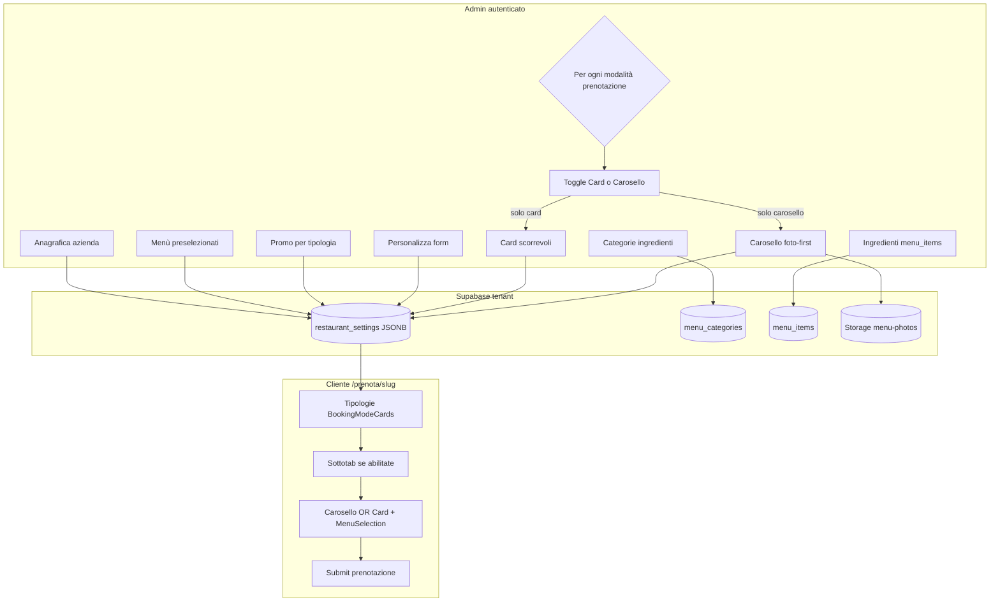

# Analisi flusso admin — onboarding nuova azienda → Pagina Prenota

**Data:** 26-05-26  
**Scope:** percorso descritto da Matteo (anagrafica → menù → preset → promo → Personalizza form → card/carosello)  
**Non include:** Menu QR pubblico (`/menu/...`) salvo nota di confine.

---

## Parte 1 — Definizione di flusso dati corretto (come deve comportarsi l’app)

### Principio guida

Il **menù generale** (categorie + ingredienti in DB) è la **fonte operativa** del ristoratore.  
La **pagina Prenota** non legge il menù “live” per le scelte del cliente: usa uno **snapshot** in `booking_public_form_config` (modalità, sottotab, testi, foto carosello, visibilità ingredienti).  
I **menù preselezionati** (`booking_custom_staff_presets`) servono a **comporre** preset e a **precompilare** le card Prenota, non a guidare da soli la UI pubblica dopo il salvataggio.

### Diagramma alto livello



### Passi admin (schermata → componente → storage)

| # | Cosa fa il ristoratore | Dove nell’app | Componenti principali | Dati scritti |
|---|------------------------|---------------|----------------------|--------------|
| 1 | Entra in nuova azienda | Login admin → tenant | `TenantContext`, `AdminDashboard` | Sessione + `organizations` (tenant) |
| 2 | Compila anagrafica | Impostazioni → **Anagrafica Azienda** | `RestaurantSettingsTab` | `restaurant_settings`: `restaurant_name`, contatti, indirizzo, orari (`business_hours`), ecc. |
| 3 | Definisce categorie ingredienti | Tab **Menu** (classica) | `MenuPricesTab` + `useMenuCategories` | Tabella `menu_categories` (`key`, `label`, `description`, `image_url`, `sort_order`) |
| 4 | Inserisce ingredienti | Stessa tab Menu | `MenuPricesTab` + `useMenuItems` | Tabella `menu_items` (`name`, `category`→key, `price`, `booking_types[]`, `sort_order`) |
| 5 | Crea menù preselezionati | Tab Menu → sezione preset | `MenuPricesTab` | `restaurant_settings.booking_custom_staff_presets[]`: `{ id, name, item_ids[], booking_types[], description?, price_per_person?, is_fixed_menu?, visible_on_booking? }` |
| 6 | Abbina promo a tipologia | Tab Menu → promo | `MenuPricesTab` | `restaurant_settings.booking_menu_promos[]`: messaggio/label + `booking_types[]` |
| 7 | Personalizza Pagina Prenota | Impostazioni → **Personalizza form** | `BookingFormConfigPanel` | `restaurant_settings.booking_public_form_config` |
| 7a | Modifica intestazione / font | Sezione intestazione | `BookingFormConfigPanel` | `page_title`, `page_description`, `header_styles` |
| 7b | Apre una **modalità** (es. Rinfresco laurea) | Card modalità espansa | `booking_modes[]` con `booking_type` fisso | `enabled`, `label`, `description`, `icon` per quella tipologia |
| 7c | Abilita «Card o Carosello» | Toggle sotto la modalità | `sub_tabs_enabled: true` | Abilita blocco sottotab su Prenota per **quella** `booking_type` |
| 7d | **Sceglie UN tipo di presentazione** | Scelta esclusiva card **oppure** carosello | *(requisito prodotto)* | Es. `booking_modes[i].sub_tabs_display: 'cards' \| 'carousel'` oppure tutte le `sub_tabs[].display` omogenee |
| 7e | Se **carosello** | `+ Carosello` → bozza → foto → campi slide → Salva | `BookingFormCarouselEditor`, `useCarouselPhotoUpload` | `sub_tabs[]` con `display:'carousel'`, `carousel_items[]` per slide (`eyebrow`, `title`, `description`, `icon`, `image_url`); foto in `menu-photos` path `booking-form-{modeId}-{tabId}/...` |
| 7f | Se **card scorrevole** | `+ Card scorrevole` → etichetta, icona, import preset, prezzo, descrizione, visibilità | `renderSubTabEditor` (cards) | `sub_tabs[]` con `display:'cards'`, `label`, `preset_id?`, `price_per_person?`, `hidden_category_keys`, `hidden_item_ids` |

### Passi cliente (Pagina Prenota)

| # | Cosa vede | Componente | Dati letti |
|---|-----------|------------|------------|
| 1 | Header nome/titolo/descrizione | `BookingRequestPage` | `booking_public_form_config` + `restaurant_name` |
| 2 | Sceglie tipologia | `BookingModeCards` | `booking_modes[]` dove `enabled` |
| 3 | Banner promo (se configurate) | `MenuPromoBannerCards` | `booking_menu_promos` filtrate per `booking_type` |
| 4 | Sottotab (se `sub_tabs_enabled`) | `BookingSubTabCards` | `activeMode.sub_tabs[]` |
| 5a | Ha scelto sottotab **carosello** | `BookingSubTabCarousel` | `carousel_items[]` della sottotab (overlay per slide) — **nessun** `MenuSelection` |
| 5b | Ha scelto sottotab **card** | `MenuSelection` + griglia | `label`, `description`, `preset_id` → item da preset; filtri `hidden_*`; prezzo da `price_per_person` sulla sottotab |
| 6 | Invia richiesta | `useCreateBookingRequest` | Payload prenotazione + snapshot scelte |

### Regola prodotto chiave (tua definizione)

Per ogni **modalità di prenotazione** (`booking_modes[i]` legata a un `booking_type`):

- Con toggle «Abilita Card o Carosello» **ON**: in Prenota compaiono **solo** card **oppure** **solo** caroselli (stesso tipo per tutte le sottotab di quella modalità).
- **Non** mescolare nella stessa tipologia alcune sottotab `cards` e altre `carousel`.

---

## Parte 2 — Analisi del flusso attuale nel codice

### 2.1 Mappa elementi toccati (implementazione reale)

| Area | File / hook | Storage |
|------|-------------|---------|
| Anagrafica | `RestaurantSettingsTab.tsx`, `useRestaurantSetting`, `useUpsertRestaurantSetting` | `restaurant_settings` (chiavi v1) |
| Categorie | `useMenuCategories`, `MenuPricesTab` | `menu_categories` |
| Ingredienti | `useMenuItems`, `MenuPricesTab` | `menu_items` |
| Preset staff | `MenuPricesTab`, `presetMenus.ts` | `booking_custom_staff_presets` |
| Promo | `MenuPricesTab`, `menuPromo.ts` | `booking_menu_promos` |
| Config Prenota | `BookingFormConfigPanel.tsx`, `bookingPublicFormConfig.ts`, `restaurantSettingRegistry.ts` | `booking_public_form_config` |
| Editor carosello | `BookingFormCarouselEditor.tsx`, `MenuHomepageConfigPanel` (`useCarouselPhotoUpload`, `replaceAt`) | JSON + `menu-photos` |
| Pubblico | `BookingRequestForm.tsx`, `BookingRequestPage.tsx`, `BookingSubTabCards.tsx` | Lettura settings via slug (`supabasePublic`) |

### 2.2 Flusso dati tra le fasi (dipendenze)

```
menu_categories + menu_items
        ↓ (item_ids)
booking_custom_staff_presets  ──import preset──→  sub_tabs[].preset_id (solo card)
        ↓ booking_types                              ↓ hidden_* calcolati da preset
booking_menu_promos  ──filtro──→  banner Prenota (indipendente dalle sottotab)

booking_public_form_config.booking_modes[]
        ├─ booking_type  →  selezione tipologia pubblica
        ├─ sub_tabs_enabled
        └─ sub_tabs[]
              ├─ display: cards | carousel  (per ogni elemento)
              ├─ carousel_items[]  (solo carousel)
              └─ label, price, hidden_*  (solo cards)
```

**Coerenza intenzionale:** dopo il Salva in Personalizza form, titolo card e testi pubblici vengono da `sub_tabs[]`, non dal nome preset in tempo reale (`applyLegacySubTabLabelOverrides` gestisce solo dati vecchi).

### Decisioni prodotto confermate (Matteo)

#### A. Due mondi menù — **accettato**

| Mondo | Ruolo | Storage |
|-------|--------|---------|
| **Tab Menu** | Magazzino: categorie, ingredienti, menù preselezionati (nome, ingredienti, prezzo consigliato, tipologie) | `menu_categories`, `menu_items`, `booking_custom_staff_presets` |
| **Personalizza form** | Vetrina Pagina Prenota: testi e layout che vede il cliente | `booking_public_form_config` → `sub_tabs[]` |

È **corretto e voluto** che il ristoratore possa **sovrascrivere solo per Prenota** etichetta, descrizione, prezzo sulla card, icona, ingredienti nascosti, ecc., anche se la card è collegata a un preset (`preset_id`):

- **Import menù preselezionato** (solo card): copia da `booking_custom_staff_presets` in `sub_tabs[]` (nome → `label`, descrizione, prezzo, `hidden_item_ids` da ingredienti non nel preset).
- **Dopo il Salva** della sottotab: il cliente vede `sub_tabs[].label` / `description` / `price_per_person`, **non** il nome del preset aggiornato in tab Menu.
- **`preset_id` resta** il legame per **quali ingredienti** mostrare nella griglia (`MenuSelection`); cambiare ingredienti nel preset in tab Menu **non** rinomina da sola la card già salvata — serve modificare Personalizza form o re-importare il preset (con regola che preserva etichetta già personalizzata).

Non è una lacuna: è **personalizzazione vetrina** senza toccare il magazzino.

#### B. Bozza vs salvata — **comportamento attuale spiegato**

| Fase | Cosa vede l’admin | Stato tecnico | Su DB |
|------|-------------------|---------------|-------|
| Clic **+ Card** / **+ Carosello** | Editor aperto «NUOVA CARD N» / «CAROSELLO N» + **Annulla** + **Salva** | `draftSubTabsByMode[modeId]` (solo RAM) | No |
| **Salva** nell’editor (bozza) | Editor si chiude; compare riga in elenco | `commitSubTabEditor` → append a `sub_tabs[]` + `persistModesSection` | Sì |
| **Annulla** (bozza) | Editor sparisce, niente in elenco | draft azzerato | No |
| Sottotab già salvata | Riga compatta (titolo + etichetta) + **Modifica** / **Chiudi** | `sub_tabs[]` in config | Già sì (ultimo Salva) |
| **Modifica** (salvata) | Editor sotto la riga (`embedded`) | `expandedSubTabByMode`; patch in memoria | No finché non **Salva** nell’editor |
| **Salva** (salvata aperta) | Pannello si chiude | `persistModesSection` con `isDraft: false` | Sì |

**Perché due modi:** la bozza evita righe vuote in lista e permette **Annulla** senza scrivere su DB; le salvate usano elenco compatto quando ci sono molte opzioni.

**Non è un bug:** è una scelta UX. Unificare tutto su «solo Modifica/Chiudi» (anche per le nuove) sarebbe possibile ma toglierebbe l’Annulla «pulito» prima del primo commit.

### 2.3 Lacune e bug rispetto al flusso desiderato

| # | Problema | Gravità | Dettaglio tecnico |
|---|----------|---------|-------------------|
| L1 | **Card e carosello mescolabili sulla stessa tipologia** | Alta (prodotto) | `SubTabAddButtons` espone sempre **entrambi** i pulsanti; `addSubTab(modeId, 'cards' \| 'carousel')` senza vincolo; in Prenota `BookingSubTabCards` renderizza **tutte** le `sub_tabs` nello stesso scroller anche se `display` misto. |
| L2 | Nessun campo «modalità = solo card \| solo carosello» | Media | `BookingMode` ha solo `sub_tabs_enabled` + array eterogeneo; manca es. `sub_tabs_presentation: 'cards' \| 'carousel'`. |
| L3 | Due UX editor (bozza vs salvata) | — (OK) | Vedi § Decisioni B. Bozza = creazione; salvata = elenco Modifica/Chiudi. Nessun cambio richiesto salvo unificazione UX futura. |
| L4 | Doppia fonte menù / snapshot vetrina | — (OK) | Vedi § Decisioni A. Personalizzazione Prenota su `sub_tabs[]` confermata dal ristoratore. |
| L5 | Carosello senza prezzo | OK | Allineato al requisito recente; `getPresetPricePerPerson` ignora `display === 'carousel'`. |
| L6 | `sub_tabs[].label` su carosello | Bassa | Sync da prima slide (`eyebrow`/`title`) per la pillola selector; le slide usano campi per-item — coerente ma non ovvio in admin. |
| L7 | Tipologia `tavolo` | Info | `bookingTypeUsesMenuSelections('tavolo')` è false: sottotab/carosello su modalità tavolo hanno poco effetto sulla griglia menù (comportamento voluto?). |
| L8 | Salvataggi parziali | Media | Intestazione, modalità, sottotab (`commitSubTabEditor`), anagrafica e sfondo hanno **Salva** separati; rischio di config incompleta se l’admin salta un passo (mitigato da `UnsavedChangesContext`). |
| L9 | Menu QR separato | Info | `menu_qr_codes` / homepage QR non fanno parte di questo onboarding; foto carosello Prenota usano path `booking-form-...` distinti da QR. |

### 2.4 Cosa funziona bene (stabilità)

- **Persistenza centralizzata** menu impostazioni su `restaurant_settings` con registry Zod (`restaurantSettingRegistry.ts`) riduce errori di parse.
- **Parse difensivo** `parseSubTabFromUnknown` + `migrateLegacyCarouselSubTab` per config vecchie.
- **Upload foto** isolato (`useCarouselPhotoUpload`, `replaceAt`, `removeAt`) con path per tenant.
- **Separazione client** admin (`supabase`) vs pubblico (`supabasePublic`).
- **commitSubTabEditor** persiste subito la sottotab senza richiedere secondo Salva sulla card modalità.

### 2.5 Coerenza

| Aspetto | Valutazione | Note |
|---------|-------------|------|
| Naming admin vs JSON | Buona dopo rename | UI «Testo Etichetta» → `eyebrow`; documentato in skill |
| Card vs carosello | **Insufficiente** | Manca enforcement «uno o l’altro» per modalità |
| Preset vs sottotab | Buona | Magazzino preset + vetrina `sub_tabs[]`; override nome/descrizione solo Prenota (confermato) |
| Promo vs sottotab | Buona | Canali separati, stesso `booking_type` |
| Menu QR vs Prenota | Buona | Confini chiari in skill; rischio confusione umana su «due caroselli» |

### 2.6 Pulizia del codice

| Aspetto | Valutazione | Note |
|---------|-------------|------|
| `BookingFormConfigPanel` | Media | File grande (~1200 righe); logica sottotab + draft + editor embedded concentrata |
| `BookingFormCarouselEditor` | Buona | Estratto recentemente; responsabilità chiara |
| Duplicazione upload | Accettabile | `useCarouselPhotoUpload` condiviso con Menu QR; `CarouselItem` tipo condiviso |
| Legacy | Gestito | `sub_tabs_overrides`, `migrateLegacyCarouselSubTab`, preset built-in deprecati |

### 2.7 Scalabilità

| Aspetto | Valutazione | Note |
|---------|-------------|------|
| Nuove tipologie prenotazione | Media | Richiede estendere `BookingType`, default in `DEFAULT_BOOKING_FORM_CONFIG`, promo/preset `booking_types` |
| Molte sottotab | Buona | Array JSON; scroll orizzontale pubblico |
| Molte slide carosello | Buona | Array `carousel_items`; editor per slide |
| Molti tenant | Buona | RLS su tabelle; settings per `tenant_id` |
| Regola card\|carosello | Da implementare | Un campo su `BookingMode` + UI che nasconde un pulsante + validazione al Salva + filtro pubblico |

### 2.8 Raccomandazioni prioritarie (solo analisi, non implementate)

1. **Prodotto + modello:** aggiungere su `BookingMode` qualcosa come `sub_tabs_presentation: 'cards' | 'carousel' | null` (null = sottotab disabilitate o non ancora scelte).
2. **Admin:** dopo la prima sottotab salvata (o alla prima scelta), mostrare **solo** `+ Card` **o** `+ Carosello`; oppure radio «Presentazione: Card | Carosello» sopra i pulsanti.
3. **Pubblico:** `BookingSubTabCards` / `BookingRequestForm` filtrano `sub_tabs` per `display` coerente con la modalità (o mostrano errore dev se dati misti legacy).
4. **Migrazione:** se esistono modalità con mix, normalizzare al primo salvataggio (tutte card o tutte carousel in base alla maggioranza).
5. **Formazione ristoratore (opzionale):** in help panel o guida breve, distinguere tab Menu (magazzino) vs Personalizza form (vetrina); spiegare bozza «NUOVA CARD» vs riga Modifica/Chiudi.

---

## Sintesi voti (1–5)

| Criterio | Voto | Una riga |
|----------|------|----------|
| Stabilità | 4 | Parse, upload e salvataggi parziali solidi; rischio config incompleta da UX multi-Salva |
| Coerenza | 3,5 | Preset/ventrina e bozza/salvata allineati al prodotto; **debole** solo su card+carosello misti per tipologia |
| Pulizia | 3,5 | Migliorata con `BookingFormCarouselEditor`; panel config ancora monolitico |
| Scalabilità | 4 | Modello JSON flessibile; vincolo card\|carosello va modellato esplicitamente |

---

## Riferimenti skill

- `docs/APP_CONTEXT_SKILL.md` § Pagina Prenota v2  
- `docs/per-ui-design-skill/BOOKING_FORM_CONFIG_PANEL_CURSOR_CONTEXT.md`  
- `docs/Sessioni di lavoro/26-05-26/Report-carosello-editor-per-slide-26-05-26.md`
