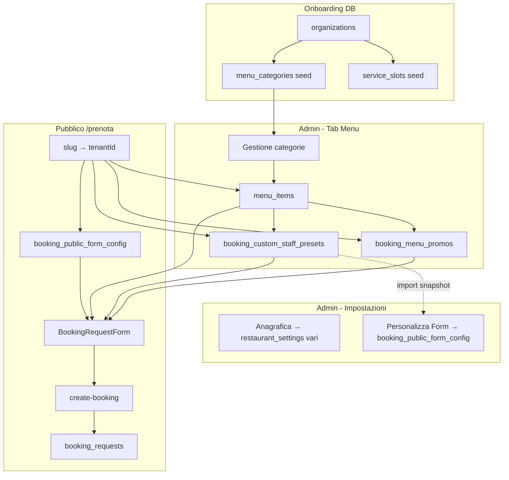

# Analisi flusso onboarding admin → pagina Prenota

**Data:** 26-05-26  
**Scope:** nuova azienda, anagrafica, menù generale, preset, promo, Personalizza form (card vs carosello), comportamento pubblico.

---

## 1. Definizione corretta del flusso dati (come da requisito prodotto)

Questa sezione formalizza il comportamento **atteso** che hai descritto. È la “fonte di verità” funzionale per confronto con il codice.

### 1.1 Identità tenant (nuova azienda)

| Passo | Chi fa cosa | Dove in app | Storage |
|-------|-------------|-------------|---------|
| Creazione organizzazione | Operatore crea tenant (slug, nome, edition) | Fuori da questo flusso (DB / backoffice / invite) | `organizations` |
| Primo accesso admin | Admin si registra con invite o login | `/invite/:token` → `validate-invite` | `admin_users` + Supabase Auth |
| Contesto sessione | Ogni schermata admin conosce il tenant | `TenantContext` (`tenantId`, `organizationName`) | Sessione + `admin_users.tenant_id` |

**Seed automatici al INSERT su `organizations` (DB):**

- `menu_categories` — categorie ingredienti default (antipasti, primi, …) via trigger `trg_seed_menu_categories_on_organization`
- `service_slots` — fasce orarie default via trigger signup (vedi `DB_SCHEMA_CONTEXT.md`)

**Non** viene creato automaticamente un JSON `booking_public_form_config`: alla prima lettura l’app usa `DEFAULT_BOOKING_FORM_CONFIG` finché l’admin non salva.

---

### 1.2 Anagrafica azienda

| Campo / blocco | Componente admin | Chiave `restaurant_settings` | Effetto pubblico |
|----------------|------------------|------------------------------|------------------|
| Nome locale | `RestaurantSettingsTab` → tab **Anagrafica Azienda** | `restaurant_name` | Header `/prenota/:slug`, sidebar |
| Email, telefono, indirizzo | stesso tab | `contact_email`, `contact_phone`, `contact_address` | Footer / box info mobile |
| Orari | stesso tab | `business_hours` | Box orari pagina Prenota |
| Fasce orarie + capienze | stesso tab | `service_slots` (tabella) + `slot_guest_capacities`, `booking_time_slots_enabled` | Disponibilità slot in form |
| Tema admin | stesso tab | `app_theme` | Solo dashboard admin |
| Sfondo pagina Prenota | tab **Personalizza Form** (sezione passata da `RestaurantSettingsTab`) | `public_booking_page_background` | Texture/gradiente viewport `/prenota` |

**Flusso dati:** form locale → `useUpsertRestaurantSetting` → riga `restaurant_settings (tenant_id, setting_key, setting_value JSONB)` → invalidazione TanStack Query → pagina pubblica rilegge con `supabasePublic` / hook con `tenantId` da slug.

---

### 1.3 Menù generale (tab Menu / `MenuPricesTab`)

Ordine logico operativo dell’admin:

```
Categorie ingredienti  →  Ingredienti (prodotti)  →  Menù preselezionati  →  Promo testuali
```

| Fase | Cosa configura | Componente | Storage | Collegamento successivo |
|------|----------------|------------|---------|-------------------------|
| **Categorie** | Nome, descrizione, foto categoria Prenota | `MenuPricesTab` + `useMenuCategories` | Tabella `menu_categories` (`key`, `label`, `description`, `image_url`, `sort_order`) | Raggruppamento ingredienti e card compose |
| **Ingredienti** | Nome, prezzo, categoria, tipologie prenotazione, foto | `MenuPricesTab` + `useMenuItems` | Tabella `menu_items` (`category` → `menu_categories.key`, `booking_types[]`) | Preset, griglia pubblica, admin prenotazione |
| **Menù preselezionati** | Nome, descrizione, prezzo consigliato, fisso/personalizzabile, ingredienti inclusi, tipologie | `PresetMenuBuilder` / pannello preset in `MenuPricesTab` | `restaurant_settings.booking_custom_staff_presets` — array `CustomStaffPreset` (`id`, `name`, `item_ids[]`, `booking_types`, `description`, `price_per_person`, `is_fixed_menu`, `visible_on_booking`) | Import in Personalizza form; selezione cliente se nessuna sottotab |
| **Promo** | Testo banner + tipologie (`tavolo`, `rinfresco_laurea`, `menu_prezzo_fisso`) | Editor promo in `MenuPricesTab` | `restaurant_settings.booking_menu_promos` — array `MenuPromo` | `MenuPromoBannerCards` in `BookingRequestForm` filtrate per `booking_type` attivo |

**Principio:** il **menù generale** (categorie + ingredienti) vive in **tabelle normalizzate**; preset e promo sono **snapshot/overlay** in `restaurant_settings`, non duplicano le righe ingredienti.

---

### 1.4 Personalizza form — modalità di prenotazione

| Livello | Cosa è | Storage | Note requisito |
|---------|--------|---------|----------------|
| **Modalità** (`BookingMode`) | Es. «Rinfresco di laurea», «Menu a prezzo fisso», «Prenota un tavolo» | `booking_public_form_config.booking_modes[]` | `booking_type`, `enabled`, `label`, `description`, `icon` |
| **Toggle «Abilita Card o Carosello»** | Attiva le sottotab per quella modalità | `booking_modes[].sub_tabs_enabled` | Se off: nessuna sottotab; flusso menù “classico” (dropdown preset se abilitato) |
| **Tipo presentazione (requisito)** | Per ogni modalità: **solo card scorrevoli** **oppure** **solo carosello** — non entrambi nella stessa tipologia | *Oggi non modellato a livello modalità* | Vedi §2.4 |
| **Sottotab Card** (`display: 'cards'`) | Una o più card orizzontali + eventuale griglia menù | `sub_tabs[]` con `label`, `description`, `price_per_person`, `preset_id?`, `hidden_*` | Etichetta card = titolo pubblico card + titolo sezione menù |
| **Sottotab Carosello** (`display: 'carousel'`) | Un carosello (slide con foto + testi per slide) | `sub_tabs[]` con `carousel_items[]` (`image_url`, `eyebrow`, `title`, `description`, `icon` per slide) | Nessun import preset; nessuna griglia `MenuSelection` sotto |
| **Intestazione pagina** | Titolo/descrizione/font/colori header | `page_title`, `page_description`, `header_styles` | Separato da modalità |

**Salvataggio admin:** `BookingFormConfigPanel` → `commitSubTabEditor` o salvataggio sezione/footer → `normalizeBookingPublicFormConfig` → `restaurant_settings.booking_public_form_config`.

**Regola dati preset ↔ card:** `preset_id` sulla sottotab **non modifica** `booking_custom_staff_presets`; serve solo a precompilare ingredienti nascosti/visibili e a caricare il pacchetto in submit. Il **nome mostrato al cliente** è `sub_tabs[].label` (Etichetta card), non `CustomStaffPreset.name`.

---

### 1.5 Pagina pubblica `/prenota/:slug` (effetto del flusso admin)

Ordine UI atteso dopo configurazione:

```
1. Header (nome, titolo, descrizione da booking_public_form_config + restaurant_name)
2. Card tipologia prenotazione (BookingModeCards) — booking_modes[].enabled
3. [Se sub_tabs_enabled] Sottotab:
      - REQUISITO: tutte card scorrevoli OPPURE un carosello per quella tipologia
      - OGGI: lista mista in BookingSubTabCards + sotto carosello se slide carousel selezionata
4. Banner promo (booking_menu_promos filtrate per booking_type)
5. [Se tipologia con menù e sottotab card selezionata / nessuna sottotab] MenuSelection
6. Dati cliente + submit → Edge Function create-booking
```

**Submit:** `preset_menu` (built-in `menu_1`… o `custom:<uuid>`), `menu_selection` JSON, totali derivati da prezzo sottotab o somma ingredienti.

---

### 1.6 Diagramma flusso dati end-to-end (sintesi)



---

## 2. Analisi del flusso implementato (codice attuale)

### 2.1 Mappa componenti ↔ storage (checklist)

| # | Step utente | File / hook principali | Persistenza |
|---|-------------|------------------------|-------------|
| 1 | Nuova azienda | Trigger SQL, `TenantContext` | `organizations`, seed categorie/fasce |
| 2 | Anagrafica | `RestaurantSettingsTab.tsx`, `useRestaurantSetting`, `useUpsertRestaurantSetting` | `restaurant_settings.*`, `service_slots` |
| 3 | Categorie | `MenuPricesTab`, `useMenuCategories` | `menu_categories` |
| 4 | Ingredienti | `MenuPricesTab`, `useMenuItems` | `menu_items` |
| 5 | Preset staff | `MenuPricesTab` + `PresetMenuBuilder`, registry `booking_custom_staff_presets` | JSON in `restaurant_settings` |
| 6 | Promo | `MenuPricesTab`, `menuPromo.ts` | JSON `booking_menu_promos` |
| 7 | Personalizza form | `BookingFormConfigPanel.tsx`, `BookingFormCarouselEditor.tsx`, `bookingPublicFormConfig.ts`, `restaurantSettingRegistry.ts` | JSON `booking_public_form_config` |
| 8 | Prenota pubblica | `BookingRequestPage.tsx`, `BookingRequestForm.tsx`, `BookingSubTabCards`, `BookingSubTabCarousel`, `MenuSelection.tsx` | Lettura settings + tabelle; scrittura `booking_requests` |

**Registry unico parsing:** `restaurantSettingRegistry.ts` — ogni chiave ha `parseFromDb` / `validate` / `serializeToDb`. Coerente per tutte le impostazioni JSON.

---

### 2.2 Gap rispetto al requisito «card O carosello per tipologia»

| Aspetto | Comportamento attuale | Requisito |
|---------|----------------------|-----------|
| Modello dati | Ogni elemento di `sub_tabs[]` ha `display: 'cards' \| 'carousel'` | Serve un vincolo **a livello `BookingMode`**, es. `sub_tabs_presentation: 'cards' \| 'carousel'` |
| UI admin | Due pulsanti sempre visibili: «+ Card scorrevole» e «+ Carosello» (`SubTabAddButtons`) | Dopo scelta modalità, **un solo** tipo di aggiunta |
| UI pubblica | `BookingSubTabCards` renderizza **tutte** le sottotab nella stessa fascia; le carousel compaiono come “card selettore” senza prezzo/descrizione, poi `BookingSubTabCarousel` sotto | Con carosello: **nessuna** fascia card selettore (o un solo blocco slide); con card: solo card + menù |
| Validazione salvataggio | Nessun controllo che impedisca `sub_tabs` miste | Validare in `normalizeBookingPublicFormConfig` o in `registry.validate` |

**Impatto stabilità:** medio — dati misti già salvati in produzione/test; serve migrazione soft (leggere misto, salvare con flag) o conversione automatica.

**Implementazione suggerita (non fatta in questa analisi):**

1. Aggiungere `BookingMode.sub_tabs_layout: 'cards' | 'carousel' | null` (null = disabilitato).
2. Toggle «Abilita Card o Carosello» → apre scelta radio Card / Carosello prima di mostrare `SubTabAddButtons`.
3. Filtrare `sub_tabs` in lettura pubblica per layout; se `carousel`, montare solo `BookingSubTabCarousel` (eventualmente una sola sottotab carousel con N slide).

---

### 2.3 Lacune, bug rischio e debito tecnico

#### A. Coerenza dati / doppie fonti

| Problema | Dettaglio | Gravità |
|----------|-----------|---------|
| **Legacy `sub_tabs_overrides`** | Campo deprecato; `applyLegacySubTabLabelOverrides` ripara label se `label` = nome preset ma esiste override | Bassa se si riscrive tutto al salvataggio (già si azzera su persist modalità) |
| **Titolo menù vs etichetta card** | Risolto di recente con `presetSectionTitle` + merge legacy; senza salvataggio admin resta rischio disallineamento | Medio (operativo, non codice) |
| **Preset built-in `menu_1`…`menu_4`** | Ancora in codice per prenotazioni vecchie; elenco staff è `booking_custom_staff_presets` | Bassa — documentare per agenti |
| **Carosello: testi per slide vs testi su sottotab** | `migrateLegacyCarouselSubTab` sposta label/description sul primo item; editor `BookingFormCarouselEditor` usa campi per slide | Medio — capire quale UX è definitiva e allineare skill/report vecchi |
| **Import preset sovrascrive label** | Mitigato con `shouldKeepSubTabLabelOnPresetImport` | Bassa |

#### B. Onboarding incompleto

| Problema | Dettaglio |
|----------|-----------|
| Nessun seed `restaurant_settings` | Prima visita: default runtime, non DB — ok ma slug senza salvataggio ha config “fabbrica” |
| `booking_public_form_config` grande | Tutte le modalità/sottotab in un unico JSON — con molti tenant e molte slide carousel il documento cresce |
| Invite-only admin | “Nuova azienda” non è un wizard in-app; dipende da processo esterno |

#### C. Flusso pubblico

| Problema | Dettaglio |
|----------|-----------|
| Carousel in fascia card | UX incoerente con requisito “solo carosello” |
| `BookingSubTabCards` per tab carousel | Mostra solo `label`; descrizione/prezzo nascosti (`display === 'carousel'`) — l’utente seleziona una “card vuota” poi vede le slide |
| Nessuna sottotab selezionata | Con `sub_tabs_enabled` e tipologia menù, griglia nascosta finché non si clicca una card — corretto ma va spiegato al ristoratore |
| Promo + preset + sottotab | Tre layer indipendenti; nessun conflitto tecnico ma documentazione necessaria |

#### D. Admin UX / salvataggi parziali

| Problema | Dettaglio |
|----------|-----------|
| Multipli dirty state | `headerDirty`, `modesDirty`, `bookingBgDirty`, `dirty` anagrafica — `UnsavedChangesContext` mitiga ma complesso |
| `commitSubTabEditor` vs footer | Salvataggio sottotab immediato su DB — bene; ma anagrafica e modalità separate possono confondere |
| `withMergedSubTabLabels` in `useEffect` dipende da `customPresetsRaw` | Rischio re-idratazione se preset staff cambiano mentre si edita form |

---

### 2.4 Valutazione qualità codice

#### Stabilità (6.5/10)

**Punti di forza**

- Parsing centralizzato (`restaurantSettingRegistry`, `parseSubTabFromUnknown`, `normalizeBookingPublicFormConfig`).
- TanStack Query con invalidazione su upsert settings.
- Guard modifiche non salvate su navigazione admin.
- Test mirati (`subTabLabelOverrides.test.ts`, `presetMenuDisplay.test.ts`).

**Rischi**

- JSON monolitico `booking_public_form_config` senza versioning schema.
- Migrazioni runtime multiple (`migrateOverridesToSubTabs`, `migrateLegacyCarouselSubTab`, `applyLegacySubTabLabelOverrides`) — ordine di applicazione deve restare deterministico.
- Upload foto carousel condiviso con Menu QR (`CarouselAddPhotoBlock`, bucket `menu-photos`) — path `booking-form-{modeId}-{tabId}`; ok ma accoppiamento tra feature.

#### Coerenza (6/10)

**Allineato al dominio**

- Separazione tabelle menù vs settings JSON.
- `preset_id` su sottotab come riferimento, non copia ingredienti nel JSON config (solo `hidden_item_ids`).

**Non allineato al requisito prodotto**

- Card + carosello mescolabili per stessa `booking_type`.
- Documentazione skill ancora parzialmente obsoleta su overlay carosello (campi a livello sottotab vs per slide).

#### Pulizia (5.5/10)

- `BookingFormConfigPanel` molto grande (~1200+ righe) — editor card/carousel/embed/collapsible.
- Logica label preset sparsa (`presetMenus.ts`, `BookingFormConfigPanel`, `BookingRequestForm`, `MenuSelection`).
- Campi deprecati ancora parseati (`sub_tabs_overrides`, `type: preset|manual`).

**Buona direzione recente:** `BookingFormCarouselEditor` estratto; `SettingsSaveUi` condiviso.

#### Scalabilità (6/10)

| Area | Valutazione |
|------|-------------|
| Ingredienti / categorie | Buona — tabelle indicizzate per `tenant_id` |
| Preset / promo | Accettabile — array JSON, O(n) scan per tenant |
| `booking_public_form_config` | Limitata — un blob per tenant; molte sottotab/carousel_items aumentano payload ogni fetch |
| Multi-tenant | Solido — `tenant_id` ovunque, RLS admin |
| Estensione “solo card o solo carousel” | Facile a livello schema (`sub_tabs_layout`); richiede migrazione UI + pubblico |

---

### 2.5 Priorità interventi (solo raccomandazioni)

1. **Alta — Requisito card XOR carosello per modalità**  
   Modello + UI admin + rendering `BookingRequestForm` (non lista mista in `BookingSubTabCards`).

2. **Media — Allineare documentazione carosello**  
   Skill/report: testi su `carousel_items[]` per slide (stato attuale codice pubblico) vs vecchio modello `subTab.label` a livello intera sottotab.

3. **Media — Validazione al salvataggio**  
   Impedire `sub_tabs` vuote con `sub_tabs_enabled: true`; coerenza `preset_id` + `display: 'cards'`.

4. **Bassa — Refactor `BookingFormConfigPanel`**  
   Sotto-componenti per modalità, hook `useBookingFormConfigDraft`.

5. **Bassa — Wizard onboarding**  
   Checklist post-creazione tenant (anagrafica → categorie → ingredienti → preset → personalizza form).

---

## 3. Conclusione sintetica

Il flusso che hai descritto è **architetturalmente supportato**: menù strutturato in tabelle, personalizzazione Prenota in `booking_public_form_config`, preset e promo come layer su `restaurant_settings`. L’admin può completare l’intero percorso da **Menu** e **Impostazioni → Personalizza Form**.

La **lacuna principale** rispetto alla tua definizione corretta è il vincolo **«per tipologia di prenotazione: o card scorrevoli o carosello»**: oggi il modello è **per singola sottotab** (`display`), e l’UI permette (e la pagina pubblica mostra) **mix** nella stessa modalità.

Secondo gap storico (parzialmente corretto): **etichetta card** vs **nome menù preselezionato** — il codice ora privilegia `sub_tabs[].label` e merge legacy, ma richiede salvataggio esplicito in admin.

Per **stabilità a lungo termine**, conviene ridurre migrazioni runtime sul JSON form, introdurre un campo esplicito di layout per modalità, e tenere il carosello Prenota distinto dal Menu QR pur riusando l’upload foto.

---

*File generato per review prodotto/tecnica; non implica modifiche al codice.*
